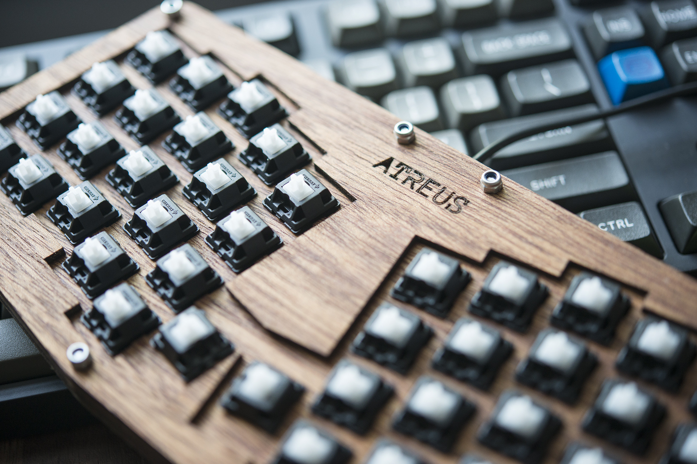

---

###Where to Buy
- From the creator Technomancy on [atreus.technomancy.us](https://atreus.technomancy.us/)

---

###Build Guides / Albums
- "Planck Style Mount" - Build Log by kegadlen on [Reddit](https://www.reddit.com/r/MechanicalKeyboards/comments/2tn3zb/my_atreusplanck_build_log/)
<blockquote class="imgur-embed-pub" lang="en" data-id="a/sCwcP"><a href="//imgur.com/sCwcP">My Atreus+Planck build log</a></blockquote> 
- Build Log by chebatron on [Reddit](https://www.reddit.com/r/MechanicalKeyboards/comments/2ppzqe/photos_ive_made_a_thing_atreust3/)
<blockquote class="imgur-embed-pub" lang="en" data-id="a/lxRvS"><a href="//imgur.com/lxRvS">[photos] I&#39;ve made a thing: Atreus/T3</a></blockquote> 
- Build Log by ericlathrop on [Reddit](https://www.reddit.com/r/MechanicalKeyboards/comments/33w0tf/i_built_an_atreus_today_its_so_tiny/)
<blockquote class="imgur-embed-pub" lang="en" data-id="a/ZsWA1"><a href="//imgur.com/ZsWA1">I built an Atreus today. It&#39;s so tiny!</a></blockquote> 
- Build Log by __ on [Reddit]()

---

###How to Program
- QMK Firmare

---

###Mods &amp; Addons
- Bluetooth Atreus by cy384 on [Reddit](https://www.reddit.com/r/MechanicalKeyboards/comments/3sgld5/finished_my_custom_bluetooth_atreus/)
<blockquote class="imgur-embed-pub" lang="en" data-id="a/9Ncdh"><a href="//imgur.com/9Ncdh">finished my custom bluetooth Atreus</a></blockquote> 

---

###More Info
- The design is OpenSource and is available on [GitHub](https://github.com/technomancy/atreus)
- There is a 60% version of the Atreus known as the Atreus62 available as well. More info to come. Visit [ProfetKeyboards.com](http://shop.profetkeyboards.com/product/atreus62-keyboard) in the meantime. 

---

###Gallery  

