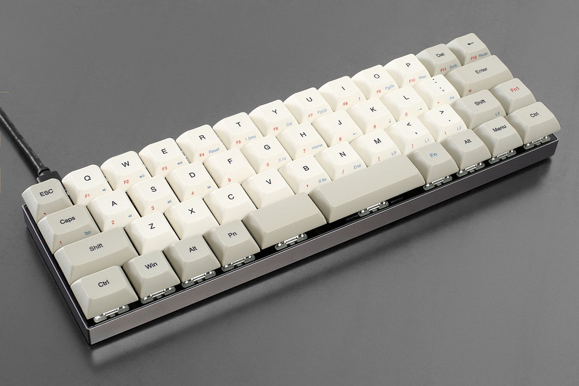
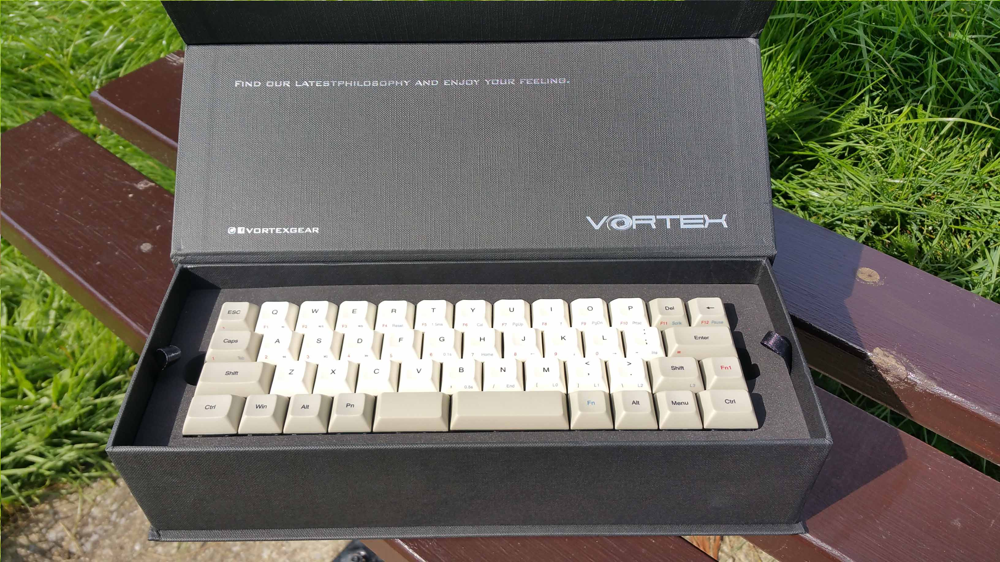

---

###Where to Buy
- $89 on [MechanicalKeyboards.com](https://mechanicalkeyboards.com/shop/index.php?l=product_list&c=375)
- Ended - ~~Group Buy on [MassDrop](https://www.massdrop.com/buy/vortex-core-47)~~

---

###Build Guides / Albums
- Video Review by RhinoFeed on YouTube
<iframe width="560" height="315" src="https://www.youtube.com/embed/zZqqIu65Vxk?rel=0" frameborder="0" allowfullscreen></iframe> 
- Album by LeandreN on [Reddit](https://www.reddit.com/r/MechanicalKeyboards/comments/5n77qm/first_look_of_the_vortex_core/)
<blockquote class="imgur-embed-pub" lang="en" data-id="a/ZsVtU"><a href="//imgur.com/ZsVtU">First look of the Vortex Core !</a></blockquote> 

---

###How to Program
- Please read the Vortex Core User manual available for [download](vortex-core-usermanual.pdf)
- Update the firmware on your Core to V1.04.05 with this [.exe](6vortex_20171020227417219.exe)

---

###Mods &amp; Addons
- Atom47: Custom PCB with QMK Programmability - [atomkb.eu](http://atomkb.eu/atom47/)

---

###More Info
- Most recent firmware and manuals available from [Vortexgear.tw](http://www.vortexgear.tw/vortex3.asp)

---

###Gallery  

