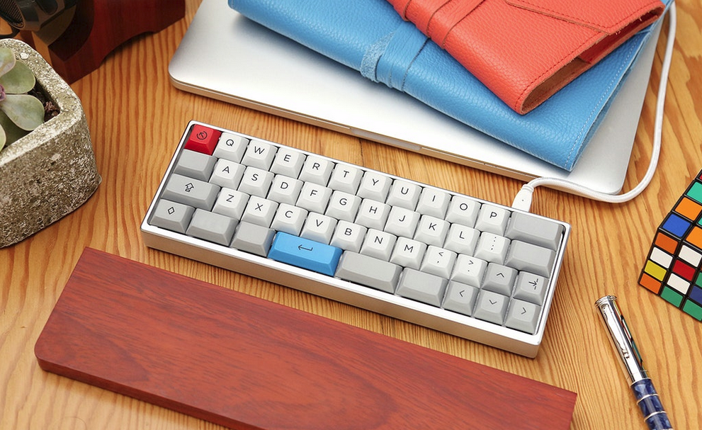
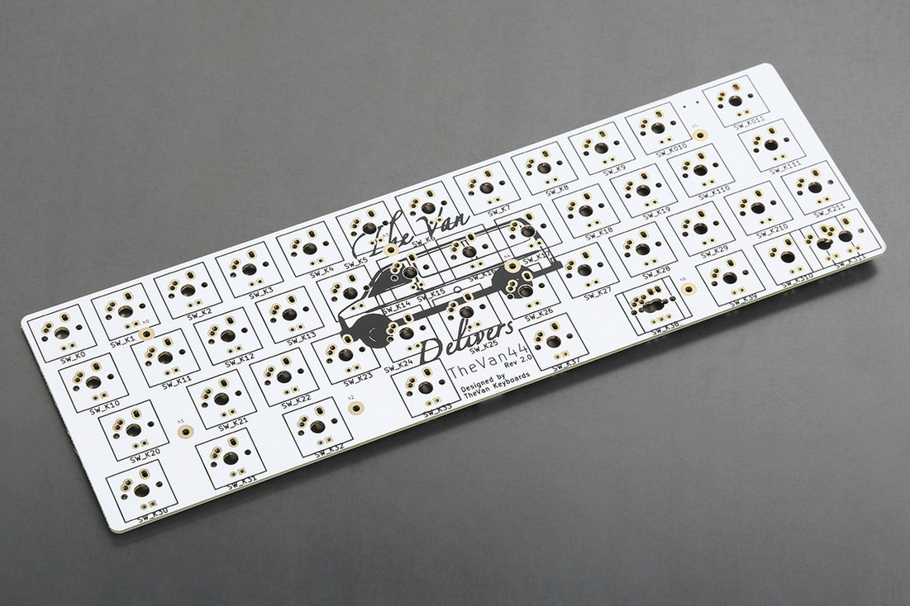
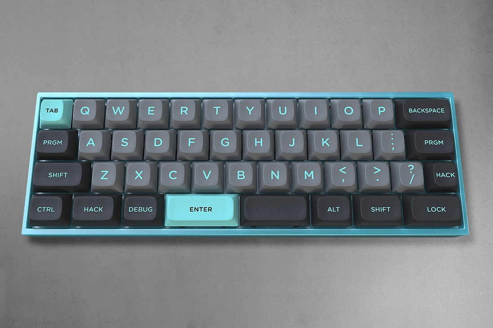
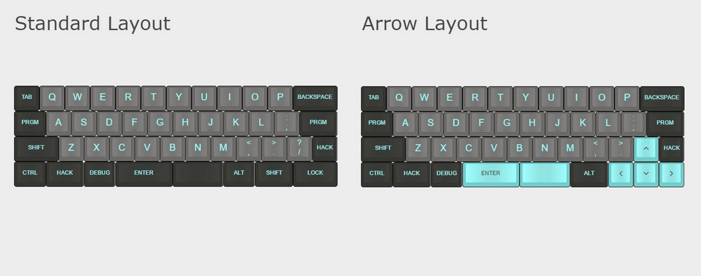

---

###Where to Buy
- $200 Pre-Order on [TheVanKeyboards.com](https://thevankeyboards.com/collections/catalog/products/minivan-powder-white-pre-order)
- Previously has run on [Massdrop.com](https://www.massdrop.com/buy/minivan-keyboard)

---

###Build Guides / Albums
- Review by RhinoFeed on YouTube
<iframe width="560" height="315" src="https://www.youtube.com/embed/g6bKhcrlnn8?rel=0" frameborder="0" allowfullscreen></iframe> 
- Build Guide by the creator: Evangs on YouTube / Reddit post [here](https://www.reddit.com/r/MechanicalKeyboards/comments/4nrtt9/guide_minivan_keyboard_kit_assembly/)
<iframe width="560" height="315" src="https://www.youtube.com/embed/H59hpNmPgQs?rel=0" frameborder="0" allowfullscreen></iframe> 
- MiniVans Get Around
<blockquote class="imgur-embed-pub" lang="en" data-id="a/uxJ4k"></blockquote> 

---

###How to Program
- Programming Guide on [TheVanKeyboards](https://thevankeyboards.com/pages/programming-guide)
- Online QMK Configurator also on [TheVanKeyboards](http://qmk.thevankeyboards.com/)

---

###Mods &amp; Addons
- Bluetooth Minivan by Grantxs on [Reddit](https://www.reddit.com/r/MechanicalKeyboards/comments/6j54ff/bluetooth_minivan_airvan_dunno_what_to_call_it/)
<blockquote class="imgur-embed-pub" lang="en" data-id="a/vf7mX"><a href="//imgur.com/vf7mX">Bluetooth Minivan™ / AirVan? dunno what to call it</a></blockquote> 
- 3d Printed Case for MiniVan on [Reddit](https://www.reddit.com/r/MechanicalKeyboards/comments/6marqh/photos_3d_printed_minivan_minireview/)
<blockquote class="imgur-embed-pub" lang="en" data-id="a/TLy3p"><a href="//imgur.com/TLy3p">[photos] 3D printed Minivan mini-review</a></blockquote> 

---

###More Info

---

###Gallery  

