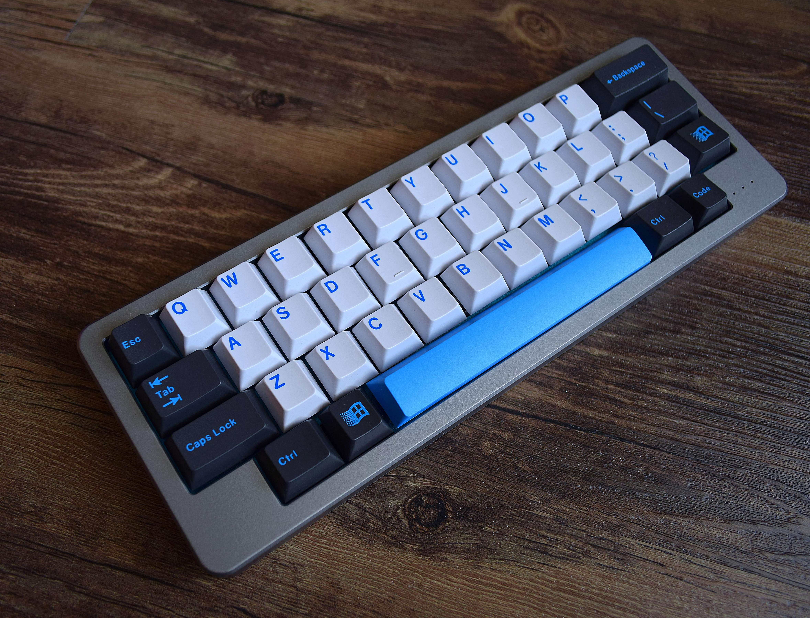
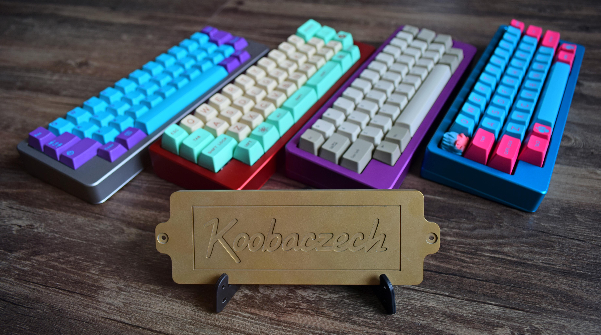
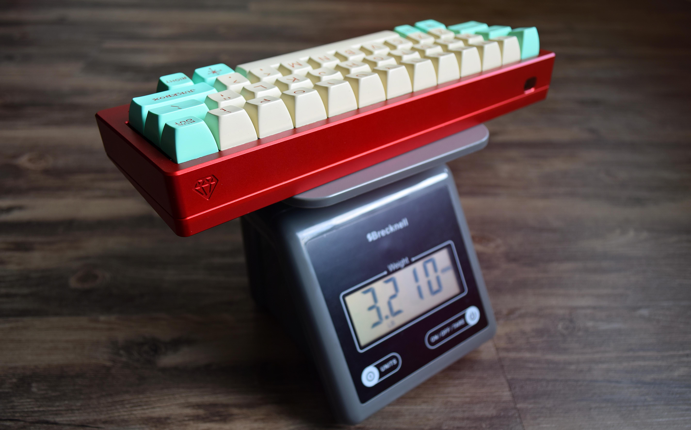
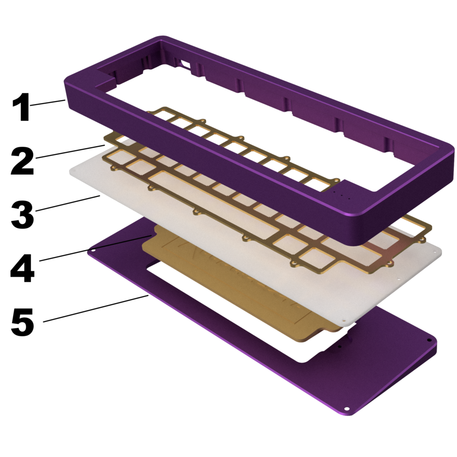
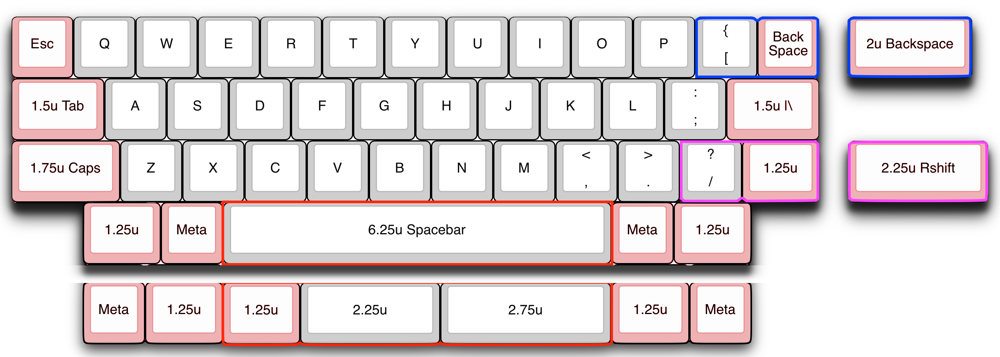

---

###Where to Buy
- Group Buy on [PearlBoards.com](https://www.pearlboards.com/products/pearl-40-groupbuy-closes-dec-1st) closes 2017-12-01

---

###Build Guides / Albums

---

###How to Program
- Bootmapper client or QMK

---

###Mods &amp; Addons

---

###More Info

---

###Gallery  

