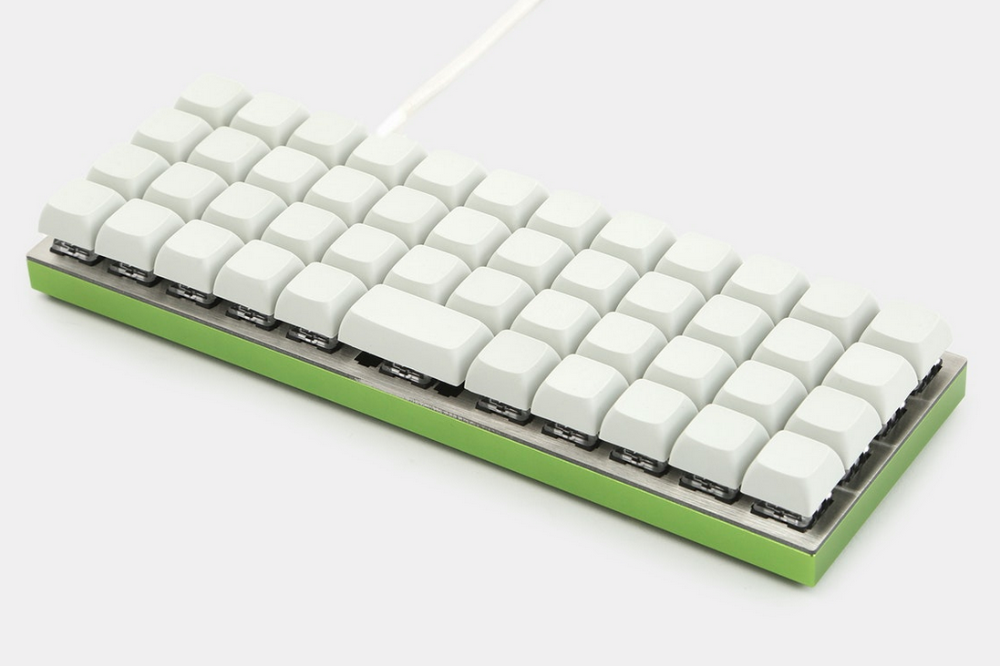
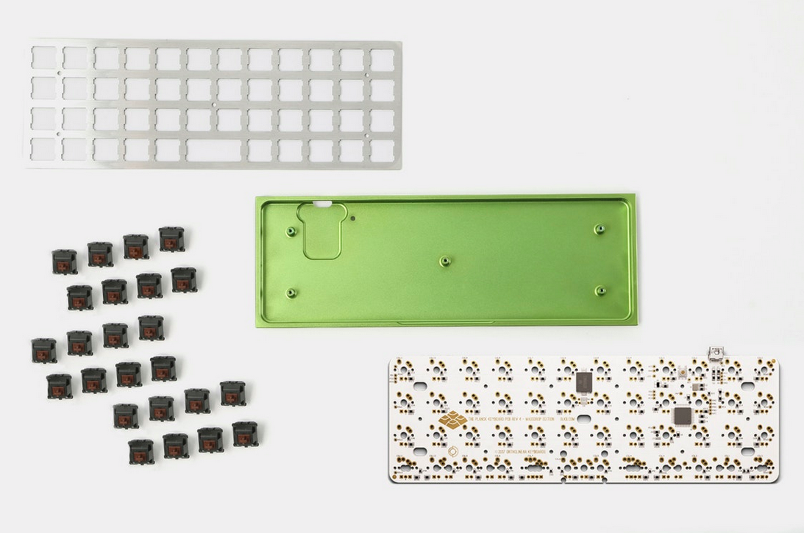
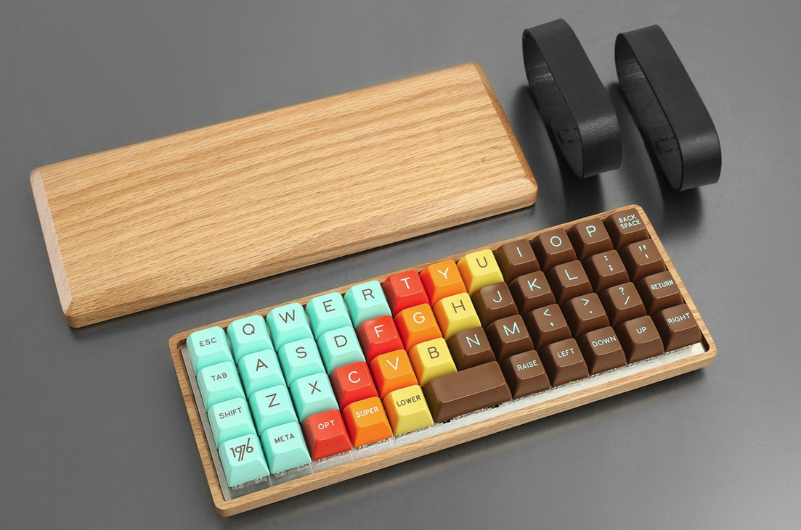

---

###Where to Buy
- Group Buy runs on [Massdrop](https://www.massdrop.com/buy/planck-mechanical-keyboard) once or twice a year.
- Planck Light on [Massdrop](https://www.massdrop.com/buy/massdrop-x-olkb-planck-light-mechanical-keyboard) currently (2017/11/28)
- Jack sells stock in his store on [OLKB.com](https://olkb.com/planck/)

---

###Build Guides / Albums
- How to Build a Planck by creator Jack Humbert on YouTube
<iframe width="560" height="315" src="https://www.youtube.com/embed/S2FApwzVxAQ?rel=0" frameborder="0" allowfullscreen></iframe> 
- Assembly Guide by [OLKB](https://olkb.com/help/guide/)
- Video Review by RhinoFeed on YouTube
<iframe width="560" height="315" src="https://www.youtube.com/embed/DdXA1D8y4TI?rel=0" frameborder="0" allowfullscreen></iframe> 
- Very First Planck Keyboard by Ptramo on [Reddit](https://www.reddit.com/r/MechanicalKeyboards/comments/2gmsps/photos_the_birth_of_the_very_first_planck/)
<blockquote class="imgur-embed-pub" lang="en" data-id="a/R9jib"><a href="//imgur.com/R9jib">[photos] The birth of the very first Planck</a></blockquote> 

---

###How to Program
- Full documentation on [QMK.fm](http://qmk.fm/keyboards/planck/)

---

###Mods &amp; Addons
- Bluetooth Planck my Adrien Friggeri on [Medium](https://medium.com/@friggeri/the-new-blanck-keyboard-c7563c4f9fa)
   - Reddit Post and Comments [here](https://www.reddit.com/r/MechanicalKeyboards/comments/6bxp62/build_log_the_new_blanck_bluetooth_planck/)
- Underglow addition by Kou5oku on [Reddit](https://www.reddit.com/r/MechanicalKeyboards/comments/46vcqw/yagp_yet_another_glowy_planck/)
<blockquote class="imgur-embed-pub" lang="en" data-id="a/KJkgC"></blockquote> 
- Datamance Wood Case for Planck on [Massdrop](https://www.massdrop.com/buy/datamancer-planck-hardwood-keyboard-case)
   

---

###More Info

---

###Gallery  

