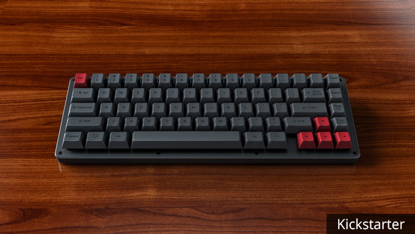

---

###Where to Buy
- Pre-Order Live! : [WhiteFox](https://kono.store/products/whitefox-mechanical-keyboard) | [NightFox](https://kono.store/products/nightfox-mechanical-keyboard) 
- ~~[Kickstarter](https://www.kickstarter.com/projects/lekashman/whitefox-mechanical-keyboard)~~ - ENDED
- ~~[MassDrop](https://www.massdrop.com/buy/the-whitefox-keyboard?utm_source=linkshare&referer=ACCCDX)~~ - R1 & R2 ENDED

---

###Build Guides / Albums
1. Video playlist by Input Club:
<iframe width="560" height="315" src="https://www.youtube.com/embed/YhfQRv8KLJU?rel=0" frameborder="0" allowfullscreen></iframe> 
2. Unboxing Album - [Reddit Post](https://www.reddit.com/r/MechanicalKeyboards/comments/4kj2q5/photoswhitefox_keyboard_barebones_kit_unboxing/)
<blockquote class="imgur-embed-pub" lang="en" data-id="a/GxeVt"><a href="//imgur.com/GxeVt">Whitefox Barebones Kit Unboxing</a></blockquote> 

---

###How to Program
- Visit this page for the online configurator: [https://input.club/configurator-whitefox/](https://input.club/configurator-whitefox/)
- Here is a link to the [QMK Branch](https://github.com/qmk/qmk_firmware/tree/master/keyboards/whitefox)

---

###Mods &amp; Addons
- Universal Plate by [Sentraq](https://sentraq.com/products/whitefox-aluminum-universal-plate)
- Hardwood Case by [Massdrop](https://www.massdrop.com/buy/hard-wood-case-for-white-fox-mechanical-keyboard?utm_source=linkshare&referer=ACCCDX)
- Anodized CNC Aluminum Cases by [Massdrop](https://www.massdrop.com/buy/anodized-cnc-aluminum-case-for-whitefox?utm_source=linkshare&referer=ACCCDX)

---

###More Info
- WhiteFox FAQ by [Matt3o](http://matt3o.com/whitefox-faq/)
- Making of the WhiteFox by [Matt3o](http://matt3o.com/whitefox-the-making-of/)
- Layout Options during Round 2:  
<blockquote class="imgur-embed-pub" lang="en" data-id="a/u9UUR"></blockquote> 

---

###Gallery  

Source: [Reddit.com](https://www.reddit.com/r/MechanicalKeyboards/comments/6ab1d3/gmk_honeywell_whitefox/)

Source: [Reddit.com](https://www.reddit.com/r/MechanicalKeyboards/comments/63r8vy/photos_ic_whitefox_w_granites/)

Source: [Kickstarter.com](https://www.kickstarter.com/projects/lekashman/whitefox-mechanical-keyboard/description)

