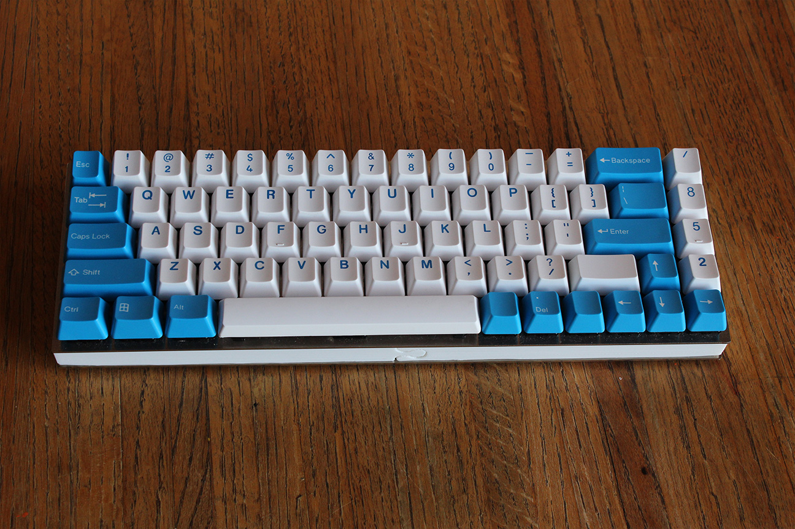

---

###Where to Buy
- ~~OLKB.co~~ - Discontinued: Jack decided to stick to Ortholinear keyboards and discontinued selling Neutrino plates

---

###Build Guides / Albums
- Build Log from me /u/koduh on [Imgur](https://imgur.com/a/KhP62)
<blockquote class="imgur-embed-pub" lang="en" data-id="a/KhP62"><a href="//imgur.com/KhP62">Neutrino Build Log</a></blockquote> 
- Album on Imgur
<blockquote class="imgur-embed-pub" lang="en" data-id="a/wPe1g"><a href="//imgur.com/wPe1g">DSA HyperFuse x Neutrino</a></blockquote> 
- Typing Test on YouTube
<iframe width="560" height="315" src="https://www.youtube.com/embed/IAf9-ehtSqI?rel=0&amp;showinfo=0" frameborder="0" allowfullscreen></iframe>

---

###How to Program
- TMK/QMK

---

###Mods &amp; Addons
- /u/niceandcreamy from Reddit converted his to bluetooth! [link](https://www.reddit.com/r/MechanicalKeyboards/comments/3i9ikm/bluetooth_neutrino_with_gmk_hyperfuse/)

---

###More Info

---

###Gallery  

