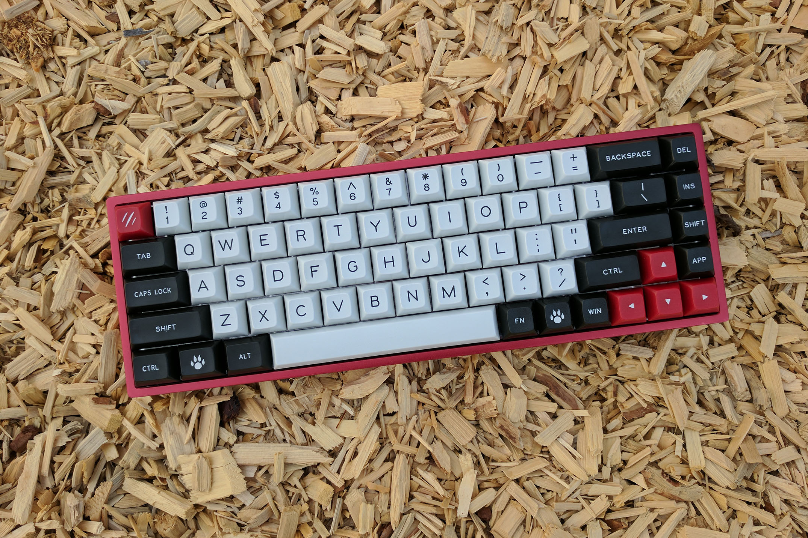
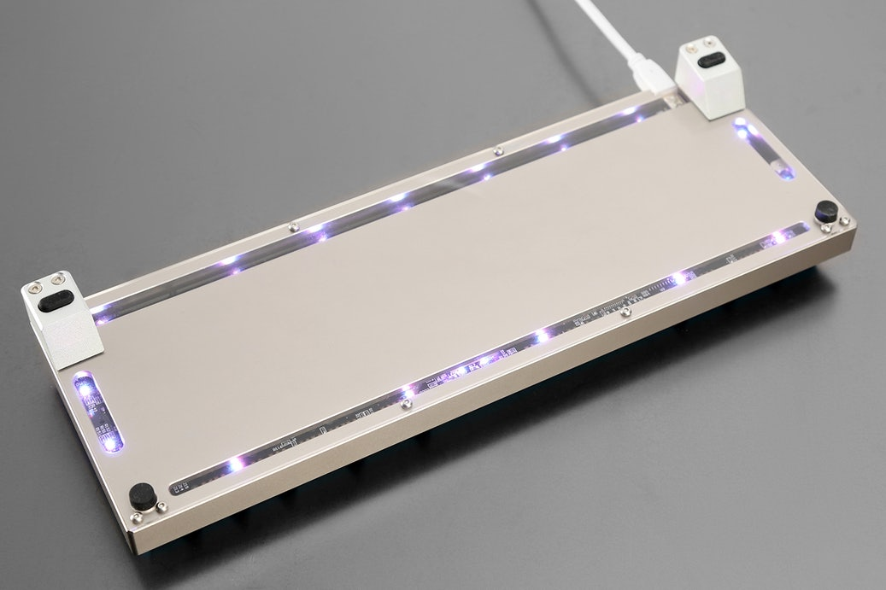
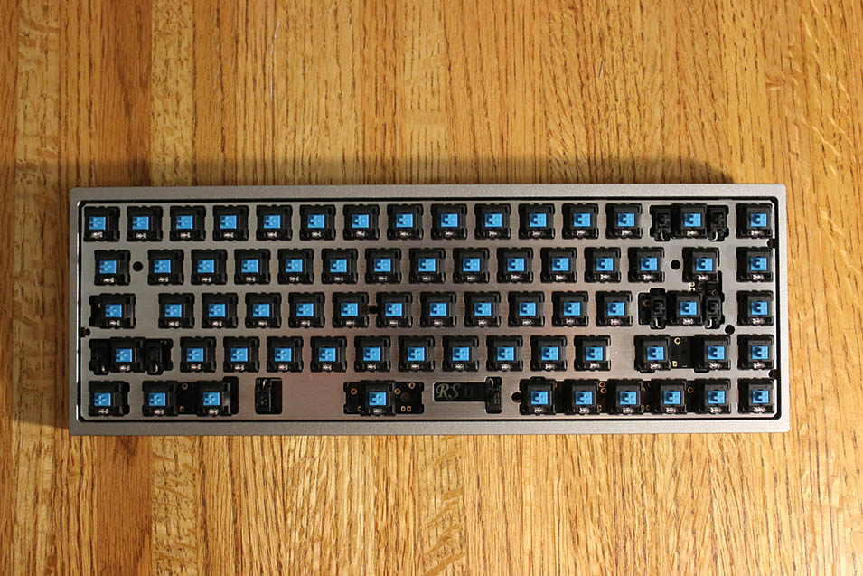

---

###Where to Buy
- ~~[MassDrop](https://www.massdrop.com/buy/red-scarf-ii-68-key-custom-keyboard-kit?utm_source=linkshare&referer=ACCCDX)~~ - R1 & R2 ENDED
- ~~[GeekHack GroupBuy](https://geekhack.org/index.php?topic=74400.0)~~ - These were originally sold in Group Buys on GeekHack and QQ groups. This thread has all the earliest info on all the RedScarf boards.

---

###Build Guides / Albums
- Build Log from /u/koduh on Imgur
<blockquote class="imgur-embed-pub" lang="en" data-id="a/1TfoZ"><a href="//imgur.com/1TfoZ">BlueScarf 68 II+ - RedScarf w/ &quot;Jailhouse&quot; Cherry MX Blues</a></blockquote> 

---

###How to Program
- Great guide by /u/livingspeedbump (creator of [Keychatter.com](http://Keychatter.com)) on how to program all the RedScarf boards: [Link to guide](https://www.massdrop.com/talk/732/programming-the-red-scarf-keyboards)
   - Here is a [link to my comment](https://www.massdrop.com/talk/732/programming-the-red-scarf-keyboards/571234) on this post that specifically talks about programming the RedScarf68.
- Another guide hosted on [Gitbook](https://www.gitbook.com/book/kairyu/red-scarf-ii-plus-user-guide-how-to-custom-layout/details)

   

---

###Mods &amp; Addons
- The RedScarf68 can fit into the High Profile cases sold for the TADA68/Saber68 boards. Here is an image that shows which screws/mounting holes line up.
   - [Link to $94 TADA68 Aluminum Case on AliExpress](https://www.aliexpress.com/store/product/Tada68-Mechanical-keyboard-anode-aluminum-high-Profiles-made-in-china/2230037_32790357144.html?spm=2114.12010612.0.0.5bdadf47X7jHgw)

---

###More Info

---

###Gallery

