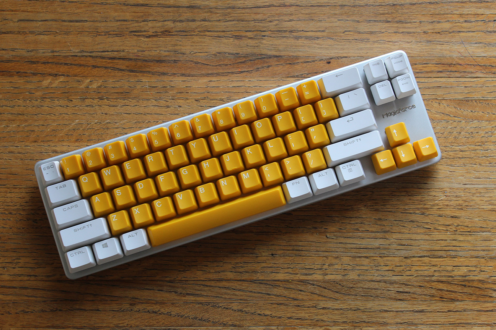
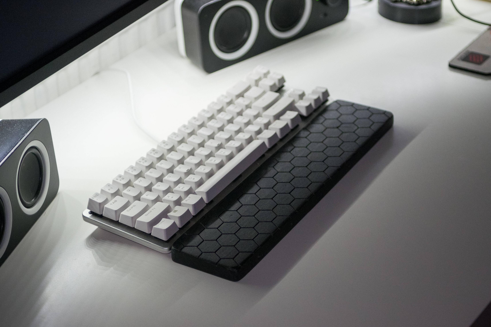
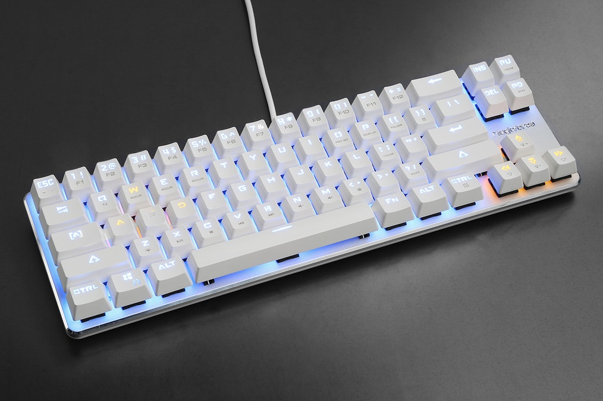

---

###Where to Buy
- [~$40 on Amazon - White Case Non-backlit w/ Outemu Brand Switches](http://amzn.to/2ftt9Cn)
- [~$70 on Amazon - White Case Backlit w/ Cherry Brand Switches](http://amzn.to/2yjiO3R)
- [~$63 on Amazon - White Case Backlit w/ Gateron Brand Switches](http://amzn.to/2wzHenv)
- [~$63 on Amazon - Black Case Backlit w/ Gateron Brand Switches](http://amzn.to/2wo4nhu)
     - Get a matching Numpad with it [~$30 on Amazon - Black Case Backlit w/ Gateron Brand Switches](http://amzn.to/2yiotqy)
- ~~[MassDrop - With Typewrite Style Keycaps](https://www.massdrop.com/buy/magicforce-68-key-mini-mechanical-keyboard?utm_source=linkshare&referer=ACCCDX)~~ - ENDED
- [$50 on AliExpress - DIY Build Kit](https://www.aliexpress.com/store/product/68-Keys-Mechanical-Keyboard-Customized-Set-PCB-Positioning-Board-Case-No-Switches-and-LED-Keycaps-included/429151_32572470432.html)
- [$60-$80 on AliExpress - Built w/ Kaihl Brand Switches](https://www.aliexpress.com/store/product/Balck-white-68-Key-PBT-compact-mini-mechanical-keyboard-kailh-mx-switches-game-Magicforce-68-mini/1806079_32471875698.html)

---

###Build Guides / Albums
- Unboxing Album by /u/planetperki
<blockquote class="imgur-embed-pub" lang="en" data-id="a/ydN6d"><a href="//imgur.com/ydN6d">Magicforce 68</a></blockquote> 

---

###How to Program
- DIP Switch Explanation by /u/Neralo on Reddit :::

   ===============================================
   
   Let me translate what I can. First time playing with tables, so excuse any formatting issues.
   
   First off, lets take a look at the **DIP Switches**
   
   DIP Switch | Function | Function when off | Function when on
   ---|---|----|----|----
   Switch 1 | Swap Caps Lock and Left Control  | **Button's function normally**. Caps is Caps, left Ctrl is left Ctrl | **Buttons functions switched.** Caps Lock = Left Ctrl, Left Ctrl = Caps Lock
   Switch 2 | Swap Win Key and Fn | **Keys function normally,** Win is Win, Fn is Fn | **Key Functions switched,** Win is Fn, Fn is Win. 
   Switch 3 | Lock Win Key | Win Key **unlocked**, pressing it opens start menu | Win Key **locked**, will not do anything. 
   
   This next section is for the escape key functions. Note that the combination **FN+Q** will switch the functions slightly. Its noted in the table below.
   
   
   Key Combination | Normal Result | After Fn+Q
   ---|---|----
   Just ESC | ESC | `
   Shift+ESC | ~ | ~
   Fn+ESC | ` | ESC
   
   
   Finally, lets look at the **Fn Layer** properly. 
   
   
   Key Combination | Function | Key Combination | Function
   ---|---|----|----
   Fn+W | Polling rate 20C/S | Fn+; | Home
   Fn+E | Polling rate: 40C/S | Fn+/ | End
   Fn+R | Polling Rate 60C/S | Fn+Page Up | Home
   Fn+1 to = | F1 - F12 | Fn+Page Down | End
   Fn+Z | Launch default media app | Fn+O | Print Screen/SysReq
   Fn+X | Play/Pause | Fn+P | Scroll Lock
   Fn+C | Stop | Fn+[ | Pause Break
   Fn+V | Previous Song | Fn+] | Calculator
   Fn+B | Next Song | Fn+Up arrow | Increase LED Brightness
   Fn+N | Volume Down | Fn+Down arrow | Lower LED brightness, keep pressing to turn them off
   Fn+M | Volume Up | Fn+Left Arrow | On/Off LED Breathing Mode
   Fb+< | Mute | Fn+Right arrow | LED Breathing mode speed 
   
   
   Feel free to let me know if there's anything else you'd like to know, or if you've got other questions. 

   Source: I own the magicforce 68, and I'm fluent in mandarin. 
   
   ===============================================
   
   See Original Post on [Reddit](https://www.reddit.com/r/MechanicalKeyboards/comments/470asq/magicforce_68_english_guide/d09cnd2/).

---

###Mods &amp; Addons
- Sticker Bomb &amp; Case painting by /u/koduh
<blockquote class="imgur-embed-pub" lang="en" data-id="a/ld0vj"><a href="//imgur.com/ld0vj">MyLittlePonyForce68</a></blockquote> 
- Sticker Bomb by /u/thedoqtor
<blockquote class="imgur-embed-pub" lang="en" data-id="a/I2kjv"><a href="//imgur.com/I2kjv">MagicForce Sticker Bomb</a></blockquote> 
- Highprofile Walnut Woodcase w/ Built in wrist wrest by /u/YucA305
<blockquote class="imgur-embed-pub" lang="en" data-id="a/yKKHw"><a href="//imgur.com/yKKHw">Magicforce Modding</a></blockquote> 
- Stickerbombing Video by /u/zimizimi
<iframe width="560" height="315" src="https://www.youtube.com/embed/HRsyLuPMtRE?rel=0&amp;showinfo=0" frameborder="0" allowfullscreen></iframe> 
- Replace the PCB and make your MagicForce fully programmable via QMK! [More info here](https://github.com/di0ib/tmk_keyboard/tree/master/keyboard/mf68) 
- Another way to make your MagicForce fully programmable is to handwire it to a Andruino Micro. [More info here](https://github.com/qmk/qmk_firmware/tree/master/keyboards/handwired/magicforce68) 

---

###More Info
- Overwatch Pro "Saebyeolbe" uses a MagicForce68 w/ Typewrtiter caps while playing

---

###Gallery  

