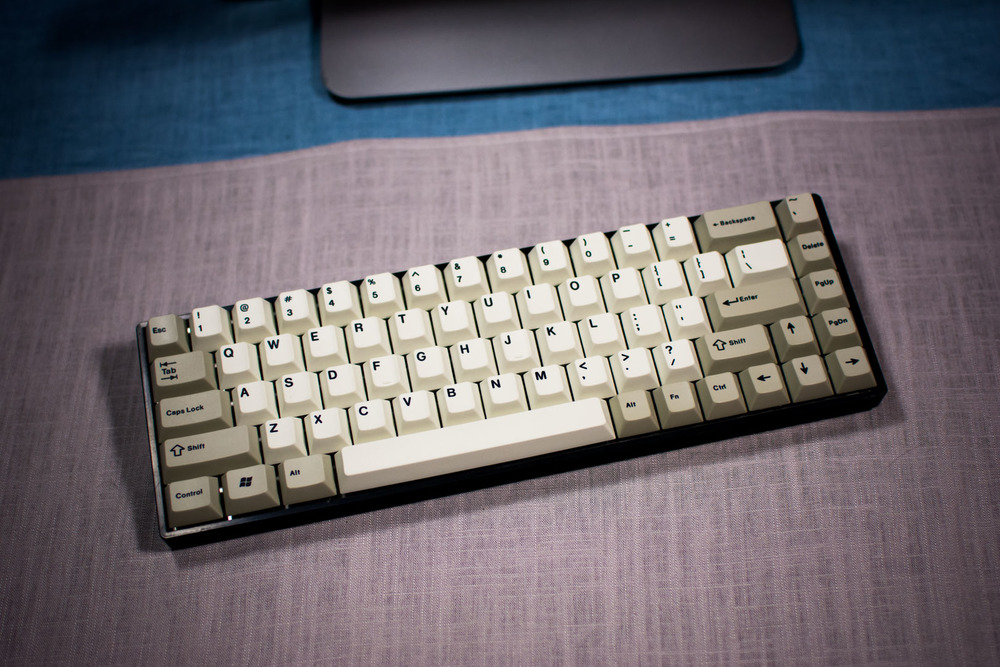

---

###Where to Buy
- [$89: TADA68 DIY Kit - KBDFans.cn](https://kbdfans.cn/collections/keyboard/products/tada68-keyboard-diy-kit) 
- [$99-$161: TADA68 Built w/ Optional Aluminum Case - KBDFans.cn](https://kbdfans.cn/collections/keyboard/products/tada68-mechanical-keyboard-gateron-swtich-65-layout-dye-sub-keycaps-cherry-profils?variant=34710238797) 
- [$94-$205: TADA68 Built w/ Optional Aluminum Case &amp; choice of Gateron/Cherry/Zealio switch - KBDFans AliExpres Shop](https://www.aliexpress.com/store/product/Tada68-diy-kit-Custom-mechanical-keyboard-Cherry-gateron-zealio-switch-can-choose/2230037_32821254418.html?spm=2114.12010612.0.0.5bdadf47X7jHgw) 
- [$60: TADA68 - Taobao.com](https://world.taobao.com/item/537653557670.htm#detail) - NOTE: Ordering from Taobao takes some learning as it is a Chinese site for selling goods to mainland China.
- [$130-$150: Saber68 - KBDist.com w/ Gateron or MOD brand switches](http://www.kbdist.com/shop/saber-68)
- [$119: Saber68 Aluminum Case - Originative.co](https://originative.co/products/saber-case)

---

###Build Guides / Albums
- Photo from /u/-Mateo- on [Reddit](https://www.reddit.com/r/MechanicalKeyboards/comments/66t8wp/photos_aqua_aluminum_tada68_love_this_thing/)
<blockquote class="imgur-embed-pub" lang="en" data-id="s2hoTdo"><a href="//imgur.com/s2hoTdo">[photos] Aqua aluminum Tada68! Love this thing!</a></blockquote> 
- Photos from /u/phatskin on [Reddit](https://www.reddit.com/r/MechanicalKeyboards/comments/6u07a9/assembling_this_tada68_was_solid_fun/)
<blockquote class="imgur-embed-pub" lang="en" data-id="a/X163R"></blockquote> 
- Photos from /u/dro524 on [Reddit](https://www.reddit.com/r/MechanicalKeyboards/comments/5xhtxt/tada68_new_case_caps/)
<blockquote class="imgur-embed-pub" lang="en" data-id="a/GGGin"><a href="//imgur.com/GGGin">TADA68 - New Case &amp; Caps</a></blockquote> 

---

###How to Program
Note: You can program the TADA68/Saber68 with QMK or the Online Configurator
- Program via QMK with the [branch here](https://github.com/qmk/qmk_firmware/tree/master/keyboards/tada68).
- [Online Configurator available here](http://123.57.250.164:3000/tada68), follow the instructions below on how to use it and how to flash your board:

> NOTE: rename layout to "flash.bin" before putting it on the keyboard. 
> 
> Create layout using online editor here: http://123.57.250.164:3000/tada68
> 
> 	1. If you’re using Google Chrome, just right-click on that page and hit “Translate to English”. 
> 	2. Click the key you want to change, then click the function you want to map.  
>      * One hiccup: I went to set CapsLock as a Fn key, and it brought up another sub-menu, and that wasn’t translated to English.  I picked the second option, then chose layer 1, and that seemed to work.  If you’re mapping multiple layers or want to do stranger things, godspeed.
> 	3. Once you’re done with your mappings, hit that big green “Compiler” button. It’ll take a second to load & then it'll prompt to save a file called FLASH.BIN. Not sure if renaming it is bad or not. But save it and it’ll download to your default download folder.
> 
> Time to program the keyboard
> 	1. Press button on the bottom of the board; if you turn it over, it’s on the right side, or under the left side if the board’s right-side up.  This will cause the backlights to start flashing.
> 	   * NOTE: THE KEYBOARD IS UNUSABLE AT THIS POINT.
>   2. You may have noticed that when you pushed the button, a new drive will have connected to your PC; that’s the TADA68’s storage.  If you open it, there’s a FLASH.BIN file in there.
>   3. Create a copy of the original FLASH.BIN file and store on your computer so you’ll always have it just in case.
>   4. Once copied, Delete the file from TADA68’s storage.  
>   5. Find your FLASH.BIN file that you downloaded and copy it.
>   6. Paste your new FLASH.BIN file in the TADA68's storage.
>      * NOTE: If you just try to paste over it, you’ll get a warning that there isn’t enough space for the file operation.  You have to delete it first.
>   7. Press the ESC key; this will restart the TADA68 (literally takes a second), and your new mappings should be live.
> 	
> See?  Very simple, but the included instructions weren’t sufficient.  Hopefully that gets fixed eventually.
> 
> NOTE: The LED Up and LED Dn will just cycle throught the LED modes.
>
> LED Lighting Modes: 
		> * Off
		> * Low
		> * Med
		> * High
		> * Breathe slow
		> * Breathe med
		> * Breathe fast
		> * Breathe really fast
		> * Off + Breathe while typing
		> * Low + Breathe while typing
		> * Med + Breathe while typing
		> * High + Breathe while typing
> 		
		> 
> ============
> 
> In order from top to bottom, the fn drop down menu options are:
> * No Operation
> * Momentary Press
> * Open / On
> * Closed / Off
> * Toggle
> * Momentary AND Press
> * Modifier
> * Combination Key
> * Tap Modifier Key
> * Toggle Modifier Key
> * Macro

- Here are some premade layouts (.bin files) you can download and flash on your keyboard. [Dropbox Link.](https://www.dropbox.com/sh/chvhhkbz83n6whe/AABDMOv3CBsD65Y6fvg5xIxBa?dl=0)
- Here is a Windows 10 Guide for QMK for the TADA68 - [Reddit Post](https://www.reddit.com/r/MechanicalKeyboards/comments/6z61px/tada68_qmk_windows_10_install_guide/)

---

###Mods &amp; Addons
- Add a USB Hub in the plastic case by /u/koduh
<blockquote class="imgur-embed-pub" lang="en" data-id="a/8opIc"><a href="//imgur.com/8opIc">DIY Adding USB hub to TADAD68</a></blockquote> 
- Convert your ANSI keyboard into an ISO version, the [PCB supports it](https://imgur.com/a/3tKAZ), you just have to modify your plate or order one 2nd hand.
   - Photo from /u/duynguyenle
<blockquote class="imgur-embed-pub" lang="en" data-id="UwjurEN"></blockquote> 
   - Before and After Photos from /u/CB279 on [Reddit](https://www.reddit.com/r/MechanicalKeyboards/comments/5diejb/custom_tada68_iso_plate_by_uduynguyenle/)
<blockquote class="imgur-embed-pub" lang="en" data-id="lIBFdor"><a href="//imgur.com/lIBFdor">Custom Tada68 Iso Plate by /u/duynguyenle</a></blockquote> 

---

###More Info
- A new variant of TADA recently released called the "Snow" or White version that has an all white plastic case and Future type face keycaps

- Keycap Sizes Chart

---

###Gallery  

