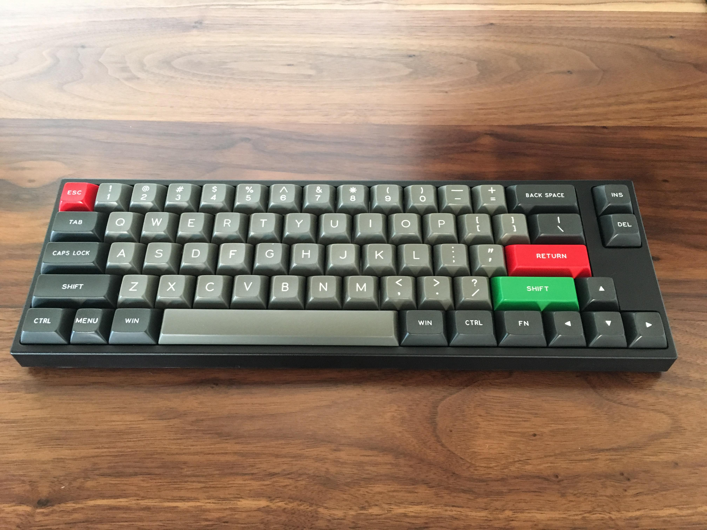
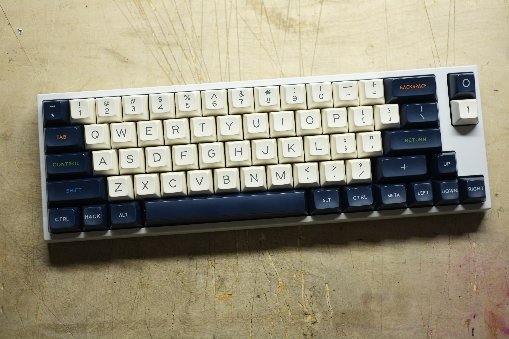
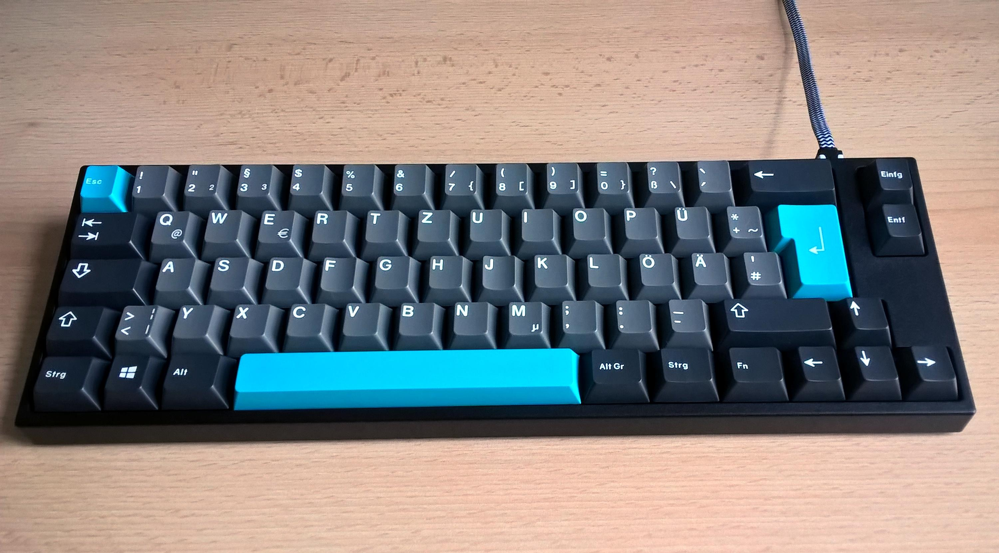
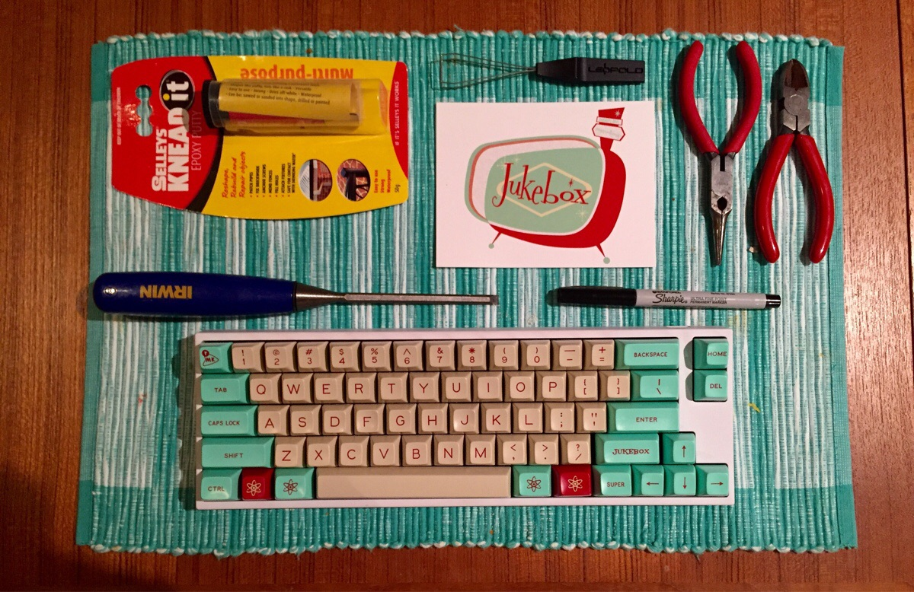

---

###Where to Buy
- $109 - Free Shipping - [MechanicalKeyboards.com](https://mechanicalkeyboards.com/shop/index.php?l=product_list&c=358)
- ~~[Massdrop](https://www.massdrop.com/buy/leopold-fc660m?utm_source=linkshare&referer=ACCCDX)~~ - Ended
- Aluminum Case: ~~[Massdrop](https://www.massdrop.com/buy/aluminum-case-for-leopold-fc660m?utm_source=linkshare&referer=ACCCDX)~~ - Ended
- Aluminum Case: $109 - Free Shipping - [AliExpress](https://www.aliexpress.com/store/product/Free-shipping-High-quality-CNC-Anodizing-Aluminum-Case-for-LEOPOLD-FC660M-Mechanical-Gaming-Keyboard-Including-Alu/429151_32683736577.html)
- Aluminum Case: $125 - Free Shipping - [Amazon](http://amzn.to/2jPcn58)

---

###Build Guides / Albums
- Photos by RESPRiT on [Reddit](https://www.reddit.com/r/MechanicalKeyboards/comments/1sv180/photos_white_leopold_fc660m_with_browns/)
<blockquote class="imgur-embed-pub" lang="en" data-id="a/6daju"><a href="//imgur.com/6daju">[photos] White Leopold FC660M with Browns - High-Quality Album</a></blockquote> 
- Photos by Jaceun on [Reddit](https://www.reddit.com/r/MechanicalKeyboards/comments/4tcwtv/carbon_sa_on_a_leopold_fc660m_aluminum_case/) ft. SA Carbon Keyset &amp; Aluminum Case
<blockquote class="imgur-embed-pub" lang="en" data-id="a/RpNAu"><a href="//imgur.com/RpNAu">Carbon SA on a Leopold FC660M + Aluminum Case</a></blockquote> 
- Photos by Tuuuuuuuuuuuuuuurkey on [Reddit](https://www.reddit.com/r/MechanicalKeyboards/comments/72nlni/sticker_bombed_my_fc660m/):
<blockquote class="imgur-embed-pub" lang="en" data-id="a/EckLX"><a href="//imgur.com/EckLX">Sticker bombed my FC660M :)</a></blockquote>

---

###How to Program
- DIP Switches

---

###Mods &amp; Addons
- Wood Case by Gameruins on [Reddit](https://www.reddit.com/r/MechanicalKeyboards/comments/5yvn9a/photos_leopold_fc660m_w_custom_wood_case/)
<blockquote class="imgur-embed-pub" lang="en" data-id="a/nzjnJ"><a href="//imgur.com/nzjnJ">Leopold FC660M w/ Custom Wood Case</a></blockquote> 
- Arrow Cluster LEDs by Rety20 on [Reddit](https://www.reddit.com/r/MechanicalKeyboards/comments/2cxngn/modificationguide_fc660m_easy_arrow_cluster_led/)
<blockquote class="imgur-embed-pub" lang="en" data-id="a/5KNmJ"><a href="//imgur.com/5KNmJ">[Guide] Leopold FC660m Easy arrow cluster LED mod</a></blockquote> 
- Spacebar stem mod (Pre-2015 Models) by Legobits on [Reddit](https://www.reddit.com/r/MechanicalKeyboards/comments/3rhf4s/jukebox_sa_on_leopold_fc660m_with_spacebar_mod/cwo1igd/)

---

###More Info
- The original FC660Ms came with a non-standard spacebar which makes using after market keycaps difficult without some modding. As of 2015 they changed to a normal spacebar.
    - Source post on [Reddit](https://www.reddit.com/r/MechanicalKeyboards/comments/3te15f/keyboard_science_photos_new_2015_fc660m_vs_old/) with album:
<blockquote class="imgur-embed-pub" lang="en" data-id="a/TM7E4"><a href="//imgur.com/TM7E4"> old fc660m vs 2015 model comparison</a></blockquote>

---

###Gallery  

