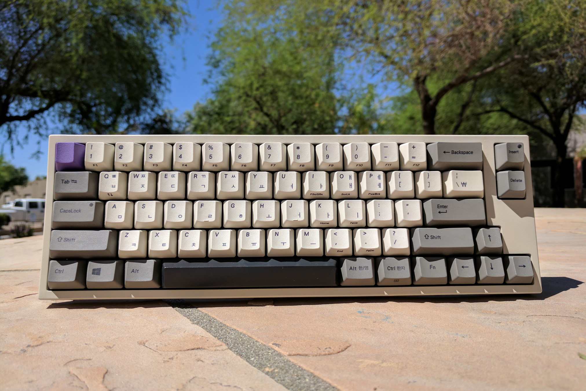
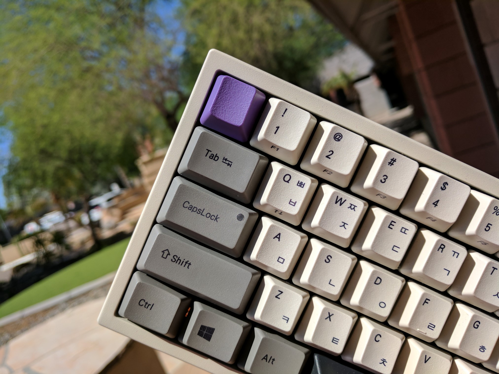
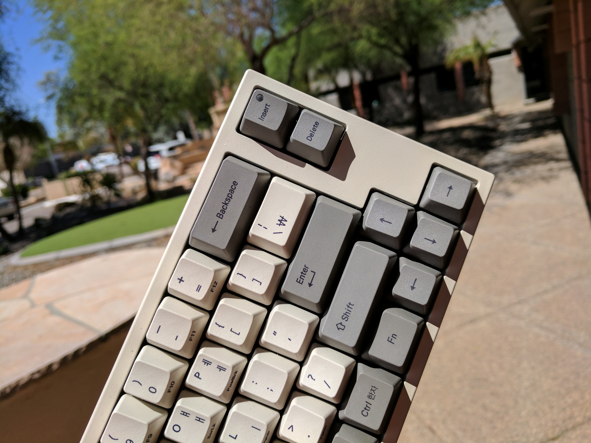
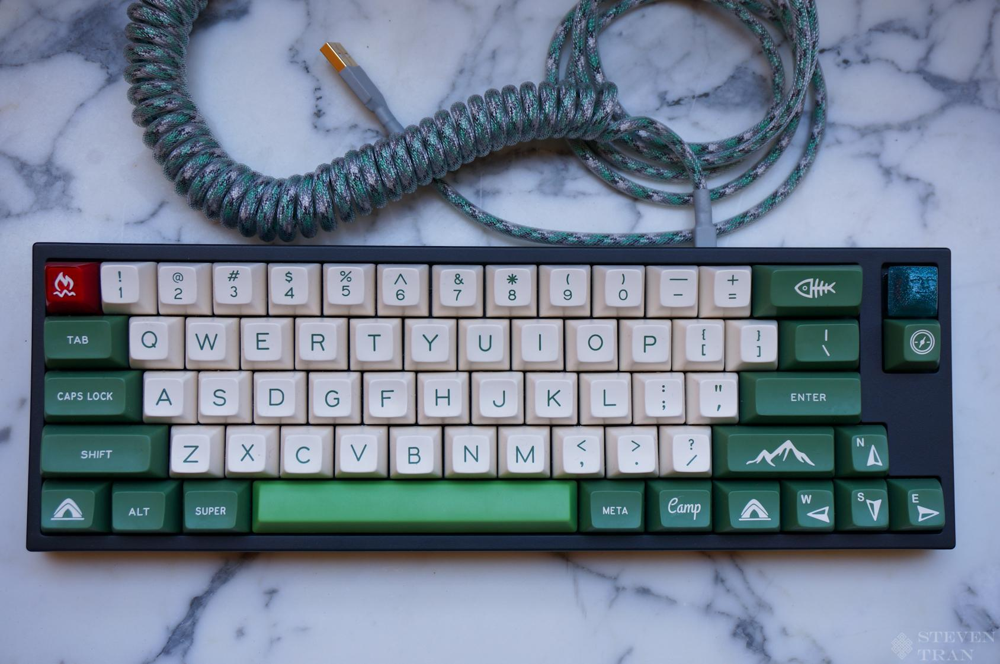

---

###Where to Buy
- $229 - Free Shipping - [MechanicalKeyboards.com](https://mechanicalkeyboards.com/shop/index.php?l=product_list&c=170)
- $254 - Free Shipping w/ [Amazone Prime](http://amzn.to/2wNv4aD)
- $189 - Been out of stock for a while now: [EliteKeyboards](https://elitekeyboards.com/products.php?sub=leopold,compact&pid=fc660c)
- $46 - Hasu Replacement Controller - [1upKeyboards.com](https://1upkeyboards.com/fc660c-controller.html)
- $39 - JTK MX Sliders - [Originative.co](https://originative.co/products/mx-sliders)
- $59 - JTK MX Sliders - [KBDFans - AliExpress Shop](https://www.aliexpress.com/store/product/JTK-Topre-to-MX-adapter-Topre-change-into-MX-switch/2230037_32799120843.html)

---

###Build Guides / Albums
- Photo Album by Basic_edits (aka Booper) on [Reddit](https://www.reddit.com/r/MechanicalKeyboards/comments/3ck5sg/photos_65_for_those_who_like_small_keyboards_but/)
<blockquote class="imgur-embed-pub" lang="en" data-id="a/IwlIO"><a href="//imgur.com/IwlIO">[photos] 65% - for those who like small keyboards but want arrow keys! - Leopold fc660c</a></blockquote> 
- Typing Video by LivingSpeedBump from KeyChatter.com
<iframe width="560" height="315" src="https://www.youtube.com/embed/A5-NFfo-F4E?rel=0" frameborder="0" allowfullscreen></iframe> 
- Guide / Walkthrough of the FC660c by iluvbeanz on YouTube
<iframe width="560" height="315" src="https://www.youtube.com/embed/E8IfxwV_fHg?rel=0" frameborder="0" allowfullscreen></iframe>

---

###How to Program
- DIP Switches: 

Important! The keyboard should be unplugged while changing the DIP switch settings; otherwise the changes may not be recognized.

| DIP Switch | Key/Function | SW OFF | SW ON |
| ---- | ---- | ---- | ---- |
| SW1 | Ctrl (left) | Ctrl (left) | Caps Lock |
| SW1 | Caps Lock | Caps Lock | Ctrl (left) |
| SW2 | Windows | Windows | Alt (left) |
| SW2 | Alt (left) | Alt (left) | Windows |
| SW3 | Windows | Windows | Fn |
| SW3 | Fn | Fn | Windows |
| SW4 | Windows | Enabled | Disabled |

- FN Layer

| Key Combination | Function |
| ---- | ---- |
| Fn + Q | Toggle default action for Esc key  between Esc and Backtick  Toggle Insert LED On/Off  to indicate state this change |
| Fn + Number Row | F1-F12 |
| Fn + Arrow Up | Page Up |
| Fn + Arrow Down | Page Down |
| Fn + Arrow Left | Home |
| Fn + Arrow Right | End |
| Fn + Ctrl (right) | Menu |
| Fn + I | Print Screen/System Request |
| Fn + O | Scroll Lock |
| Fn + P | Pause/Break |
| Fn + K | Home |
| Fn + L | Page Up |
| Fn + < | End |
| Fn + > | Page Down |
| Shift + Esc | ~ |
| Fn + Esc | ` |

- Installing &amp; Programming a Hasu Controller in your FC660c by u/stoic-lemon on [Reddit](https://www.reddit.com/r/MechanicalKeyboards/comments/66i2wo/fc660c_out_with_the_old_controller/)
<iframe width="560" height="315" src="https://www.youtube.com/embed/TYmAb8zOPWU?rel=0" frameborder="0" allowfullscreen></iframe>

- Quick Links for Programming a Hasu controller:
   - [Online Keymap Editor](http://www.tmk-kbd.com/tmk_keyboard/editor/unimap/)
   - [Original GeekHack thread which describes install, remap, and flashing instructions](https://geekhack.org/index.php?topic=90317.0)
   - [How to flash firmware](https://github.com/tmk/tmk_keyboard/wiki#flash-firmware)

---

###Mods &amp; Addons
- FC660c Replacement Controller for Full Programmability in TMK/QMK developed by Hasu on [GeekHack](https://geekhack.org/index.php?topic=88439.0)
   - Purchase the Hasu controller from [1upkeyboards.com](https://1upkeyboards.com/fc660c-controller.html) or from [Hasu's Group Buy](https://geekhack.org/index.php?topic=90317.0) 
- Silencing Mod by Tiltowaitt on [Reddit](https://www.reddit.com/r/MechanicalKeyboards/comments/285em9/modification_i_installed_a_silent_mod_on_my/)
<blockquote class="imgur-embed-pub" lang="en" data-id="a/YAMbH"><a href="//imgur.com/YAMbH">Leopold FC660C Silent Mod</a></blockquote> 
- Topre to MX replacement sliders to use MX compattible keysets on your FC660c! Read a review on [Reddit](https://www.reddit.com/r/MechanicalKeyboards/comments/636zie/review_jtk_vs_novatouch_sliders/)
   - Purchase from [Originative](https://originative.co/products/mx-sliders)
<blockquote class="imgur-embed-pub" lang="en" data-id="a/EFKq7"><a href="//imgur.com/EFKq7">Review: JTK vs Novatouch Sliders</a></blockquote>    

---

###More Info

---

###Gallery  

Source: [Reddit](https://www.reddit.com/r/MechanicalKeyboards/comments/6wjcpw/sa_camping_on_fc660c/)
