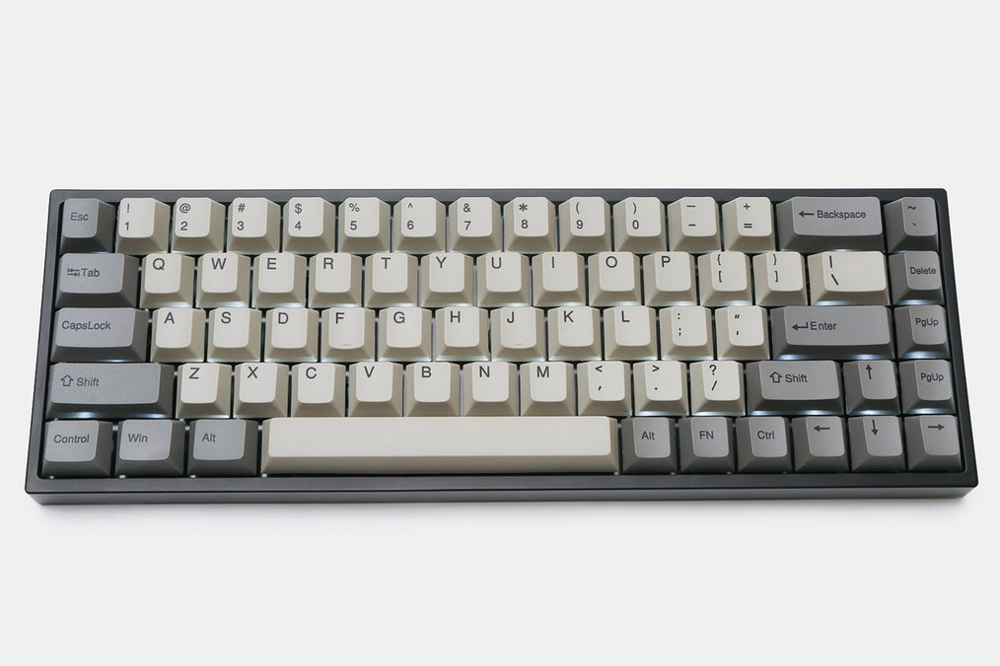
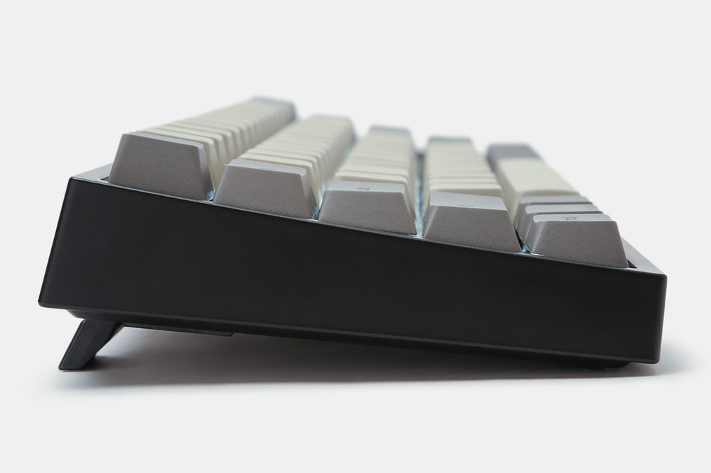
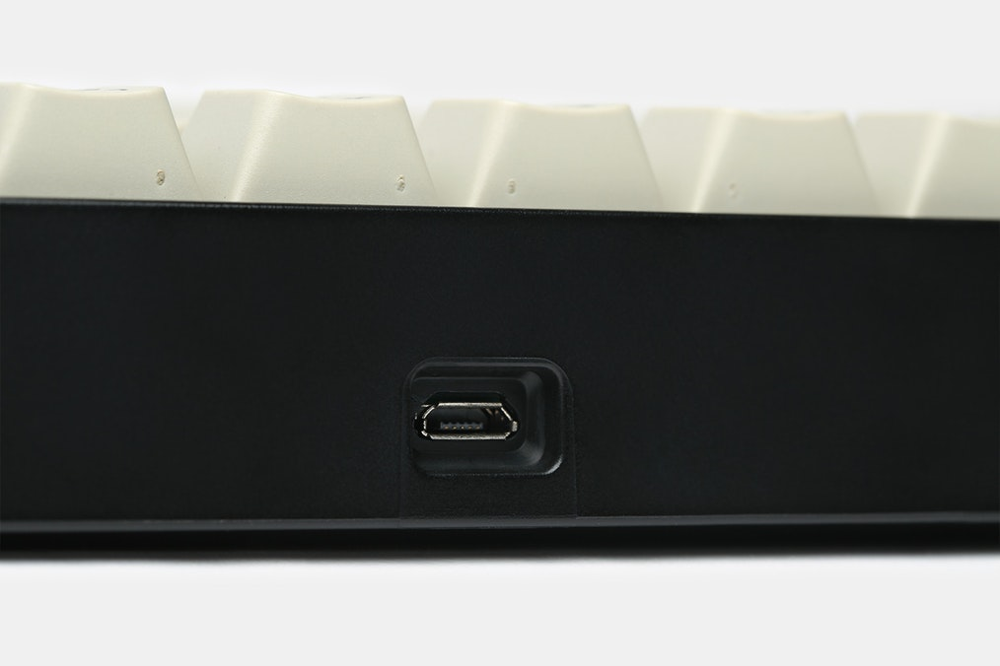

---

###Where to Buy
- ~~$99 on [Massdrop](https://www.massdrop.com/buy/keywalker-68-bluetooth-mechanical-keyboard?utm_source=linkshare&referer=ACCCDX)~~ - R1 Ended
- $137 from a Taobao Agent - [EnglishTaobao.net](https://www.englishtaobao.net/product/553190209186/0)
   - $91 - Original [Taobao listing](https://world.taobao.com/item/555743764637.htm?spm=a312a.7700714.0.0.6419a3bc50V5PL)

---

###Build Guides / Albums
- Photos from JonnyUnreliable on [Reddit](https://www.reddit.com/r/MechanicalKeyboards/comments/6pxpxv/keywalker_68_from_massdrop_w_maxkeys_sa_ashens/)
<blockquote class="imgur-embed-pub" lang="en" data-id="a/vj0Cm"><a href="//imgur.com/vj0Cm">KeyWalker 68 Key - Maxkeys SA Ashens</a></blockquote> 
- Unboxing Album from Furykai on [Reddit](https://www.reddit.com/r/MechanicalKeyboards/comments/6rh340/keywalker/)
<blockquote class="imgur-embed-pub" lang="en" data-id="a/KQGNN"><a href="//imgur.com/KQGNN">Keywalker</a></blockquote>

---

###How to Program
- A [github repo](https://github.com/GonzaloAlvarez/ifd68) has been created to attempt to recreate some more resources on thise keyboard as the origins are hazy. He has included the original programming Windows program that you can download and attempt to program your board with. 
   - I downloaded the github repo and re-hosted here just in case it goes down. [Download the .zip](ifd68-master.zip)

---

###Mods &amp; Addons

---

###More Info
- Here is the [pdf manual for the Keywalker mechanical keyboard](keywalker-wireless-mechanical-keyboard-manual.pdf).
- Announcement thread on [Reddit](https://www.reddit.com/r/MechanicalKeyboards/comments/6diwkb/buying_100_68_key_bluetooth_keyboard_the_keywalker/)

---

###Gallery  

