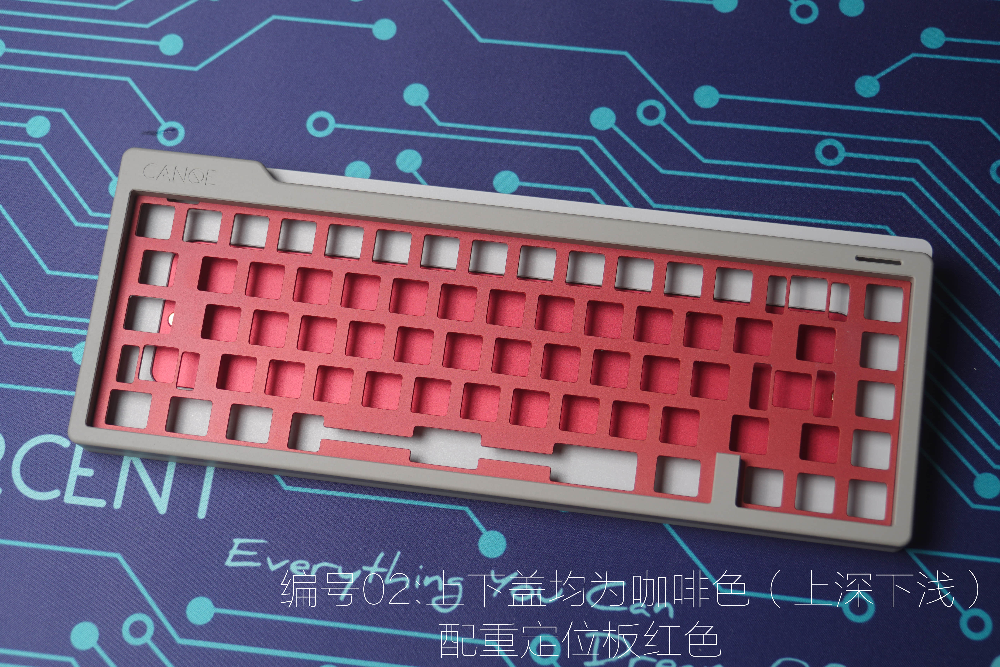

---

###Where to Buy
- Interest Check on GH - Possibly [October 2017 GB](https://geekhack.org/index.php?topic=91559.msg2495062#msg2495062): [GeekHack Post](https://geekhack.org/index.php?topic=91559.0)
- ~~[GroupBuy / Taobao.com](https://world.taobao.com/item/557265083694.htm?fromSite=main&spm=a1z10.3-c.w4002-15243948423.31.3ff19e11HGuPFj)~~ - R1 ENDED - Only 40 units

---

###Build Guides / Albums
1. First Teaser from Kingnestea on [Reddit](https://www.reddit.com/r/MechanicalKeyboards/comments/6o09qz/canoe_by_percent_with_gmk_hyperfuse/):
<blockquote class="imgur-embed-pub" lang="en" data-id="a/FI8ps"><a href="//imgur.com/FI8ps">Canoe by Percent with GMK Hyperfuse</a></blockquote> 
2. Photos of "Captain America" Canoe from Zimoxx on [Reddit](https://www.reddit.com/r/MechanicalKeyboards/comments/6y23rf/photosthe_canoe_of_captain_america/):
<blockquote class="imgur-embed-pub" lang="en" data-id="a/FMhCJ"><a href="//imgur.com/FMhCJ">Canoe</a></blockquote> 
3. Photos w/ GMK Hyperfuse from Zimoxx:
<blockquote class="imgur-embed-pub" lang="en" data-id="a/LMc8D"><a href="//imgur.com/LMc8D">canoe</a></blockquote> 
4. Photos w/ SA PhotoStudio from Zimoxx on [Reddit](https://www.reddit.com/r/MechanicalKeyboards/comments/6ugp2p/sa_photostudio_and_mix_originative_penumbra/):
<blockquote class="imgur-embed-pub" lang="en" data-id="a/WM0Qo"><a href="//imgur.com/WM0Qo">SA PhotoStudio </a></blockquote> 
5. Photos w/ SA GodSpeed from Zimoxx on [Reddit](https://www.reddit.com/r/MechanicalKeyboards/comments/71bg2o/godspeed_on_canoe/?utm_content=comments&utm_medium=user&utm_source=reddit&utm_name=frontpage):
<blockquote class="imgur-embed-pub" lang="en" data-id="a/tj3sB"><a href="//imgur.com/tj3sB">Godspeed with Canoe</a></blockquote> 
6. Photos w/ Maxkeys Cyan on Dolch from Necromanx on [Reddit](https://www.reddit.com/r/MechanicalKeyboards/comments/71yy2c/my_canoe_my_endgame/)
<blockquote class="imgur-embed-pub" lang="en" data-id="a/87KtO"><a href="//imgur.com/87KtO">Canoe with Maxkeys Cyan on Dolch (Kailh BOX Black switches)</a></blockquote> 
7. Photos of PCB &amp; Case Yuppieee [Reddit](https://www.reddit.com/r/MechanicalKeyboards/comments/72peu0/photos_canoe_by_percent_with_67g_zilent_blacks/)
<blockquote class="imgur-embed-pub" lang="en" data-id="a/PQkL7"><a href="//imgur.com/PQkL7">[photos] Canoe by Percent with 67g Zilent Blacks</a></blockquote> 
8. Typing Video from Kingnestea
<iframe width="560" height="315" src="https://www.youtube.com/embed/d8PPow1r5iY?rel=0" frameborder="0" allowfullscreen></iframe>

---

###How to Program
- 

---

###Mods &amp; Addons
- Dyed switch housings by Kingnestea on [Reddit](https://www.reddit.com/r/MechanicalKeyboards/comments/6z1qy1/65_end_game/)
<blockquote class="imgur-embed-pub" lang="en" data-id="a/kqH0p"><a href="//imgur.com/kqH0p">65% End game</a></blockquote>

---

###More Info
- 

---

###Gallery  

