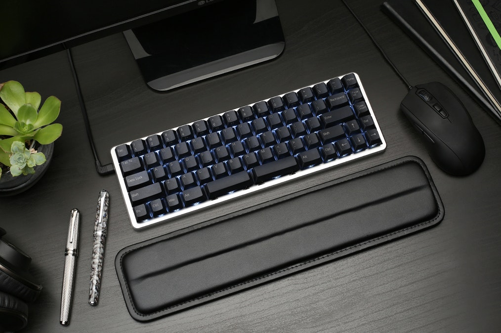
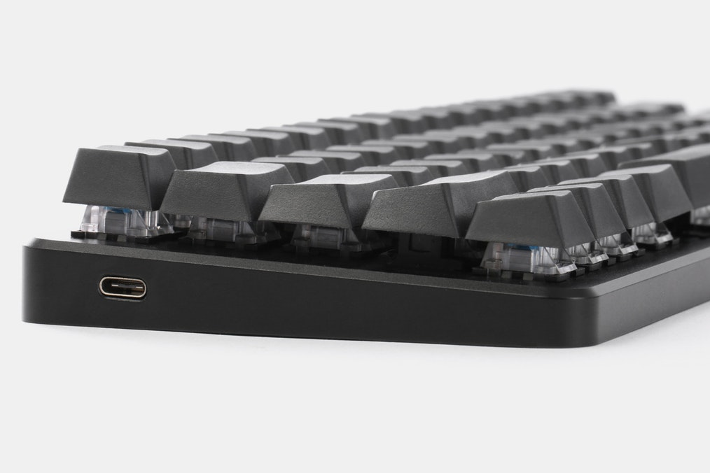
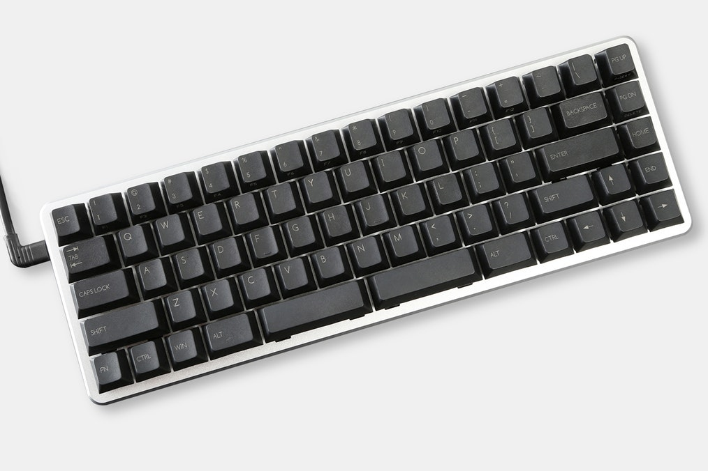

---

###Where to Buy
- $179+ ::: z70 Pro on [Kono.Store](https://kono.store/products/z70-pro-65-rgb-mechanical-keyboard) or [zFrontier](https://en.zfrontier.com/products/group-buy-0-01-z70-rgb-mechanical-keyboard)
- ~~$99+ on [Massdrop](https://www.massdrop.com/buy/z70-mechanical-keyboard?utm_source=linkshare&referer=ACCCDX)~~ - R1 Ended

---

###Build Guides / Albums
- First Look / Review by LivingSpeedBump on [Keychatter.com](https://www.keychatter.com/2016/12/14/first-look-z70-split-spacebar-aluminum-keyboard/) 
- Unboxing and Build Log by Watsyurdeal on [Reddit](https://www.reddit.com/r/MechanicalKeyboards/comments/69gtg4/my_z70_is_finally_here/)
<blockquote class="imgur-embed-pub" lang="en" data-id="a/Lk7m4"><a href="//imgur.com/Lk7m4">My Z70 keyboard</a></blockquote> 
- Photo Album featuring SA Round 6 keyset by Bigbysjackingfist on [Reddit](https://www.reddit.com/r/MechanicalKeyboards/comments/6vqwy7/photos_round_6_001_z70/)
<blockquote class="imgur-embed-pub" lang="en" data-id="a/xjz26"><a href="//imgur.com/xjz26">[photos] Round 6, 0.01 z70</a></blockquote> 
- Video Review by RhinoFeed on YouTube
<iframe width="560" height="315" src="https://www.youtube.com/embed/MtVaElMpr7c?rel=0" frameborder="0" allowfullscreen></iframe>

---

###How to Program
- GUI available for download from 0.01's [Website](http://www.zpzotech.com/download/)
- Instructions in the [comments on Massdrop](https://www.massdrop.com/buy/z70-mechanical-keyboard/talk/1671184)
> You can use the progamming tool to reset function key, but only support Windows now, so you may need find a computer running Windows. fortunately, all your change will be automatically saved.
> 
> BTW, we've updated the firmware, please update firmware first.
> - [Google Drive Link](https://drive.google.com/open?id=0B6OlsxK8tzdnMDk1TkpIa21aWVk) - software
> - [Google Drive Link](https://drive.google.com/open?id=0B6OlsxK8tzdnZ21ScGtGckNBbFU) - bin file
> - [Google Drive Link](https://drive.google.com/open?id=0B6OlsxK8tzdncG92SDdpZHJ2cms) - instructions

  - Re-hosted the [software](KBTools_201704241213.zip) / [instructions](Z70_firmware_upgrade_instruction.pdf) / [bin](Z70_HW_V1.0_201705012057.bin) file here just in case.

- Video Instructions from 0.01
   1. How to program KEY value using KBTools?
   <iframe width="560" height="315" src="https://www.youtube.com/embed/XQ2UfnL063o?rel=0&amp;showinfo=0" frameborder="0" allow="autoplay; encrypted-media" allowfullscreen></iframe>
   2. How to program LED color using KBTools?
   <iframe width="560" height="315" src="https://www.youtube.com/embed/-UfzbPrZnkQ?rel=0&amp;showinfo=0" frameborder="0" allow="autoplay; encrypted-media" allowfullscreen></iframe>
   3. How to program SHORTCUTS using KBTools?
   <iframe width="560" height="315" src="https://www.youtube.com/embed/wbGGHcbPBVc?rel=0&amp;showinfo=0" frameborder="0" allow="autoplay; encrypted-media" allowfullscreen></iframe>
   4. How to update firmware using KBTools?
   <iframe width="560" height="315" src="https://www.youtube.com/embed/jGQ14nRK35A?rel=0&amp;showinfo=0" frameborder="0" allow="autoplay; encrypted-media" allowfullscreen></iframe>
   
  

---

###Mods &amp; Addons
- 

---

###More Info
- Original vs Pro

Parts | Original | Pro
---|---|----
LEDs | White | RGB
Connector | USB-C | USB-C
Layout | One Option | ANSI and ISO w/ bottom row options
Switches |   | Hot-swappable using Kailh Sockets
Keycaps | PBT - OEM Profile | PBT - MIX Profile

- [ORIGINAL z70] - As explained by LivingSpeedBump on [Keychatter](https://www.keychatter.com/2016/12/14/first-look-z70-split-spacebar-aluminum-keyboard/)

> The first step was using the ever popular 65% layout as a starting point, as it has become a hugely popular layout within the enthusiast community over the past year. The Macbook (and Apple’s current keyboard layout) was another very influential inspiration for the layout. To top it all off, 0.01 recognized the popularity of the HHKB among enthusiasts, and made sure to incorporate the HHKB stock layout into the z70 as well.

>    

> The end result? A fully programmable keyboard that not only supports the standard Apple layout, but also allows for the standard HHKB layout to be fully utilized, with the added functionality of dedicated arrow keys.

---

###Gallery  

