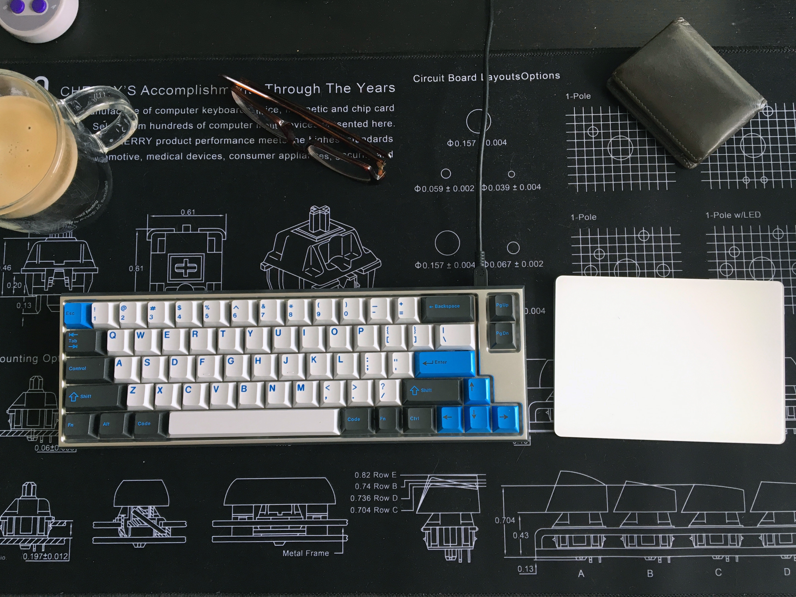

---

###Where to Buy
- $229 Aluminum Clueboard - [Clueboard.co](https://clueboard.co/clueboard-66/)
- ~~[Massdrop](https://www.massdrop.com/buy/clueboard-keyboard-kit?utm_source=linkshare&referer=ACCCDX)~~ - R1 &amp; R2 ENDED

---

###Build Guides / Albums
- Photo Album featuring GMK Carbon by Johuu on [Reddit](https://www.reddit.com/r/MechanicalKeyboards/comments/6f6rdt/carbonized_clueboard/)
<blockquote class="imgur-embed-pub" lang="en" data-id="a/lOoHM"><a href="//imgur.com/lOoHM">Carbonized Clueboard</a></blockquote> 
- Photo Album featuring ISO layout with DSA Dolch by the_pokemon_kid on [Reddit](https://www.reddit.com/r/MechanicalKeyboards/comments/6bvses/my_new_clueboard/)
<blockquote class="imgur-embed-pub" lang="en" data-id="a/FwPwq"><a href="//imgur.com/FwPwq">My new Clueboard!</a></blockquote> 
- Clueboard Review by LivingSpeedBump on [Keychatter](https://www.keychatter.com/2017/06/21/mini-review-clueboard/)
- Build log of acrylic cased Clueboard 2.0 on [CoreDump.io](http://coredump.io/buildlogs/clueboard2/)

---

###How to Program
- Check out the Github repo for the [Clueboard](https://github.com/qmk/qmk_firmware/tree/master/keyboards/clueboard)

---

###Mods &amp; Addons

---

###More Info
- Great [Reddit comment](https://www.reddit.com/r/MechanicalKeyboards/comments/5d9bt6/buying_clueboard_mechanical_keyboard_kit_on/da2t6ya/) by the creator, Skullydazed, about the pricing, engineering, and machine work that goes into the creating of the Aluminum cases on the Clueboard.
- History
   - Clueboard v1 - Acrylic cases or repurposed [Leopold FC660m](../leopold-fc660m) cases
   - Clueboard v2 - [Added layout options](https://static1.squarespace.com/static/55c13bdee4b099be5dcb82eb/5842fbdce3df28eae5ec557e/58db764b6a49632e13a359b3/1490777688879/1489095816841.png?format=750w), added optional RGB underglow, Aluminum case is announced, but still using acrylic &amp; repurposed cases
   - Clueboard v2.5.1 - Current iteration

---

###Gallery  

Source: LivingSpeedBump's photo on [Keychatter](https://www.keychatter.com/2017/06/21/mini-review-clueboard/)

Source: iaca400's post on [Reddit](https://www.reddit.com/r/MechanicalKeyboards/comments/5rhux2/photos_always_wanted_a_split_spacebar_keyboard/)

Source: JerkinToTheOldie's post on [Reddit](https://www.reddit.com/r/MechanicalKeyboards/comments/6eoz6a/i_spilled_on_my_clueboard/)
