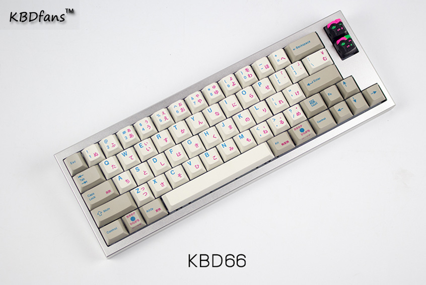
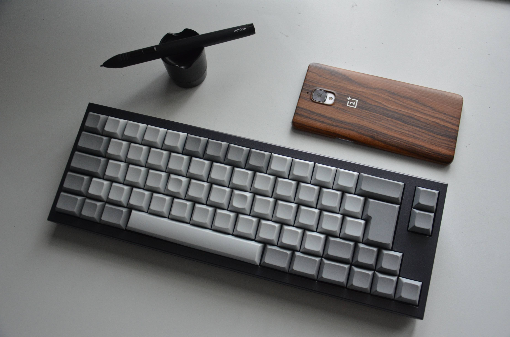
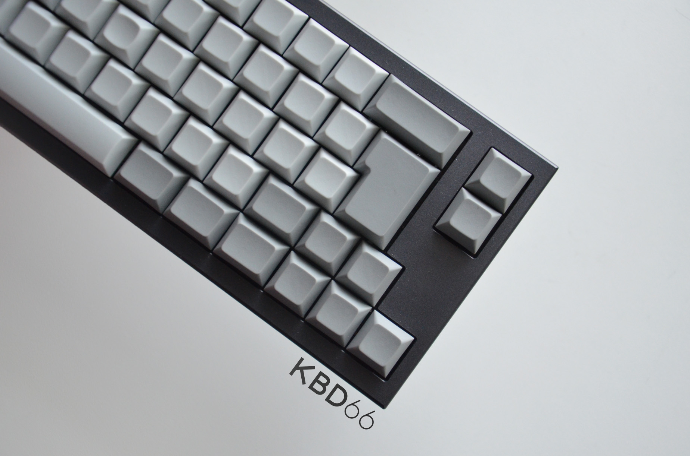
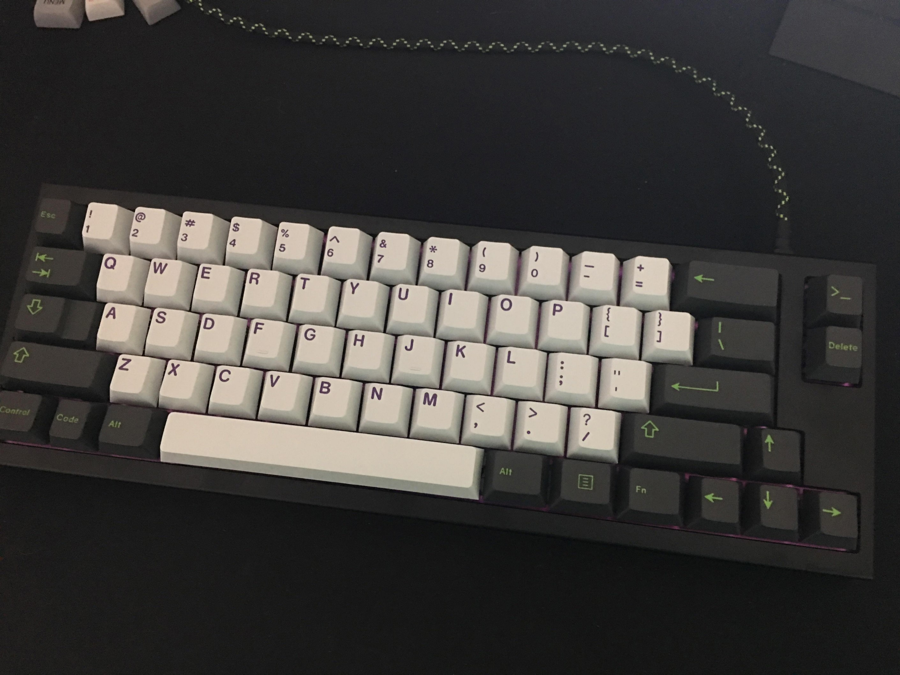
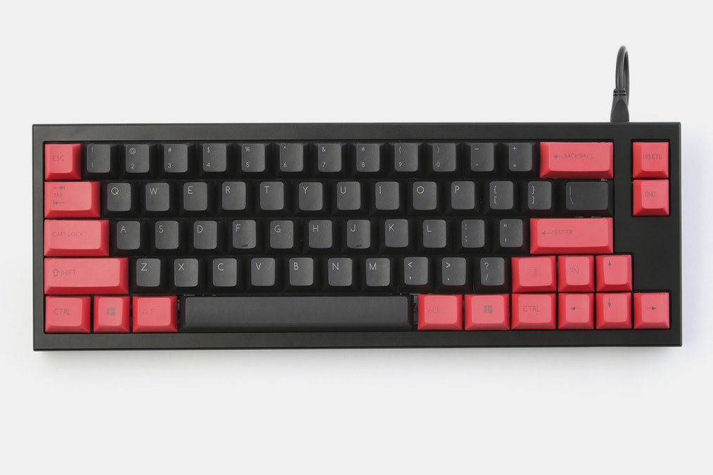
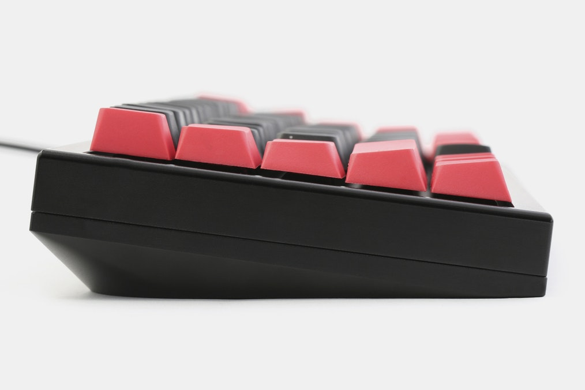
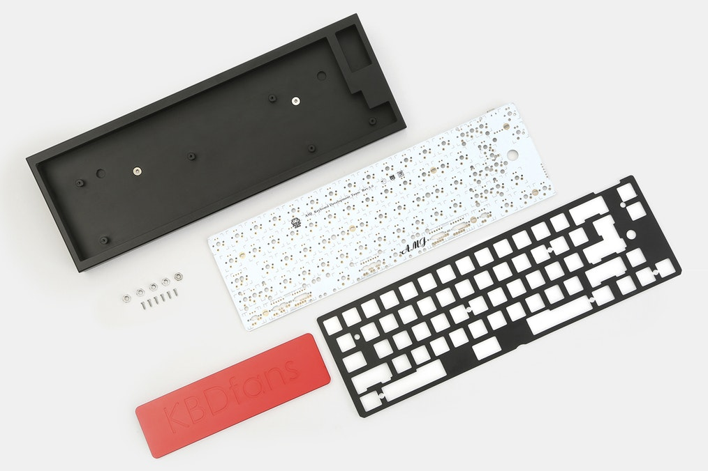

---

###Where to Buy
- $148 - Group Buy - [KBDFans.cn](https://kbdfans.myshopify.com/products/kbd66-keyboard-gb) - R2 In Progress
- ~~[Massdrop](https://www.massdrop.com/buy/kbd66-mechanical-keyboard-kit?utm_source=linkshare&referer=ACCCDX)~~ - R1 ENDED

---

###Build Guides / Albums
- Photo Album by KBDFans on 
<blockquote class="imgur-embed-pub" lang="en" data-id="a/94vR5"><a href="//imgur.com/94vR5">KBDfans  kbd66 keyboard</a></blockquote>

---

###How to Program
- Download the software here: [Google Drive Link](https://drive.google.com/file/d/0B9XoYZuzpjWnbU9jMGxUZVFKd2M/view) 

---

###Mods &amp; Addons

---

###More Info
- Link to the announcement post on [Reddit](https://www.reddit.com/r/MechanicalKeyboards/comments/5qgqcv/buying_kbd66_keyboard_gb/)

---

###Gallery  

Source: duckyfx's photo on [Reddit](https://www.reddit.com/r/MechanicalKeyboards/comments/6hudm6/kbd66_2/)

Source: hailsagan1986's photo on [Reddit](https://www.reddit.com/r/MechanicalKeyboards/comments/6hudm6/kbd66_2/)

