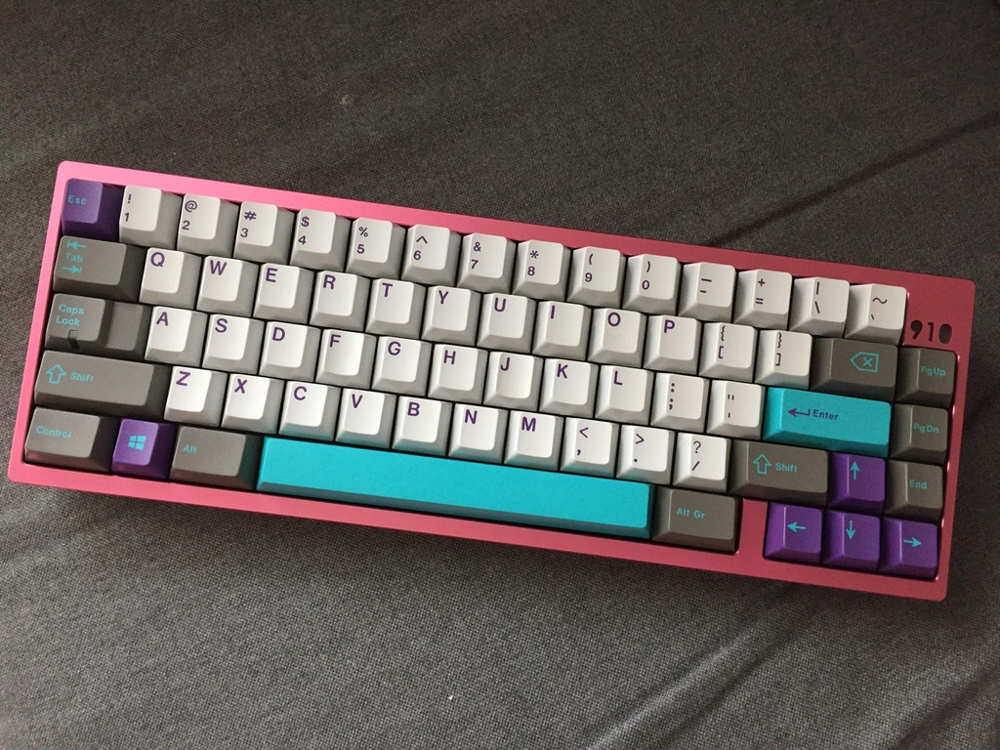
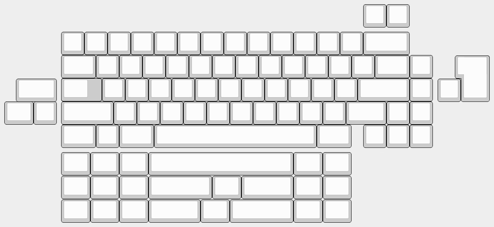

---

###Where to Buy
- Interest Check on [Reddit](https://www.reddit.com/r/MechanicalKeyboards/comments/5cezjj/interest_check_the_tgr_910_65_full_aluminium/)
- Group Buy on [GeekHack](https://geekhack.org/index.php?topic=85771.0)

---

###Build Guides / Albums
1. Photo Album from ZackFoo on [Reddit](https://www.reddit.com/r/MechanicalKeyboards/comments/6lzhsx/tgr_910_booiiiii/)
<blockquote class="imgur-embed-pub" lang="en" data-id="a/CO2DR"><a href="//imgur.com/CO2DR">TGR 910</a></blockquote> 

---

###How to Program
- PS2AVRGB PCB / Programming Tool

---

###Mods &amp; Addons
- 

---

###More Info
- 

---

###Gallery  

Source: Jumie83 on [Reddit](https://www.reddit.com/r/MechanicalKeyboards/comments/6u7jj2/meet_the_tgr910/)

