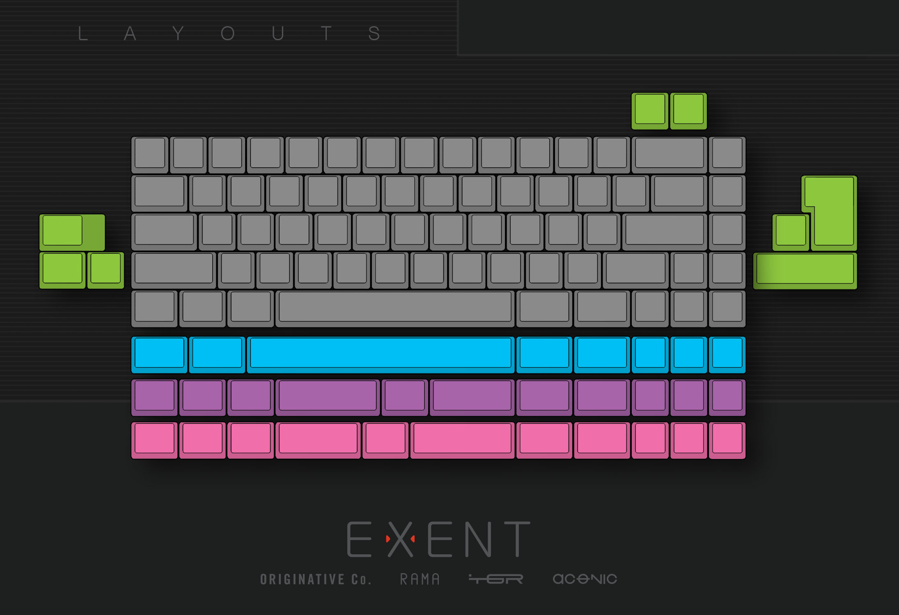

---

###Where to Buy
- Group Buy on [GeekHack](https://geekhack.org/index.php?topic=87213.0)
   - [Google Order Form](https://docs.google.com/forms/d/e/1FAIpQLScgc1jLcukIpmTPCjYUx3niuWMqppPrDa3lnHOjoa0iNeiJYQ/viewform) - [Screenshot](https://i.imgur.com/3xzgjxO.png) if form goes down
   

---

###Build Guides / Albums
- Engineering Samples:
<blockquote class="imgur-embed-pub" lang="en" data-id="a/hmJ5m"><a href="//imgur.com/hmJ5m">New The Exent Keyboard Pictures</a></blockquote> 
- Photos by Hanshen on [Flickr](https://www.flickr.com/photos/jokrik/sets/72157682774665026/)
 

---

###How to Program
- PS2AVRGB PCB / Programming Tool
 

---

###Mods &amp; Addons
- 

---

###More Info
- 

---

###Gallery  

