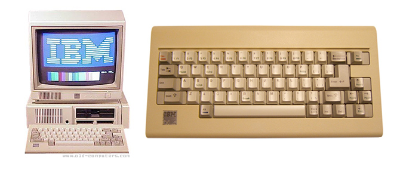
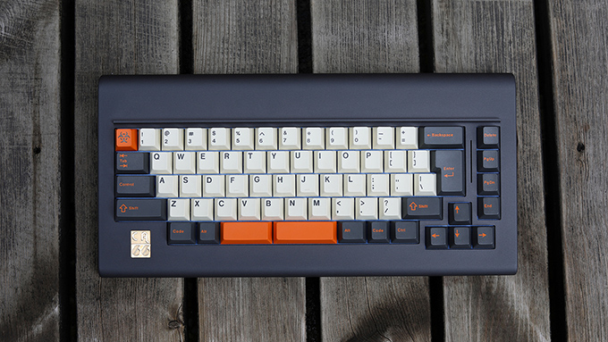
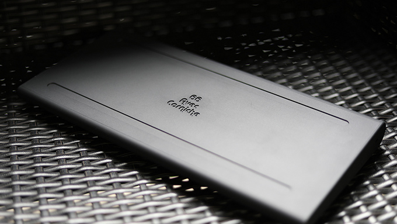
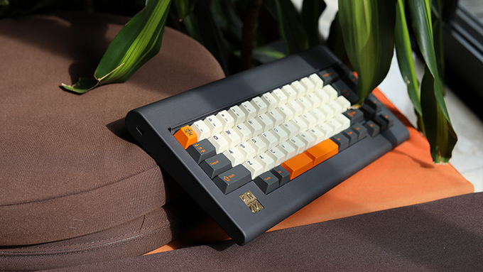
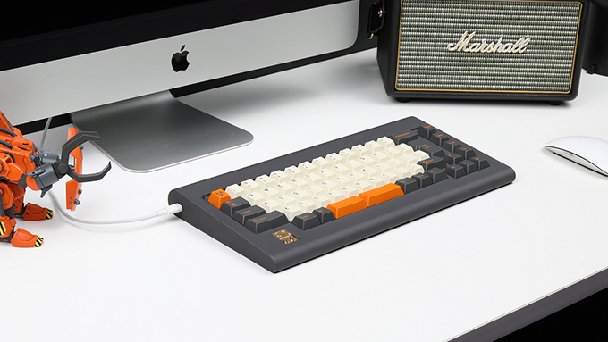
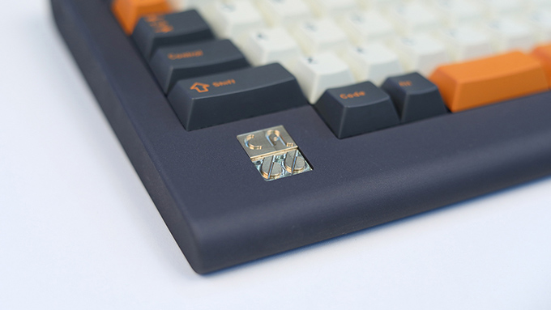

---

###Where to Buy
- (2017-10-03) Interest Check threads for a Group Buy on [GeekHack](https://geekhack.org/index.php?topic=91874.0) &amp; on [Reddit](https://www.reddit.com/r/MechanicalKeyboards/comments/741g0k/ic_ca66_custom_keyboard/)
- ~~[Taobao](https://world.taobao.com/item/554507757989.htm?fromSite=main&spm=a230r.1.14.23.76bf52368wjqT&ns=1&abbucket=4#detail)~~ - ENDED: R1 was a small Group Buy of 40 kits

---

###Build Guides / Albums
- Build Guide by Aurora_Reddit on [Reddit](https://www.reddit.com/r/MechanicalKeyboards/comments/738jgz/ca66_with_maxkey_cyan_on_dolch/)
<blockquote class="imgur-embed-pub" lang="en" data-id="a/koWlK"><a href="//imgur.com/koWlK">Ca66 with MaxKey Cyan on Dolch</a></blockquote> 
- Photo from [@dailyclack on Instagram](https://www.instagram.com/p/BY4o1qXg3Gi/)
- Photo from [@barryboy5566 on Instagram](https://www.instagram.com/p/BYw975wgo7A)

---

###How to Program
- Online Configurator : [ydkb.io](http://ydkb.io/?Ca66#!)

---

###Mods &amp; Addons

---

###More Info
- Based loosely on the IBM "PCjr" (PC Junior)
 
- The name came from French, "66 avec de la corniche". A 66 keyboard with cornice.

---

###Gallery  

