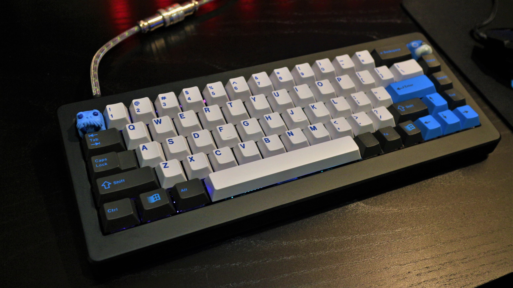
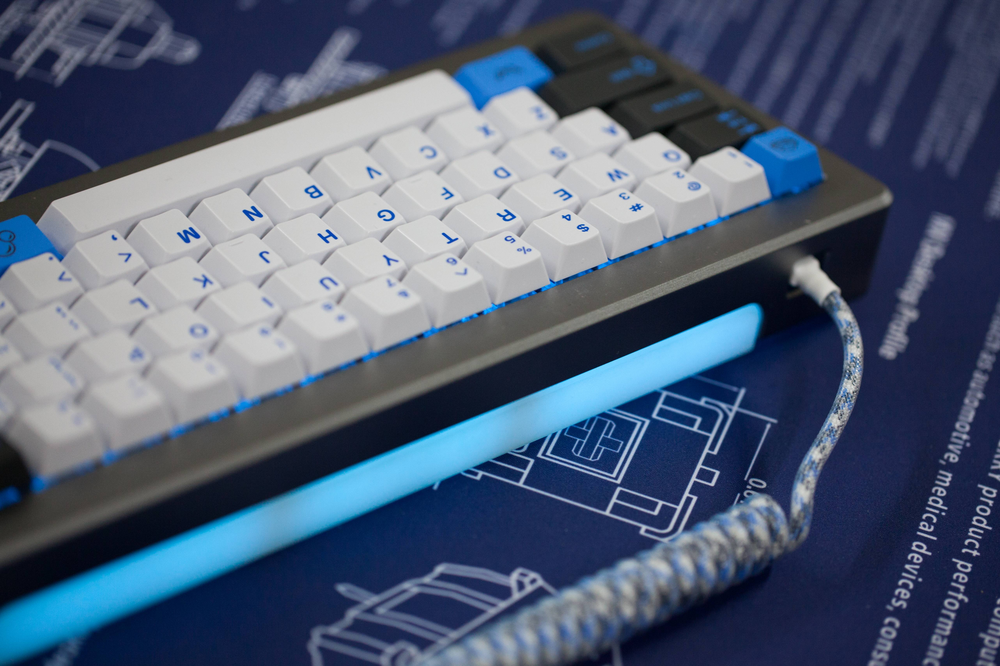
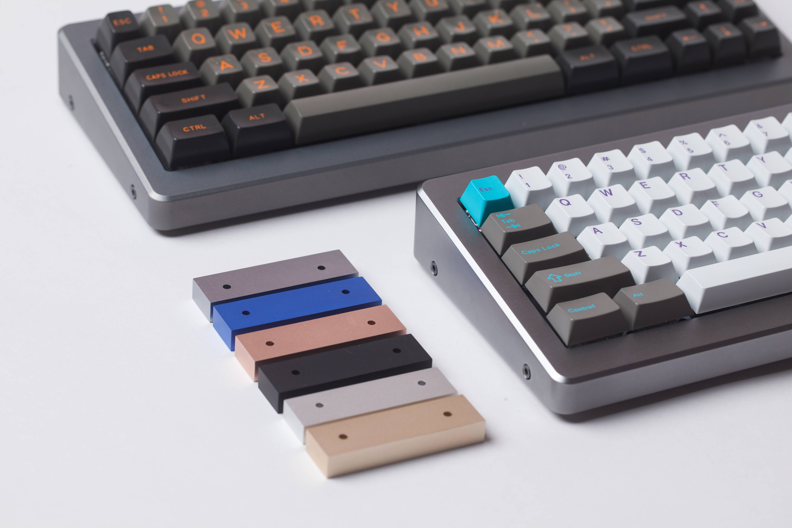
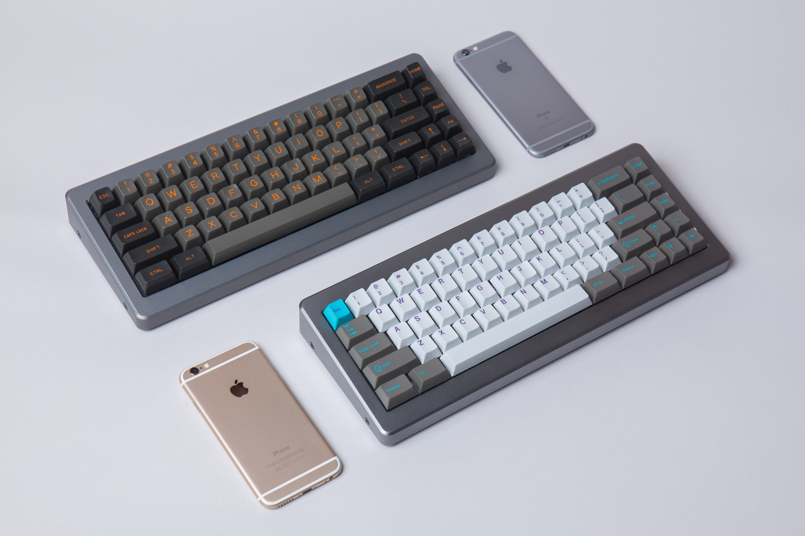

---

###Where to Buy
- ~~Group Buy run by jChan94 on [KeyClack / GeekHack](https://geekhack.org/index.php?topic=86756.0)~~ ENDED

---

###Build Guides / Albums
- Build Log by Catweewee on [Reddit](https://www.reddit.com/r/MechanicalKeyboards/comments/6gaiq1/matte_jet_black_m65a_build_log/)
<blockquote class="imgur-embed-pub" lang="en" data-id="a/gVfcT"><a href="//imgur.com/gVfcT">Matte Jet Black M65A Build log!</a></blockquote> 
- Photos &amp; Renders jChan94 on [Reddit](https://www.reddit.com/r/MechanicalKeyboards/comments/6jwtj6/only_teasing_picturesrenders_of_m65a_but_not_the/)
<blockquote class="imgur-embed-pub" lang="en" data-id="a/Ydx34"><a href="//imgur.com/Ydx34">Only Teasing - Pictures/Renders of M65A, but not the whole board</a></blockquote> 

---

###How to Program
- PS2AVRGB? Use the Bootloader follow the guide on [KBDLounge.com](http://www.kbdlounge.com/2017/03/24/how-to-reprogram-ps2avrgb-boards/)
- QMK? Here is the link to the QMK repo on [Github](https://github.com/jetpacktuxedo/qmk_firmware/tree/m65a/keyboards/jc65)

---

###Mods &amp; Addons

---

###More Info
- The original "JC65" was sold as an aluminum sandwhich style keyboard with the same RGB underglow. I believe it was shortly after that jchan94 &amp; RAMA collaborated on making it into the M65a.
- Original renders and product page on [RAMAs website](https://rama.works/m65a/).
- Open Source files for the platy layout and the PCB are on [Github](https://github.com/Keyclack/M65-A)
- Interest Check thread on [GeekHack](https://geekhack.org/index.php?topic=85629.0)

---

###Gallery  

