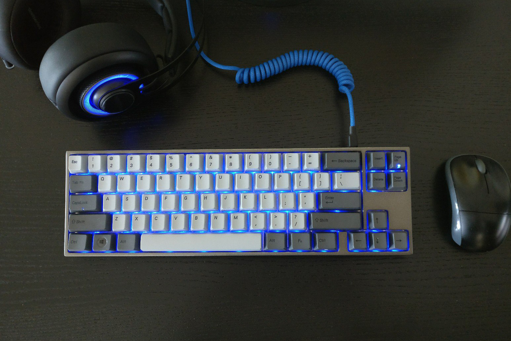
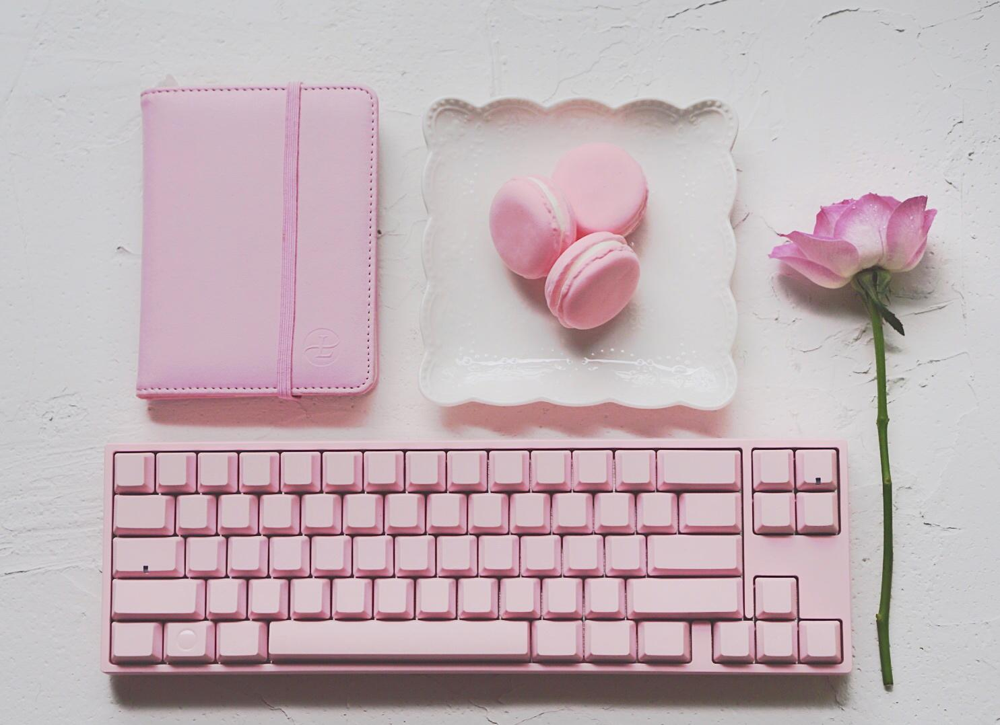
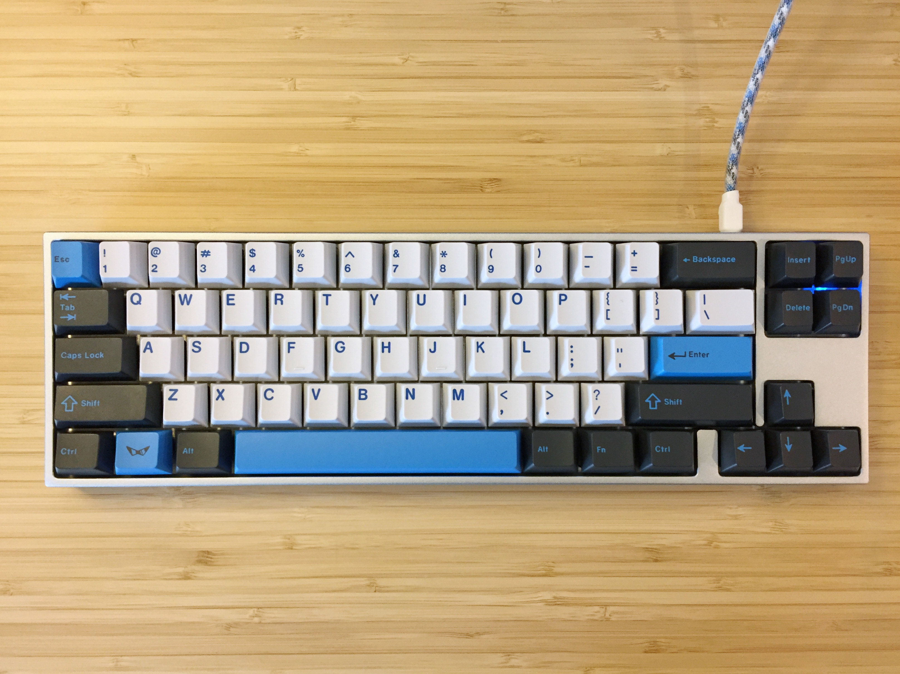

---

###Where to Buy
- $169-289 - Variety of Options on [MechanicalKeyboards.com](https://mechanicalkeyboards.com/shop/index.php?l=product_list&c=325)
- $194+ - Variety of Options on [Caps-Unlocked.com](http://caps-unlocked.com/varmilo-va68m/)
- $115+ - DIY Kit w/ Options on [Caps-Unlocked.com](http://caps-unlocked.com/varmilo-va68m-diy-kit/)
- $169+ - Variety of Options on [DoyuStudio.com](https://shopkey.doyustudio.com/017kb9cz-2)
- Group Buy has been run on [Massdrop](https://www.massdrop.com/buy/varmilo-va68m-mechanical-keyboard?utm_source=linkshare&referer=ACCCDX) before.

---

###Build Guides / Albums
- Magnesium Case Photo by Varmilo's rep JOWQH on [Reddit](https://www.reddit.com/r/MechanicalKeyboards/comments/50s4lb/varmilo_va68m_new_magnesium_alloy_case/)
 
- Build Log by Manzel0 on [Reddit](https://www.reddit.com/r/MechanicalKeyboards/comments/69m8n4/photos_finally_ascended_from_a_k70_va68m_build_log/)
<blockquote class="imgur-embed-pub" lang="en" data-id="a/6ZRDM"><a href="//imgur.com/6ZRDM">[photos] Finally ascended from a K70: VA68M build log</a></blockquote> 
- Build Log by Digisax on [Reddit](https://www.reddit.com/r/MechanicalKeyboards/comments/6ex4pb/photos_my_alps_va68m_build_log/)
<blockquote class="imgur-embed-pub" lang="en" data-id="a/1XiG8"><a href="//imgur.com/1XiG8">[photos] My Alps VA68m build log</a></blockquote> 
- Build Log by Lost2Frostbite on [Reddit](https://www.reddit.com/r/MechanicalKeyboards/comments/47gczq/photos_varmilo_va68m_from_taobao_build_it/)
<blockquote class="imgur-embed-pub" lang="en" data-id="a/CeQzH"><a href="//imgur.com/CeQzH">[photos] Varmilo VA68M from Taobao (build it yourself edition)</a></blockquote> 

---

###How to Program
- Not programmable but here is a [pdf chart](VA68M_Keycombinations.pdf) for the different key combinations

---

###Mods &amp; Addons

---

###More Info

---

###Gallery  

