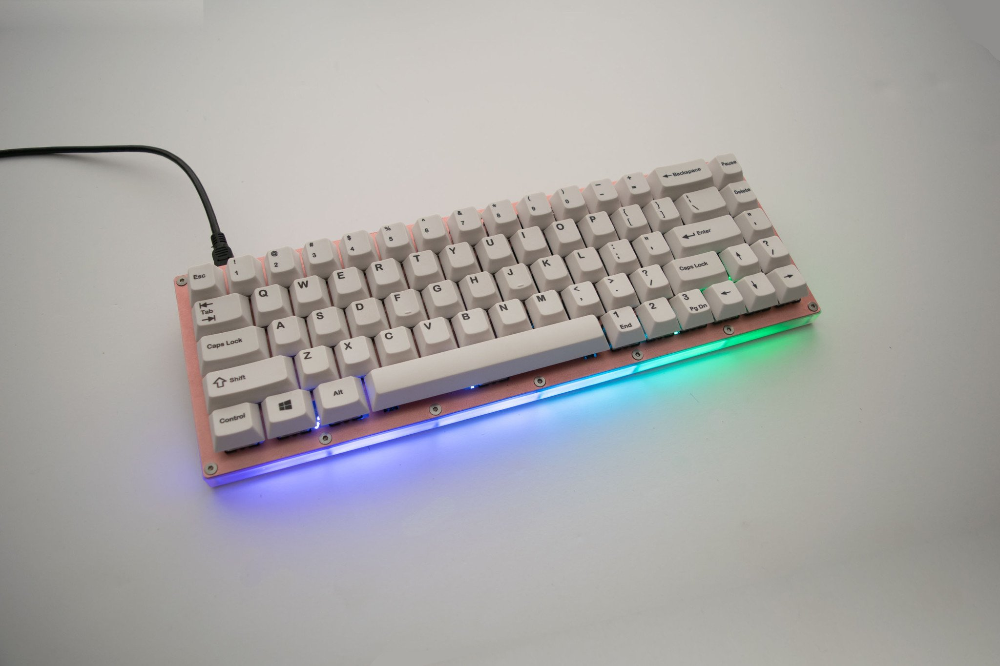
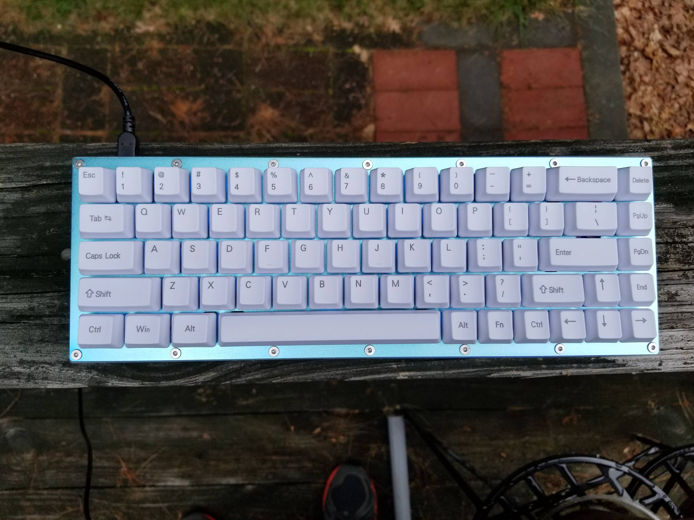
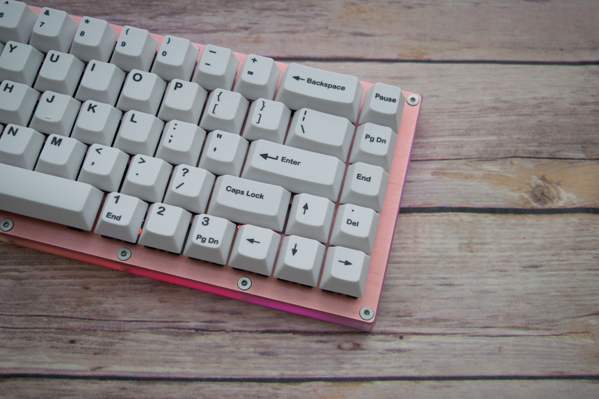

---

###Where to Buy
- $139 - DIY Kit - [Sentraq.com](https://sentraq.com/collections/kits/products/copy-of-closed-s65-x-rgb-diy-keyboard-kit)
    - Group Buy [Status Page](https://sentraq.com/pages/group-buy-status)
- $49 - PCB Only - [Sentraq.com](https://sentraq.com/collections/frontpage/products/65-rgb-underglow-pcb)

---

###Build Guides / Albums
- Review by Teacob on [Reddit](https://www.reddit.com/r/MechanicalKeyboards/comments/6jfpk1/review_sentraq_s65x_kit/)
- Build Log by Teacob on [Reddit](https://www.reddit.com/r/MechanicalKeyboards/comments/6jea6k/photos_s65x_build_log/)
<blockquote class="imgur-embed-pub" lang="en" data-id="a/KuiwS"><a href="//imgur.com/KuiwS">[photos] S65-X build log</a></blockquote> 
- Photo Albums by M3T1V13R on [Reddit](https://www.reddit.com/r/MechanicalKeyboards/comments/6gde9c/completed_sentraq_s65x/)
<blockquote class="imgur-embed-pub" lang="en" data-id="a/0HMff"><a href="//imgur.com/0HMff">Sentraq S65-X Build</a></blockquote> 

---

###How to Program
- QMK - Find files on [Github](https://github.com/qmk/qmk_firmware/tree/master/keyboards/s65_x)
- Programming guide by M3T1V13R on [Reddit](https://www.reddit.com/r/MechanicalKeyboards/comments/6gde9c/completed_sentraq_s65x/diptw7d/)

---

###Mods &amp; Addons

---

###More Info
- There is a similar board available called the [S65-Plus](https://sentraq.com/collections/frontpage/products/gb-s65-plus-diy-keyboard-kit?variant=43320615626) which features an additional 10x 1u keys to the left of the keyboard similar to an [RedScarf78](https://www.massdrop.com/buy/red-scarf-ii-ver-b-custom-mechanical-keyboard-kit?utm_source=linkshare&referer=ACCCDX)

---

###Gallery  

