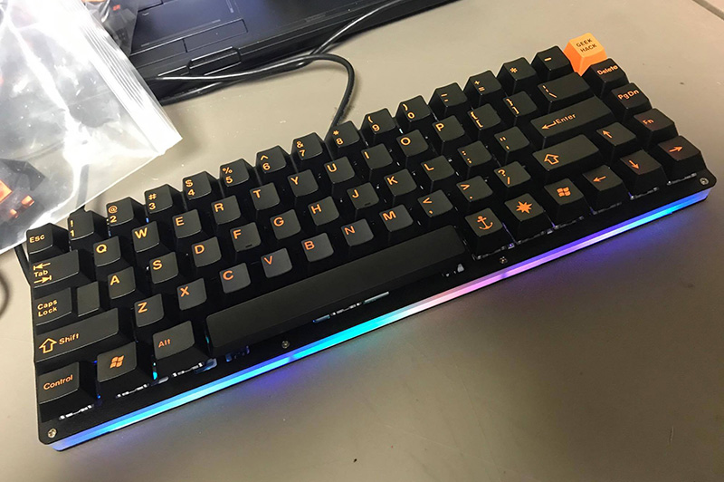

---

###Where to Buy
- ~~$132 on [MechKeys.ca](https://oldsite.mechkeys.ca/product/alu68/)~~ - Seems they are no longer for sale

---

###Build Guides / Albums
- Photos by ExoticeWhal3 on [Reddit](https://www.reddit.com/r/MechanicalKeyboards/comments/6sk83x/my_current_daily_driver_the_alu68/)
<blockquote class="imgur-embed-pub" lang="en" data-id="a/Ydnty"><a href="//imgur.com/Ydnty">ALU68</a></blockquote> 
- Photos by Irhymeswithpie on [Reddit](https://www.reddit.com/r/MechanicalKeyboards/comments/6i1wtz/mechkeysca_alu68_with_whitefox_keycaps/)
<blockquote class="imgur-embed-pub" lang="en" data-id="a/OYem1"><a href="//imgur.com/OYem1">ALU68 - whitefox</a></blockquote> 

---

###How to Program
- This is a PS2AVRGB PCB
- Use Bootmapper Client

---

###Mods &amp; Addons

---

###More Info

---

###Gallery  

