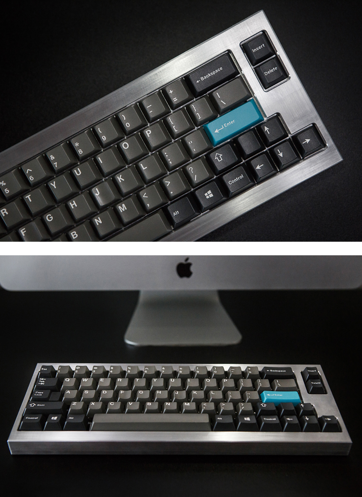
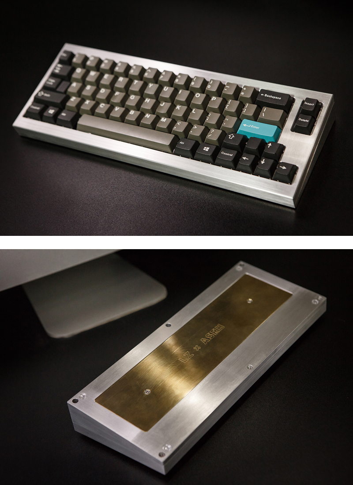

---

###Where to Buy
- ~~Group Buy on [GeekHack](https://geekhack.org/index.php?topic=89360.0)~~ - Ended 2017-05-12
    - Here is the Interest Check thread on [GeekHack](https://geekhack.org/index.php?topic=88607.0)
	

---

###Build Guides / Albums

---

###How to Program
- Use the [JigOn Firmware](http://kbdlab.co.kr/index.php?mid=board_sw&document_srl=2702787)
   - PDF Guide [here](Leeku_L3_Software.pdf) original [GeekHack thread](https://geekhack.org/index.php?topic=83950.0)

---

###Mods &amp; Addons

---

###More Info
- Original people that ordered are listed on this [Google Sheet](https://goo.gl/qdEJhq)

---

###Gallery  

