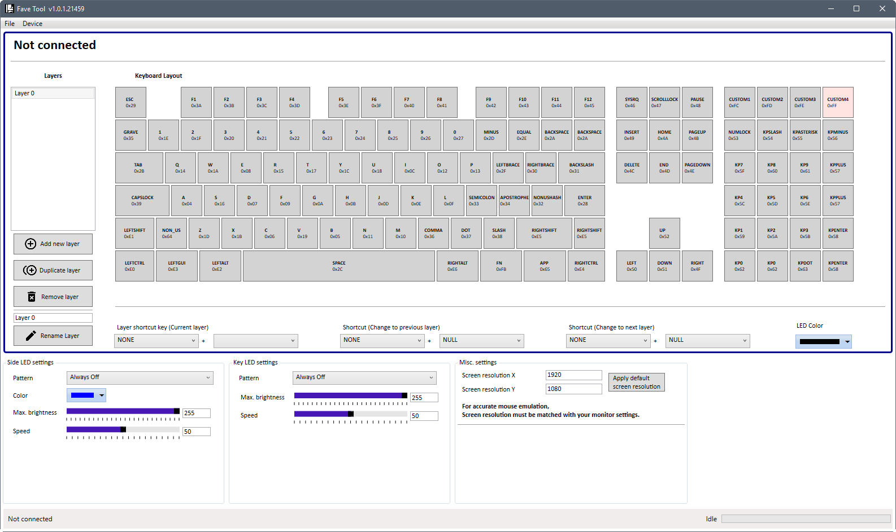
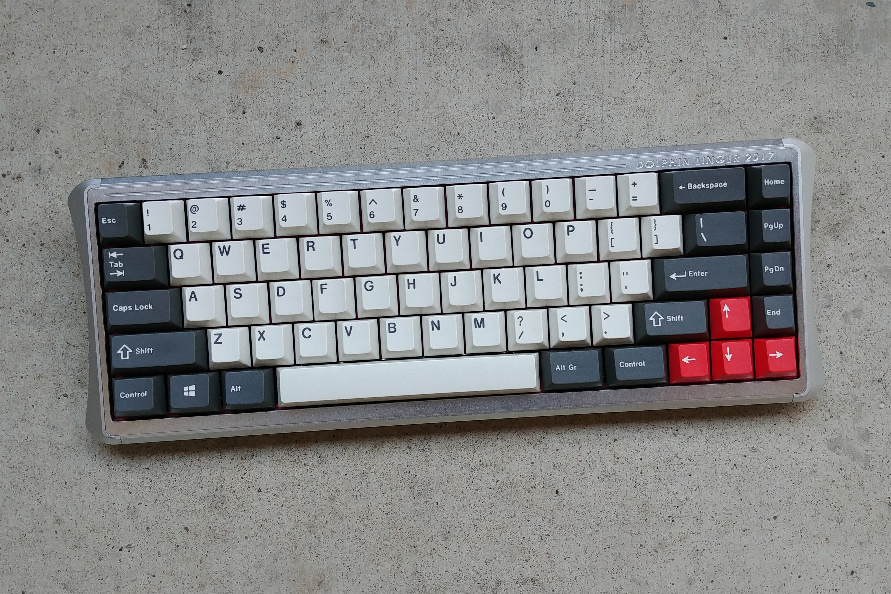
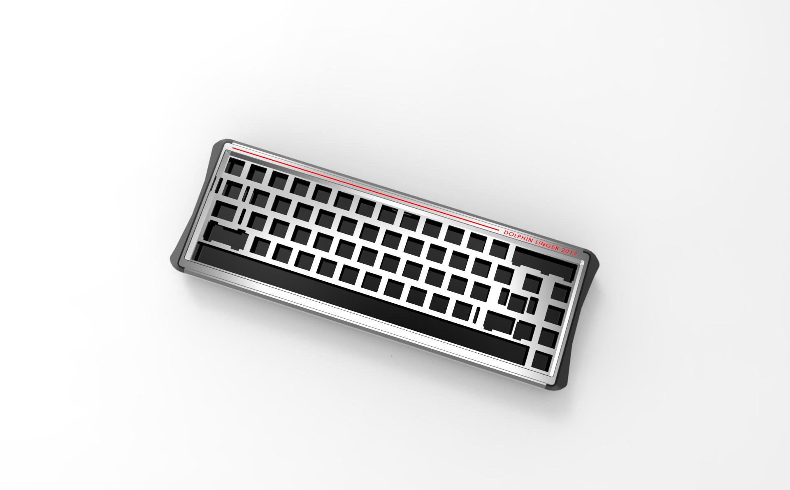
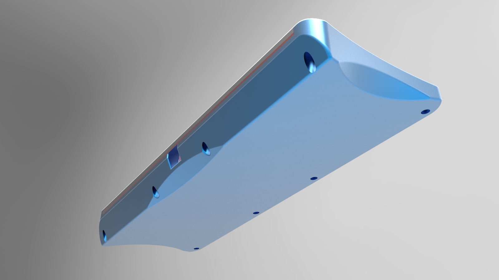
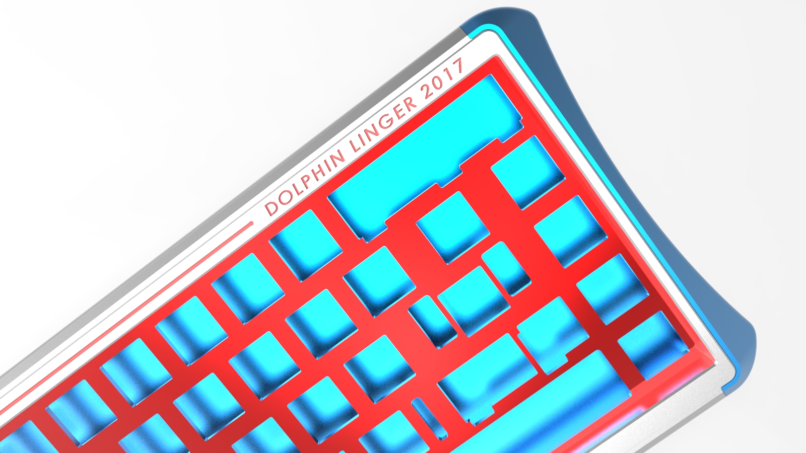

---

###Where to Buy
- Was teased as in Interest Check on [GeekHack](https://geekhack.org/index.php?topic=87727.0) - But GroupBuy was run on Korean forums. I do not have a link to the original information. 

---

###Build Guides / Albums
- Prototype Rendering on [GeekHack](#)
<blockquote class="imgur-embed-pub" lang="en" data-id="a/p1Tfv"><a href="//imgur.com/p1Tfv">Dolinger</a></blockquote> 

- Mid Build Photos by 001Anthony on [Reddit](https://www.reddit.com/r/MechanicalKeyboards/comments/8dfct4/sa_amazing_chocolatier_in_dolinger/dxmtjg6/)
<blockquote class="imgur-embed-pub" lang="en" data-id="a/BJhBG"><a href="//imgur.com/BJhBG">Dolinger (Vintage Black 65g)</a></blockquote> 

- Photo album by 001Anthony (Reuploaded by koduh)
<blockquote class="imgur-embed-pub" lang="en" data-id="a/29Eke"><a href="//imgur.com/29Eke">Lynx3 Dolphin Linger - aka Dolinger</a></blockquote> 

- Full build video (4hrs42min) by 001Anthony on [YouTube](https://www.youtube.com/watch?v=j4xtMRVBiH0)
<iframe width="560" height="315" src="https://www.youtube.com/embed/j4xtMRVBiH0?rel=0&amp;showinfo=0" frameborder="0" allow="autoplay; encrypted-media" allowfullscreen></iframe> 

---

###How to Program

**Runs FaveTool programming:**
1. No firmware is on the PCB by default so when you plug it shows up as a flash drive in CRP DISABLED mode
2. Swap out the file that is in there with this '[87.bin](http://keyboardcatalog.com/user/pages/04.65-percent/21.dolphinlinger/87.bin)' file.
   - [Mirror Download from my Dropbox](https://www.dropbox.com/s/tubhigeow2g4e0d/87.bin?dl=0)
3. Download the GUI / Programming tool / Flashing tool - [FaveTool65.zip](FaveTool65.zip)
   - [Mirror Download from my Dropbox](https://www.dropbox.com/s/29d5vx2n7tawt5h/FaveTool65.zip?dl=0)
4. Use FaveTool to create layouts and flash the keyboard. 
   - Connect to the board "Device→Connect"
   - Download the layout
   - Make changes and save your .config file for use later or sharing 
   - Transfer configuration to the board. 

Screenshot of GUI:   
   

---

###Mods &amp; Addons

---

###More Info

---

###Gallery  

