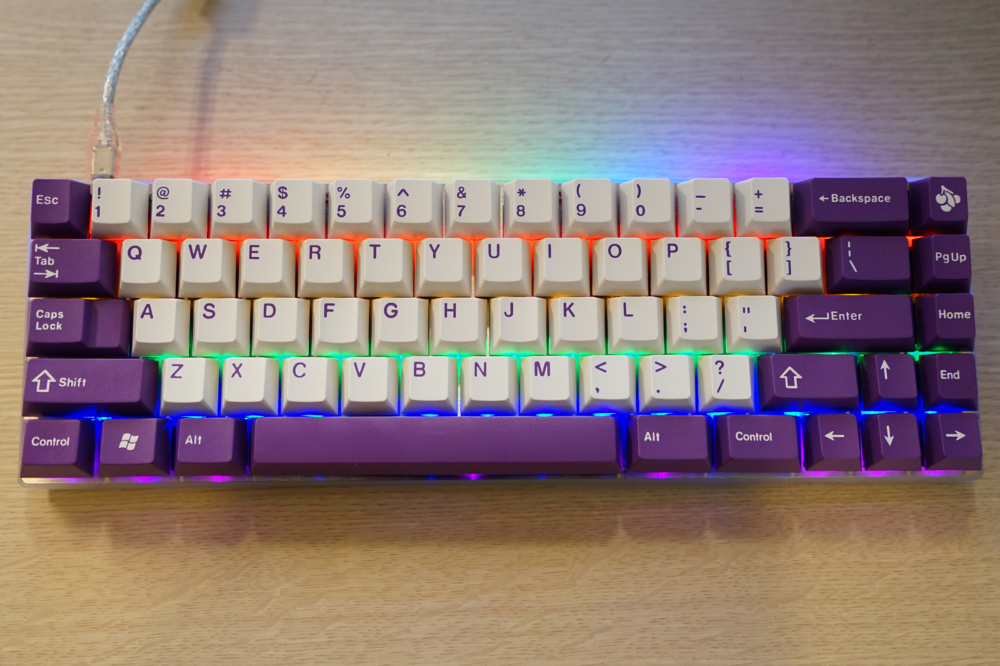
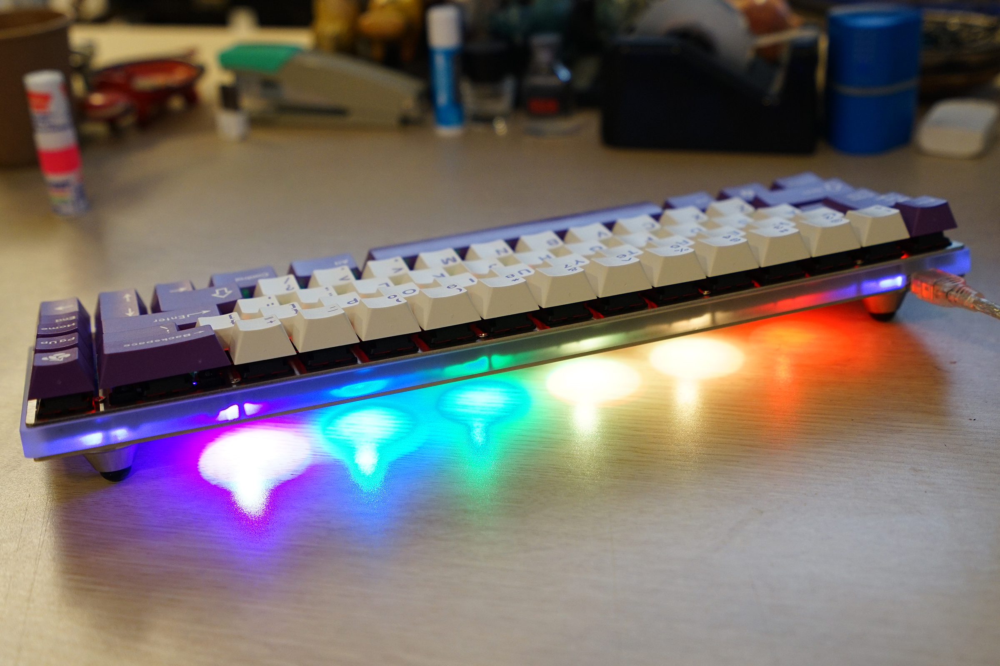
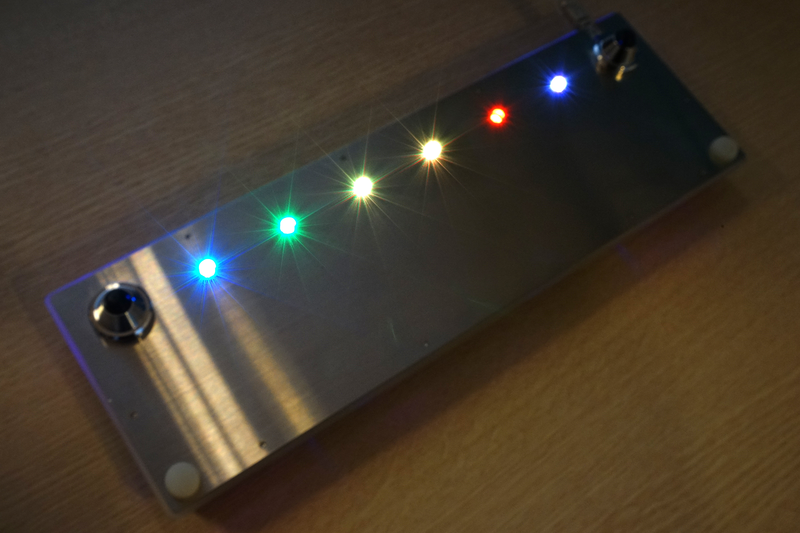

---

###Where to Buy
- $69+ - 22Mini PCB on [Winkeyless.kr](http://winkeyless.kr/product/22mini-b-x2-pcb/)
- Custom order from Apollos' Custom Keyboard Workshop on [22kbd.com](http://22kbd.com).

---

###Build Guides / Albums
- 22Mini-RGB w/ MX Blues on [22kbd.com](http://22kbd.com/148)
- 22Mini-RGB Stainless Steel on [22kbd.com](http://22kbd.com/164)
- 22Mini-RGB w/ Duck Feet on [22kbd.com](http://22kbd.com/174)

---

###How to Program

---

###Mods &amp; Addons

---

###More Info
- 22Mini Available Layouts on [22kbd.com](http://22kbd.com/145)

---

###Gallery  

