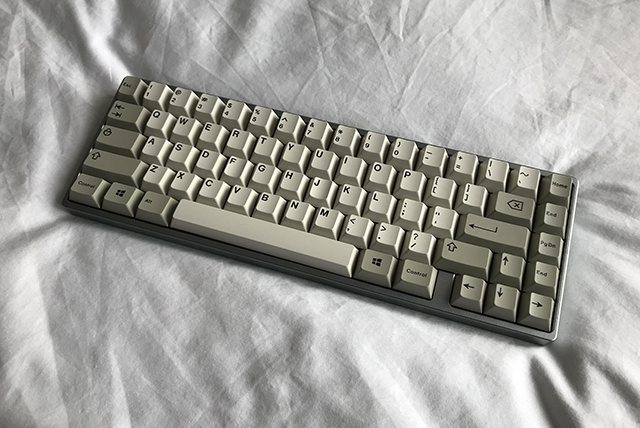
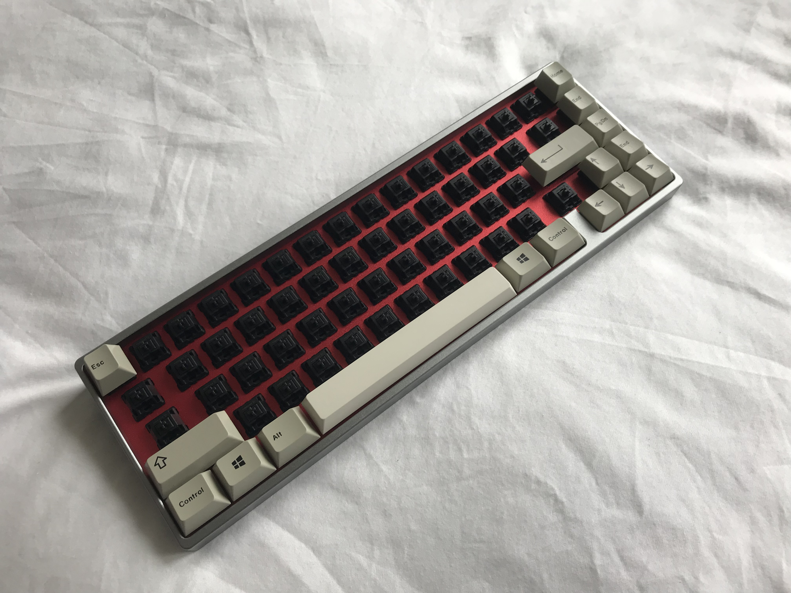
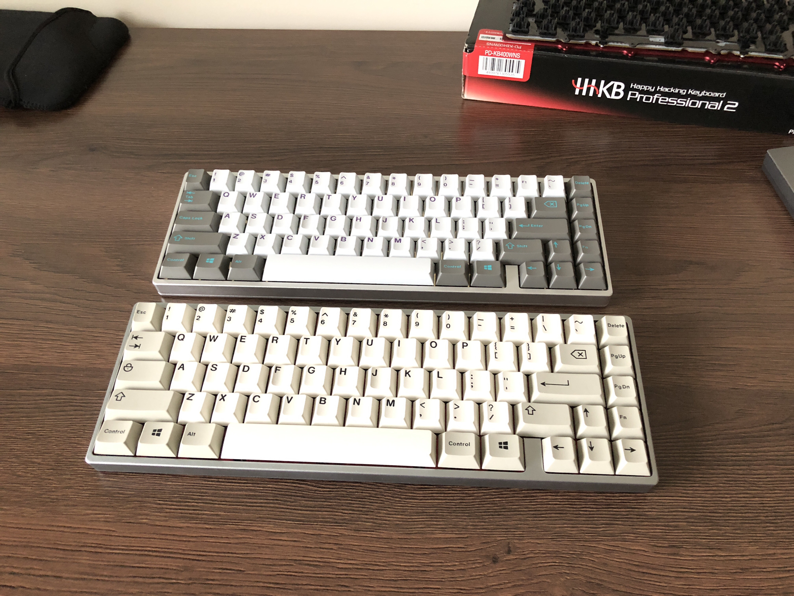
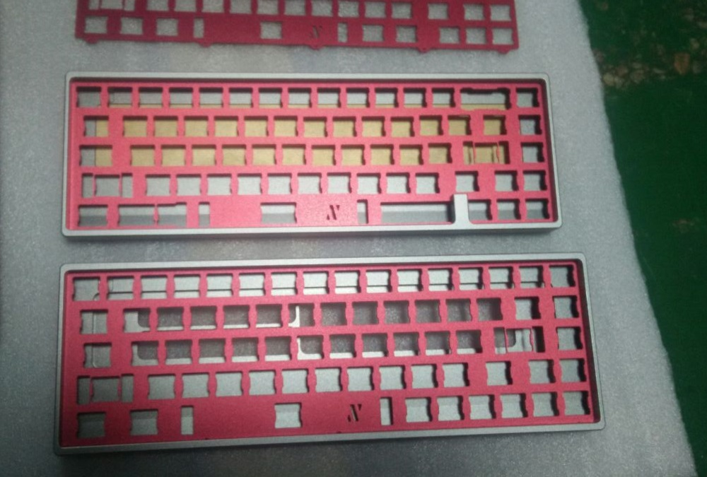

---

###Where to Buy
- Group Buy on [GeekHack](https://geekhack.org/index.php?topic=92066) 
   - 22 AG units + 28 normal units = 50 total 268s in the wild

---

###Build Guides / Albums

---

###How to Program

---

###Mods &amp; Addons

---

###More Info
- Interest Check on [GeekHack](https://geekhack.org/index.php?topic=91616) - Group Buy for only 50 units scheduled for Mid-October 2017

---

###Gallery  

