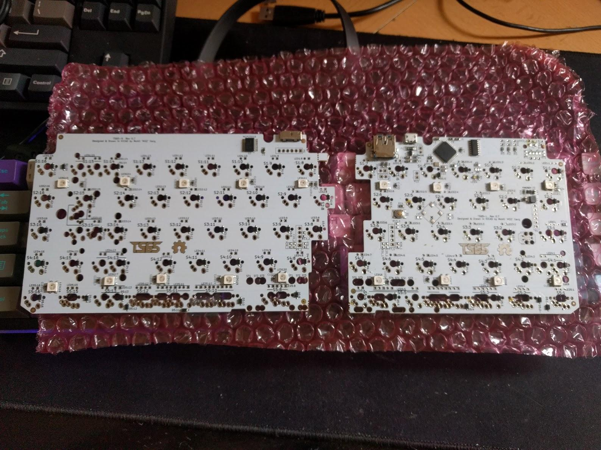
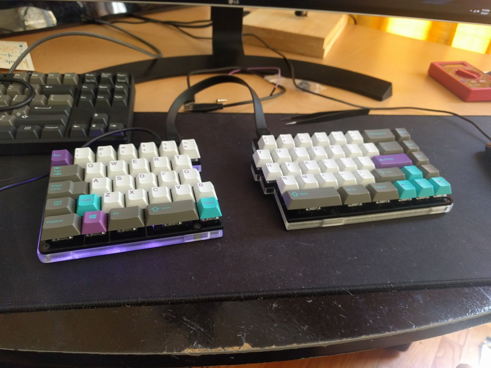
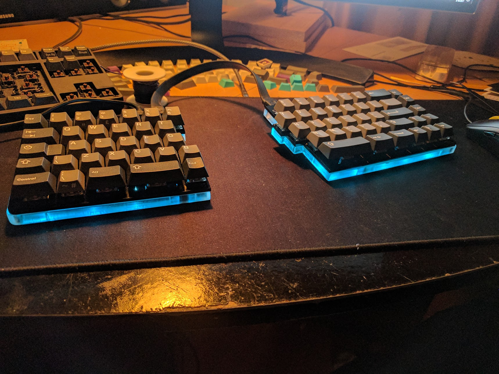
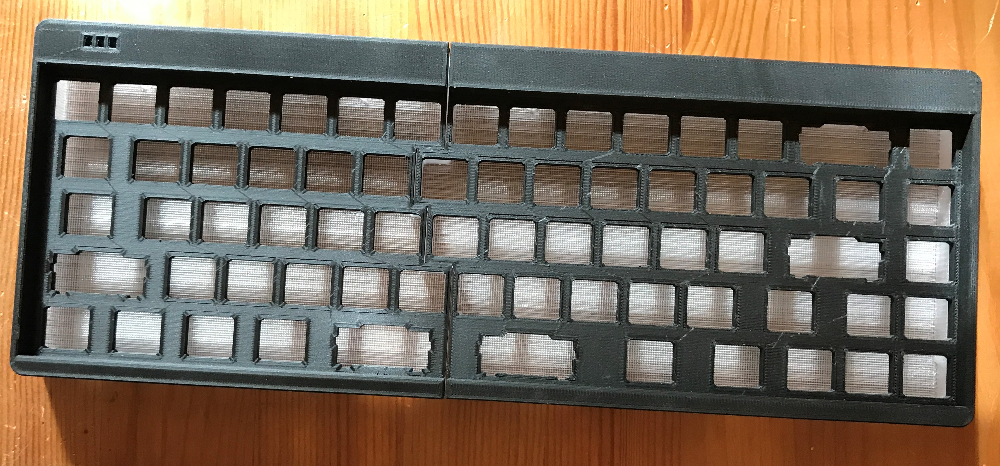
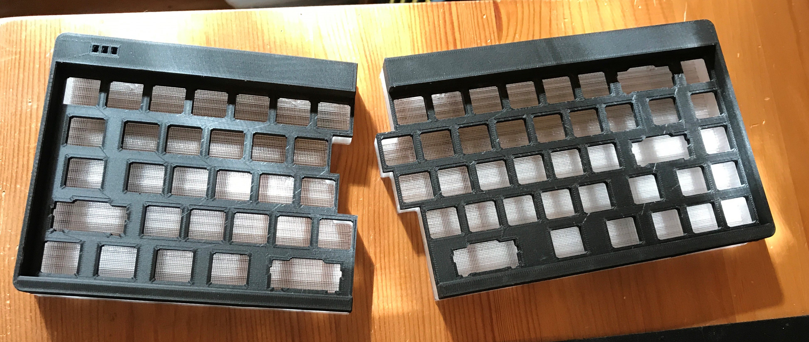
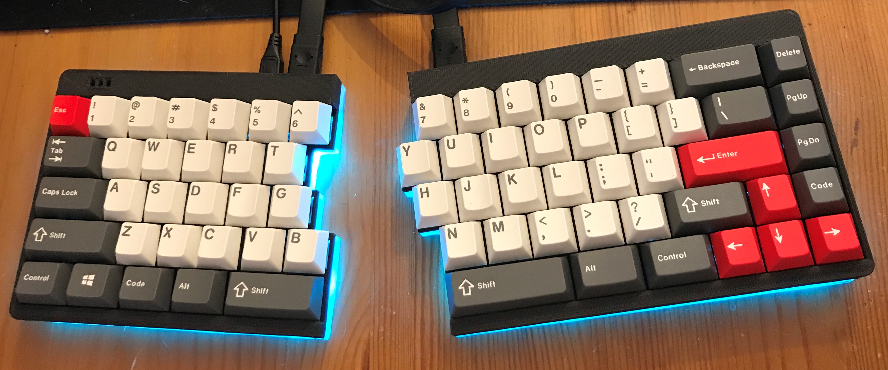
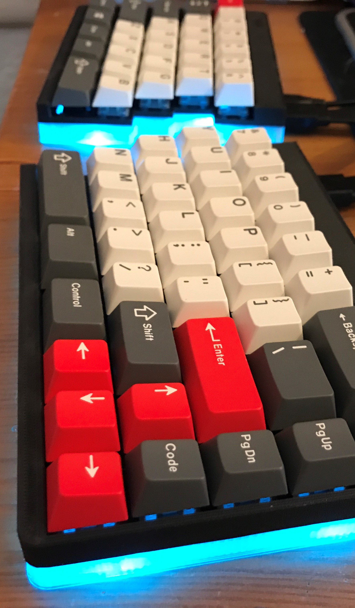

---

###Where to Buy
- Not available yet - Work In Progress on [GeekHack](https://geekhack.org/index.php?topic=79161.0)

---

###Build Guides / Albums

---

###How to Program

---

###Mods &amp; Addons

---

###More Info

---

###Gallery  

