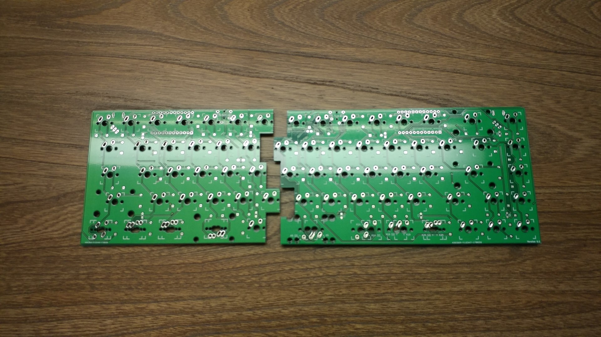
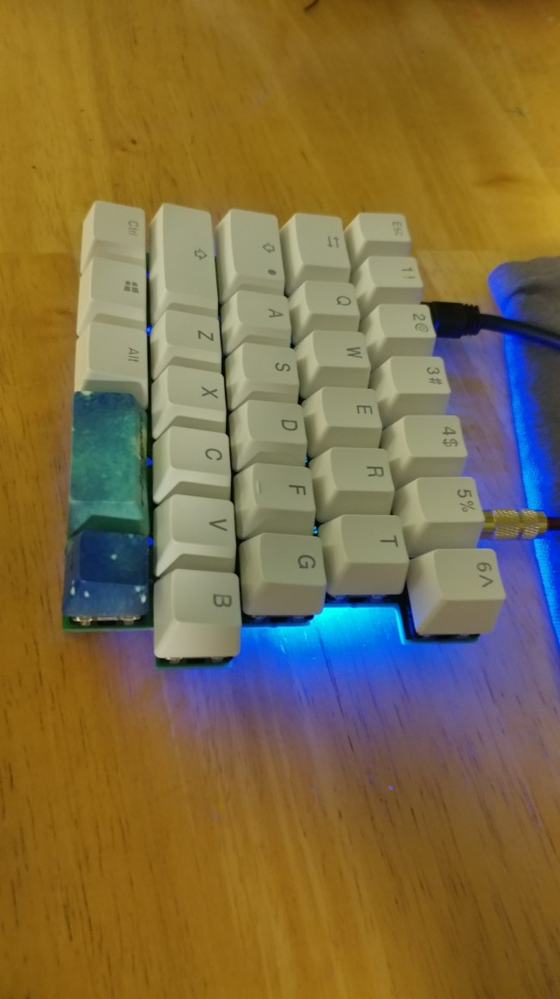

---

###Where to Buy
- Not available yet - Work In Progress on [Reddit](https://www.reddit.com/r/MechanicalKeyboards/comments/6nbvdu/ic_the_uruk_a_65_staggered_split_board/)

---

###Build Guides / Albums

---

###How to Program

---

###Mods &amp; Addons

---

###More Info

---

###Gallery  

