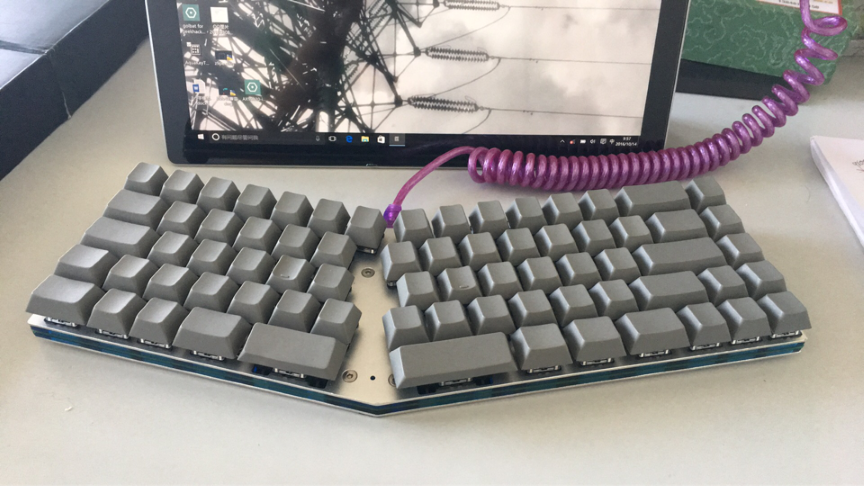
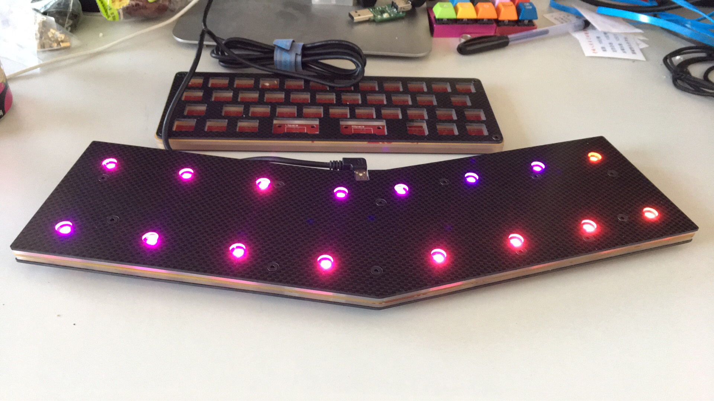

---

###Where to Buy
- ~~Groupbuy on [Taobao](https://world.taobao.com/item/540745278193.htm?fromSite=main&spm=a1z10.3-c.w4002-9909553700.44.1366898fpV2i1g)~~ I think it is no longer available, but need confirmation. 

---

###Build Guides / Albums
- Photos from Taobao listing including layout options:
<blockquote class="imgur-embed-pub" lang="en" data-id="a/WFV9B"></blockquote> 

---

###How to Program
- Unknown

---

###Mods &amp; Addons
- Unknown

---

###More Info
- Unknown

---

###Gallery  

