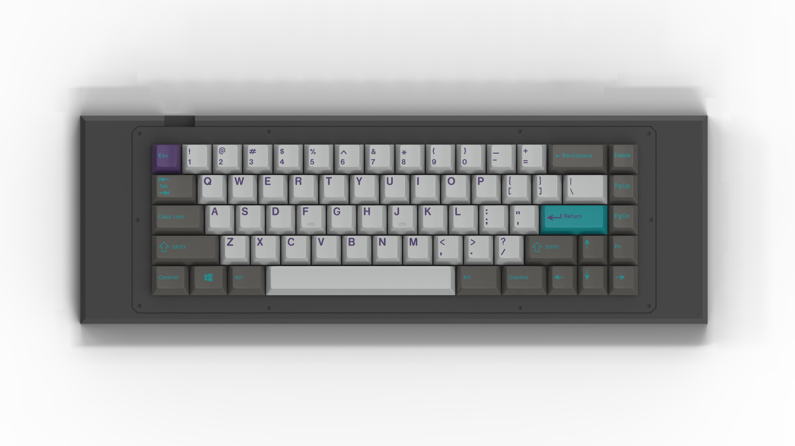
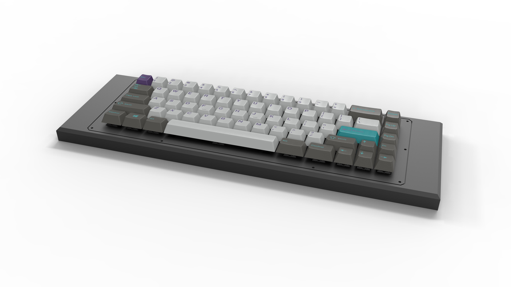

---

###Where to Buy
- Group Buy Coming Soon™ on [Reddit]()

---

###Build Guides / Albums
- First Prototypes:
<blockquote class="imgur-embed-pub" lang="en" data-id="a/gh4vr"></blockquote> 

- Initial Renders: 
<blockquote class="imgur-embed-pub" lang="en" data-id="a/IxvlC"><a href="//imgur.com/IxvlC">Levɘ˩</a></blockquote>

---

###How to Program
- QMK - Find files on [Github](https://github.com/qmk/qmk_firmware/tree/master/keyboards/s65_x)
- Programming guide by M3T1V13R on [Reddit](https://www.reddit.com/r/MechanicalKeyboards/comments/6gde9c/completed_sentraq_s65x/diptw7d/)

---

###Mods &amp; Addons

---

###More Info
- Uses PCB from Sentraq's S65x

---

###Gallery  

