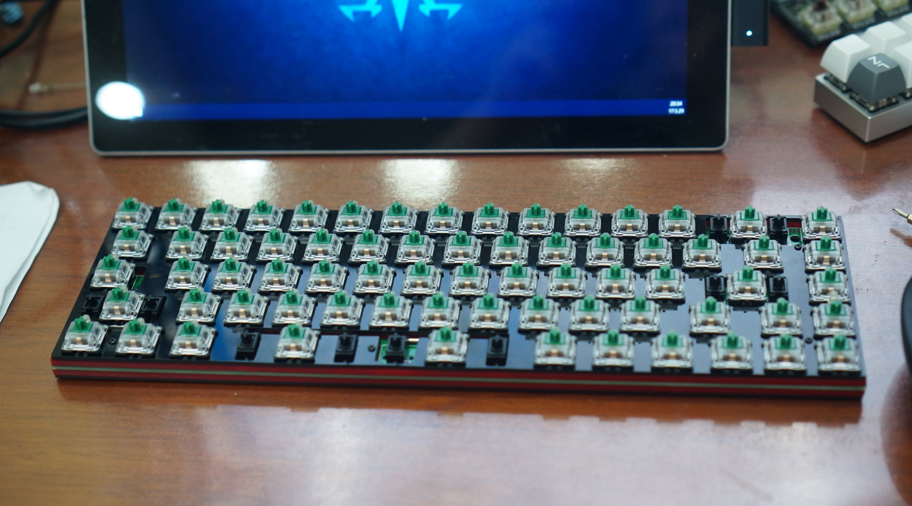
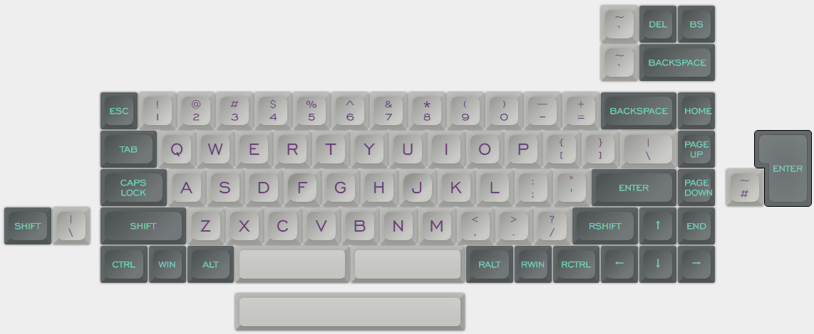

---

###Where to Buy
- [$18 on Taobao](https://item.taobao.com/item.htm?id=551408863173&toSite=main)

---

###Build Guides / Albums

---

###How to Program
-  The Taobao listing isn't clear though it mentions TMK support

---

###Mods &amp; Addons

---

###More Info

---

###Gallery  

