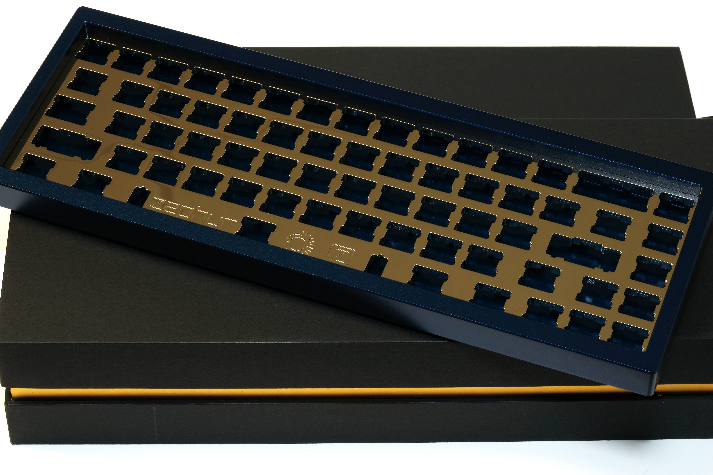
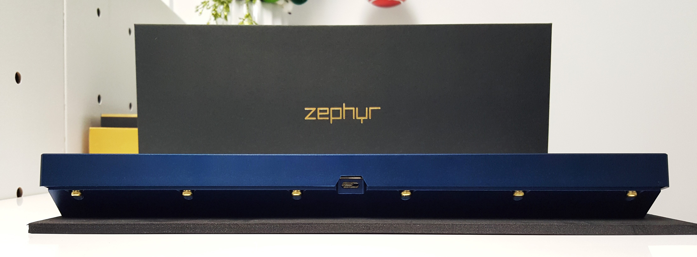
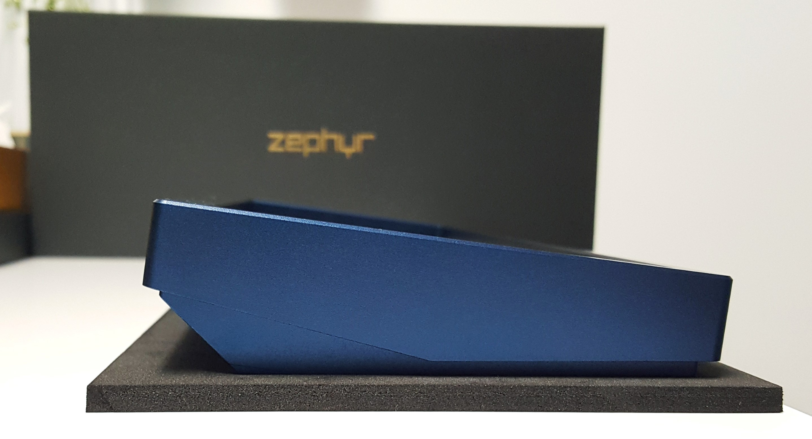
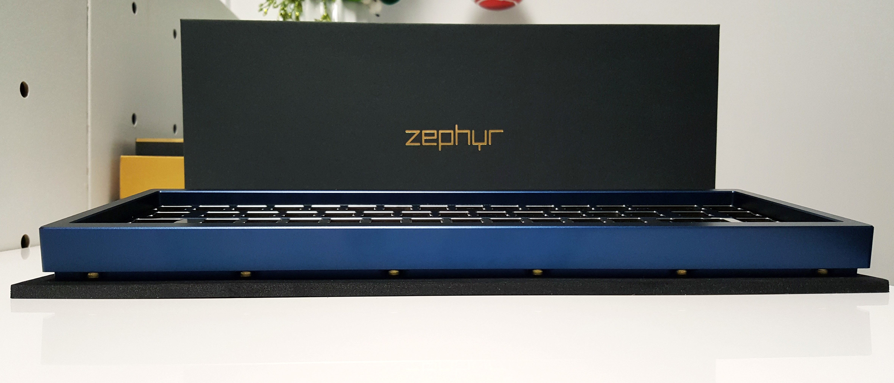
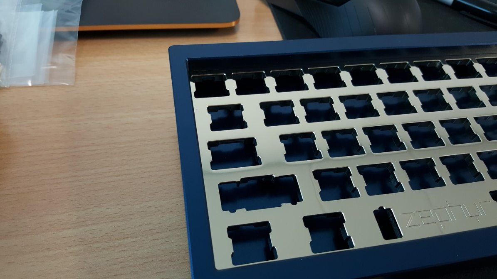

---

###Where to Buy
- $600 - Group Buy on [ZealPC.net](https://zealpc.net/collections/group-buy-pre-orders/products/zephyr)
   - Note: Round One was $550 / Round two is $600
   

---

###Build Guides / Albums

---

###How to Program
- Via [QMK Firmware](http://qmk.fm/)

---

###Mods &amp; Addons

---

###More Info
- [GeekHack GB Thread](https://geekhack.org/index.php?topic=93966.0)
   - Note the 5MM thick brass plate! 

---

###Gallery  

