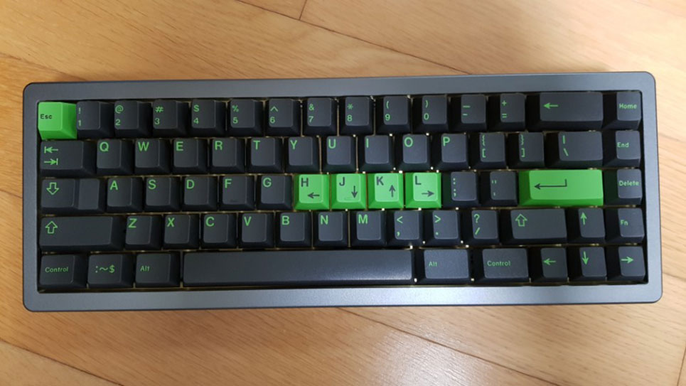
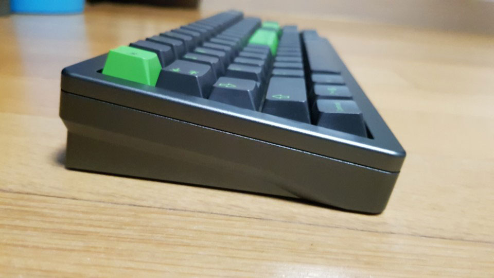
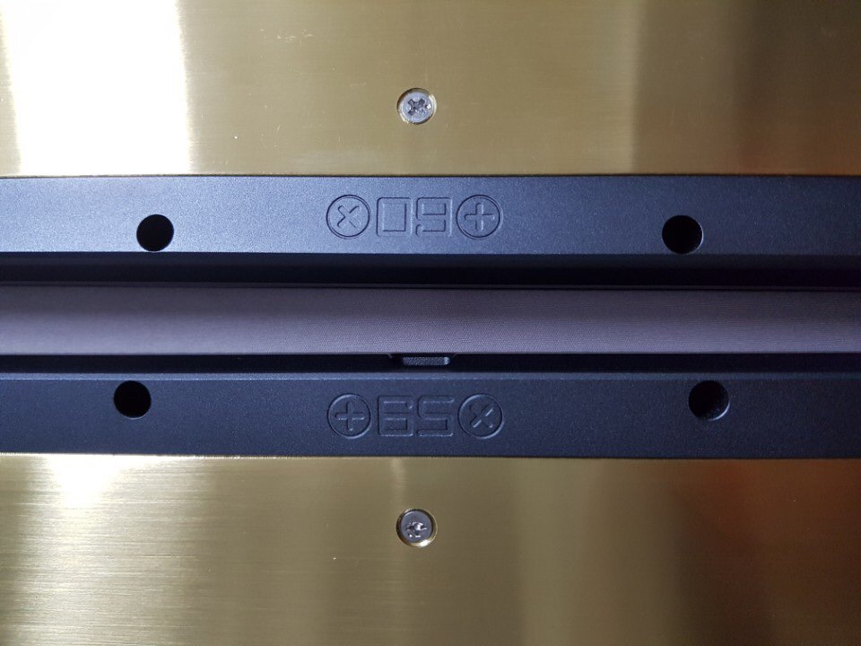
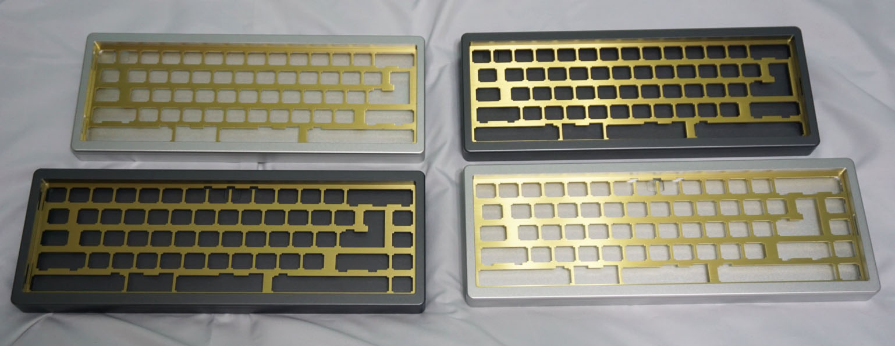
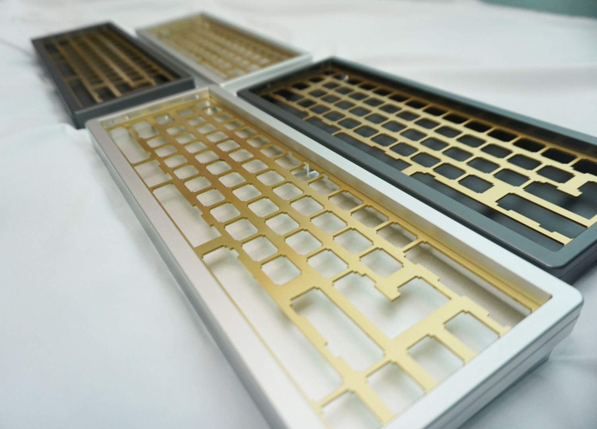

---

###Where to Buy
- In Production. Pre-orders soon. 
   - Interest Check on [GeekHack](https://geekhack.org/index.php?topic=92924.0;all)

---

###Build Guides / Albums
- Photo Album from [KBDLab.co.kr](http://kbdlab.co.kr/index.php?mid=board_Lsno50&page=2&document_srl=5048493)
<blockquote class="imgur-embed-pub" lang="en" data-id="a/auOYc"></blockquote> 

---

###How to Program

---

###Mods &amp; Addons

---

###More Info

---

###Gallery  

