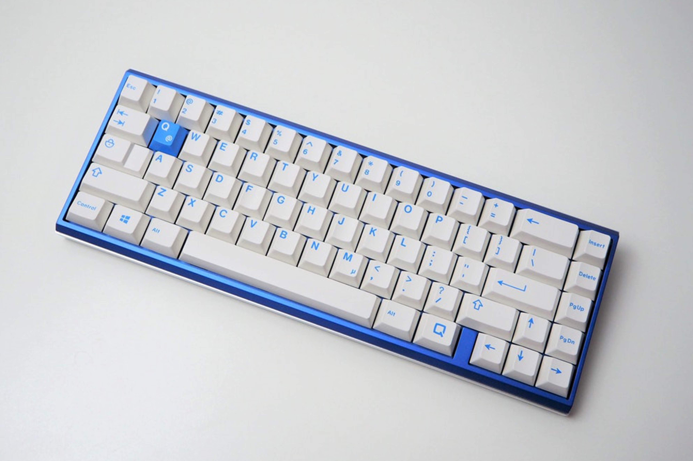
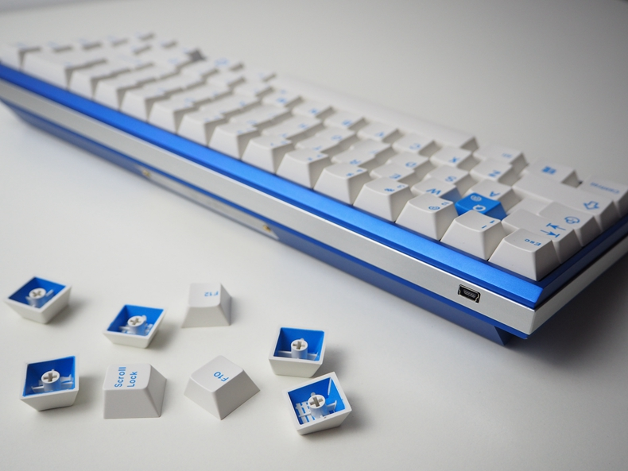
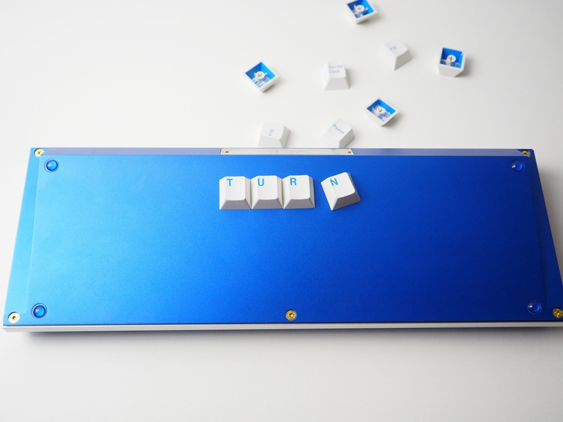
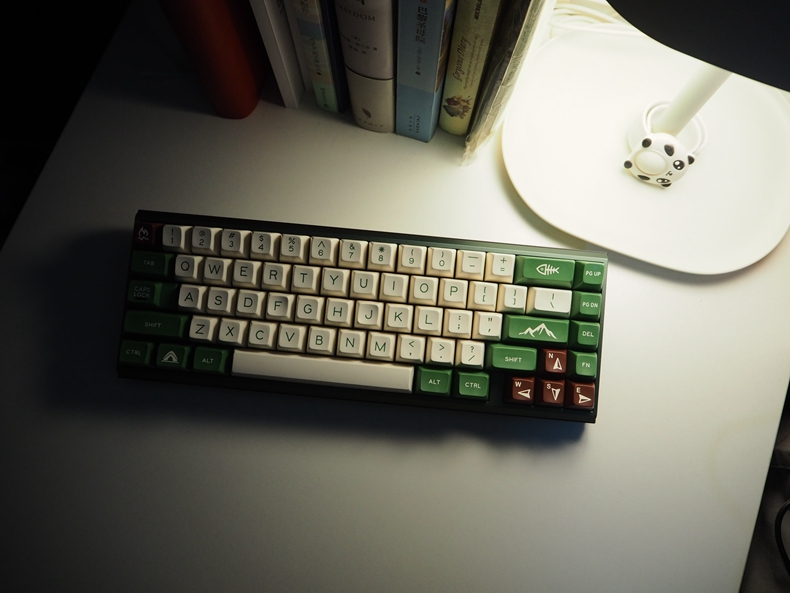

---

###Where to Buy
- $349 - GroupBuy on [KPRepublic.com](https://kprepublic.com/products/gbhooper-ace65-custom-mechanical-keyboard-set-65-anodized-aluminum-cover-rgb-drop-shadow-cnc) 
   - Runs 2018-02-06 to 2018-02-28
- ENDED: ~~Group Buy on [Taobao](https://item.taobao.com/item.htm?spm=a1z10.3-c-s.w4002-14986073507.10.2eb72f47JoBWnA&id=563904244142)~~

---

###Build Guides / Albums
- Photo from u/kingnestea on [Reddit](https://www.reddit.com/r/MechanicalKeyboards/comments/7q4dia/the_family_has_grown_a_little_bit_over_2017/) - ACE65 is featured in the bottom right corner with GMK Griseann (white on black keycaps)
<blockquote class="imgur-embed-pub" lang="en" data-id="a/pYptB"></blockquote>
 

---

###How to Program

---

###Mods &amp; Addons

---

###More Info
- [IC on GeekHack for International Group Buy](https://geekhack.org/index.php?topic=93921.0)

---

###Gallery  

