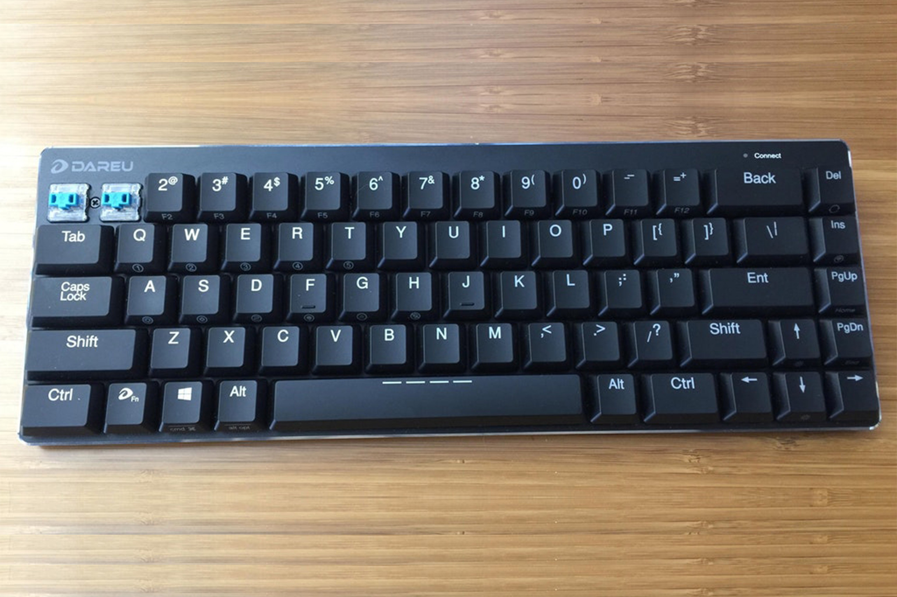
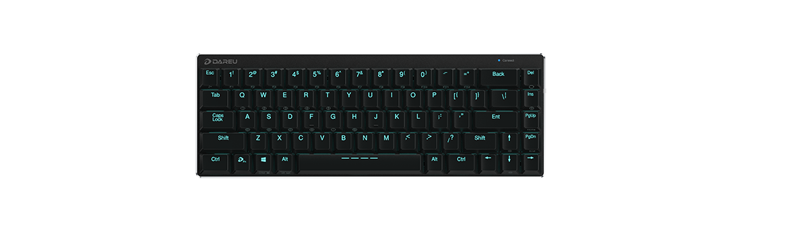
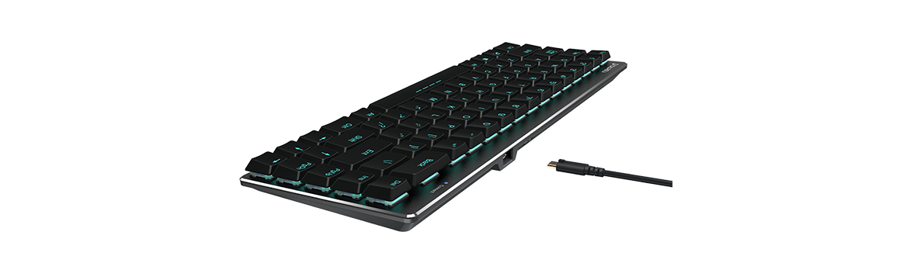

---

###Where to Buy
- $75 - [Amazon](https://www.amazon.com/DareU-Bluetooth-Mechanical-Low-profile-Backlighting/dp/B078C64JQM)
- $65 - [FlashQuark](https://flashquark.com/product/dareu-ek820-bluetooth-68-key-mechanical-keyboard-wkailh-low-profile-switches/)

---

###Build Guides / Albums
- Review by u/mkusanagi on [Reddit](https://www.reddit.com/r/MechanicalKeyboards/comments/7nhpyx/dareu_ek820_bluetooth_68key_mechanical_keyboard/)

---

###How to Program
- No programming available but here is the [manual translated to english](DareU-EK820-Manual.pdf).

---

###Mods &amp; Addons

---

###More Info

---

###Gallery  

