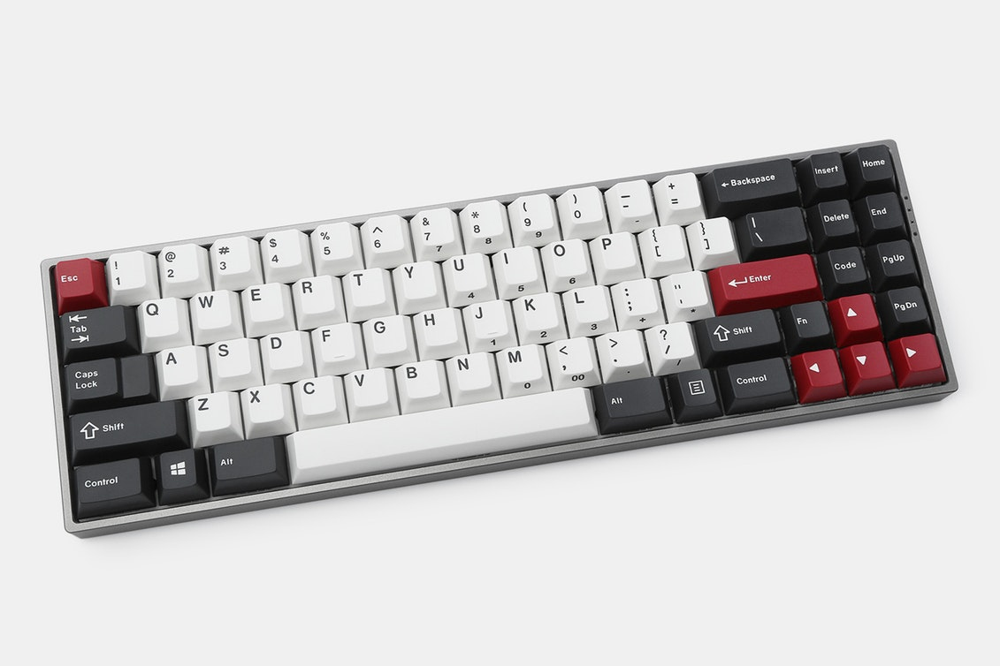
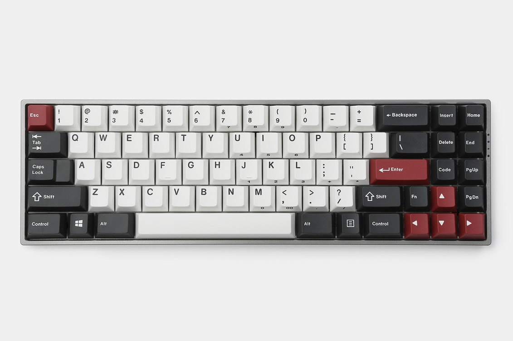
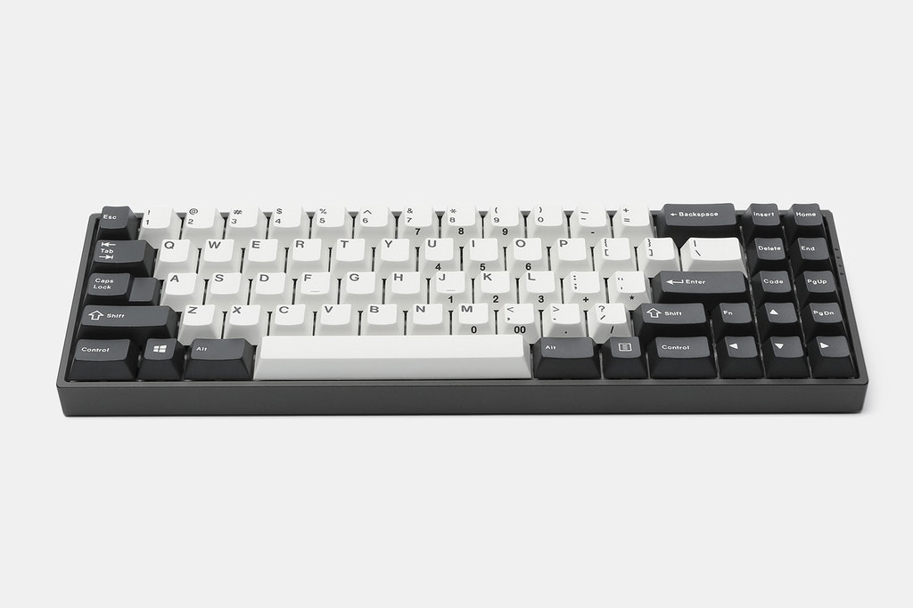
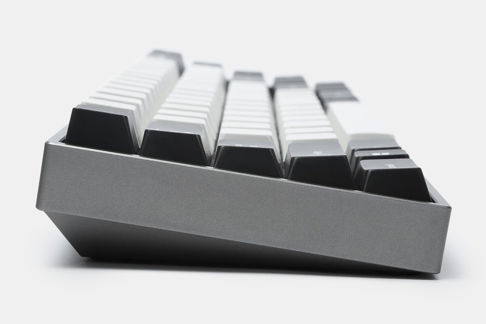
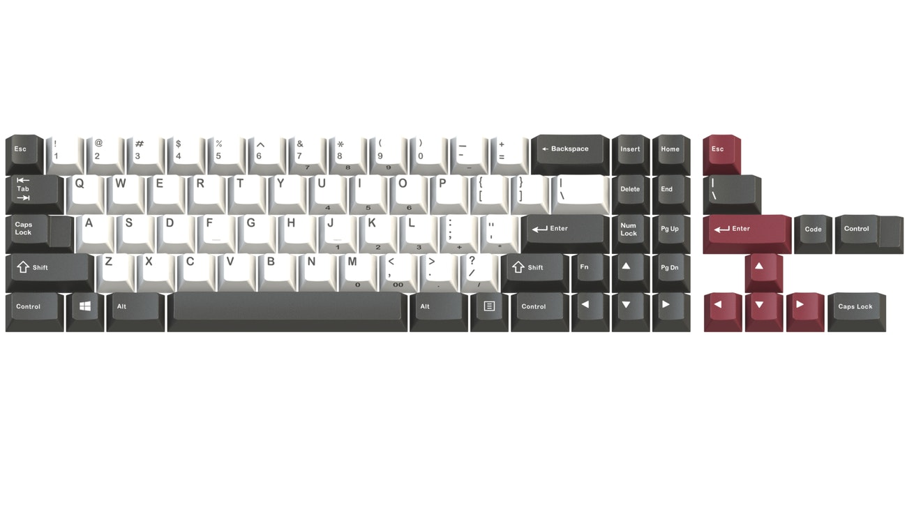

---

###Where to Buy
- Initial Group Buy run on [Massdrop](https://www.massdrop.com/buy/gmk-uniqey-c70-mechanical-keyboard#description)
- Soon™ to be available in more variants* from [Uniqey.net](https://uniqey.net)
   - *Variants that weren't in the initial GB such as ISO option and Kit options instead of pre-built.

---

###Build Guides / Albums

---

###How to Program
- UNIQEY Control - GMK's new custom keyboard configuration software. 

---

###Mods &amp; Addons

---

###More Info
- Story behind the creationg of the Q70 by LivingSpeedBump on [Massdrop](https://www.massdrop.com/talk/2889/designing-the-gmk-uniqey-c-70-custom-keyboard-a-true-community-custom)

---

###Gallery  

The initial Group Buy came with this custom GMK Keyset as well ↑
