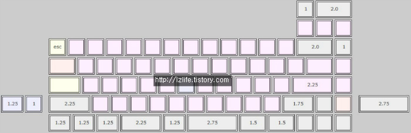

---

###Where to Buy
- Group Buy on [GeekHack](https://geekhack.org/index.php?topic=67863.0) : ENDED - 2015

---

###Build Guides / Albums
- Album on [DeskThority](https://deskthority.net/photos-f62/lz-sq-t11052.html) by Jokrik
 
 
- Photos on [KBDLab.co.kr](http://kbdlab.co.kr/index.php?mid=board_Lsno50&page=6&document_srl=2640187)

- Typing Test on [YouTube](https://www.youtube.com/watch?v=RVU5rZVheFc) by 이건호
<iframe width="560" height="315" src="https://www.youtube.com/embed/RVU5rZVheFc?rel=0&amp;showinfo=0" frameborder="0" allow="autoplay; encrypted-media" allowfullscreen></iframe> 
- Unboxing Video on [YouTube](https://www.youtube.com/watch?v=svFMMBlZgyU) by Fakeflight
<iframe width="560" height="315" src="https://www.youtube.com/embed/svFMMBlZgyU?rel=0&amp;showinfo=0" frameborder="0" allow="autoplay; encrypted-media" allowfullscreen></iframe> 

---

###How to Program
- Use the [JigOn Firmware](http://kbdlab.co.kr/index.php?mid=board_sw&document_srl=2702787)
   - PDF Guide [here](Leeku_L3_Software.pdf) original [GeekHack thread](https://geekhack.org/index.php?topic=83950.0)

---

###Mods &amp; Addons

---

###More Info

---

###Gallery  

