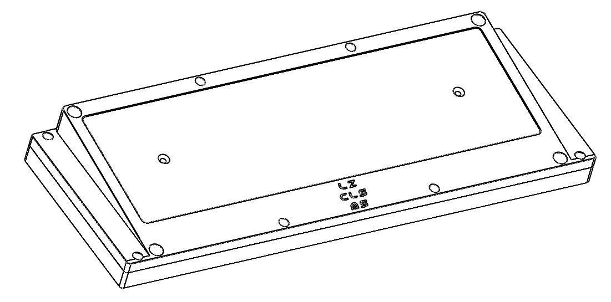

---

###Where to Buy
- IC on [GeekHack](https://geekhack.org/index.php?topic=94841) no yet in GroupBuy as of Apr 17, 2018

---

###Build Guides / Albums

---

###How to Program
- Use the [JigOn Firmware](http://kbdlab.co.kr/index.php?mid=board_sw&document_srl=2702787)
   - PDF Guide [here](Leeku_L3_Software.pdf) original [GeekHack thread](https://geekhack.org/index.php?topic=83950.0)

---

###Mods &amp; Addons

---

###More Info

---

###Gallery  
 
 
 

