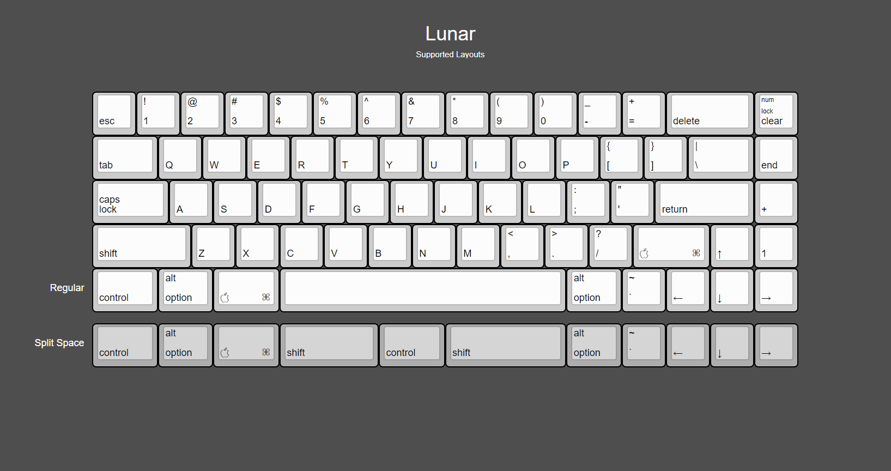
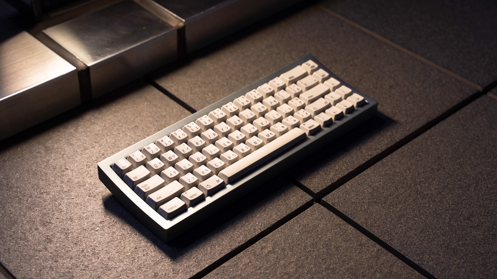
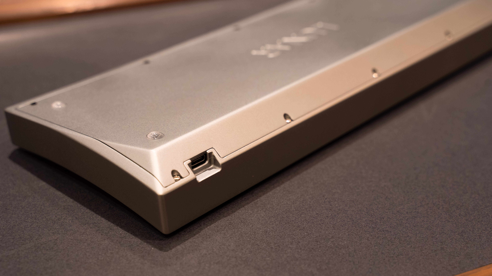
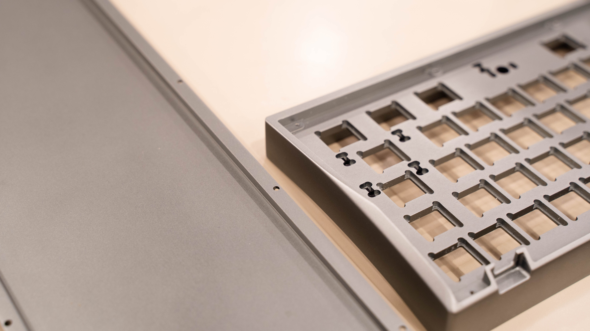

---

###Where to Buy
- GB hosted by u/ReconsiderIt on [SwitchPlate.co](https://switchplate.co/collections/lunar-group-buy)
- IC on [GeekHack](https://geekhack.org/index.php?topic=96112.0)  - GroupBuy Starts in August 2018, ends in September 2018
- IC on [Reddit](https://www.reddit.com/r/MechanicalKeyboards/comments/9a6rpu/the_original_apple_aekii_adapted_for_a_modern/)

---

###Build Guides / Albums
 - Prototype on Imgur
<blockquote class="imgur-embed-pub" lang="en" data-id="a/EaEIzpK"><a href="//imgur.com/EaEIzpK">Lunar</a></blockquote>  
 

---

###How to Program
- QMK Firmware

---

###Mods &amp; Addons

---

###More Info
- Layout options

---

###Gallery  

