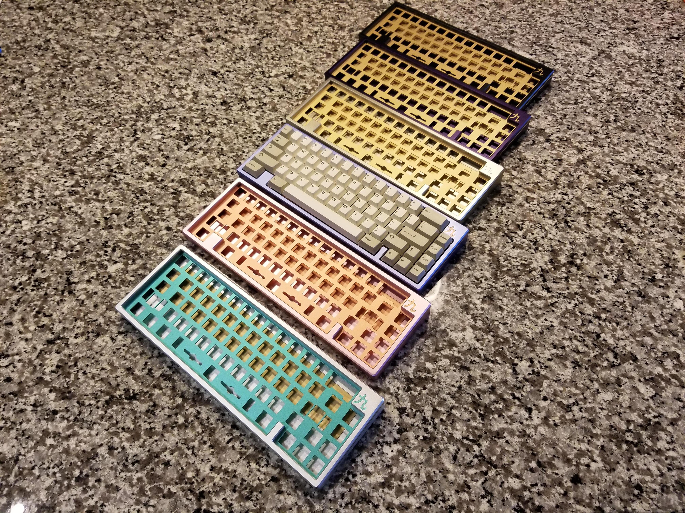

---

###Where to Buy
- Round 1 = Private GB
- Round 2 IC on [GeekHack](https://geekhack.org/index.php?topic=96662.0)  - GroupBuy Starts in August 2018, ends in September 2018
- Round 2 IC on [Reddit](https://www.reddit.com/r/MechanicalKeyboards/comments/8jh24h/kyuu_custom_65_keyboard/)

---

###Build Guides / Albums
 - Round One photos from the designer Quantrik | Post on [Reddit](https://www.reddit.com/r/MechanicalKeyboards/comments/8jh24h/kyuu_custom_65_keyboard/)
<blockquote class="imgur-embed-pub" lang="en" data-id="a/g3z2GEx"><a href="//imgur.com/g3z2GEx">Kyuu</a></blockquote>  
 - Kyuu typing video w/ Holy Chicky Switches
<iframe width="560" height="315" src="https://www.youtube.com/embed/DY7Im3-Zmxs?rel=0" frameborder="0" allow="autoplay; encrypted-media" allowfullscreen></iframe>  
 

---

###How to Program
- QMK Firmware

---

###Mods &amp; Addons

---

###More Info
- Layout options

---

###Gallery  

