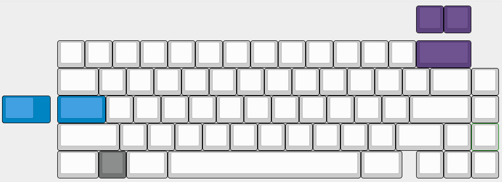

---

###Where to Buy
- Still in design phase. Teased in #kb-kustoms chat on MechKeys discord. 

---

###Build Guides / Albums
 

---

###How to Program
- QMK Firmware

---

###Mods &amp; Addons

---

###More Info
- Layout options

---

###Gallery  

