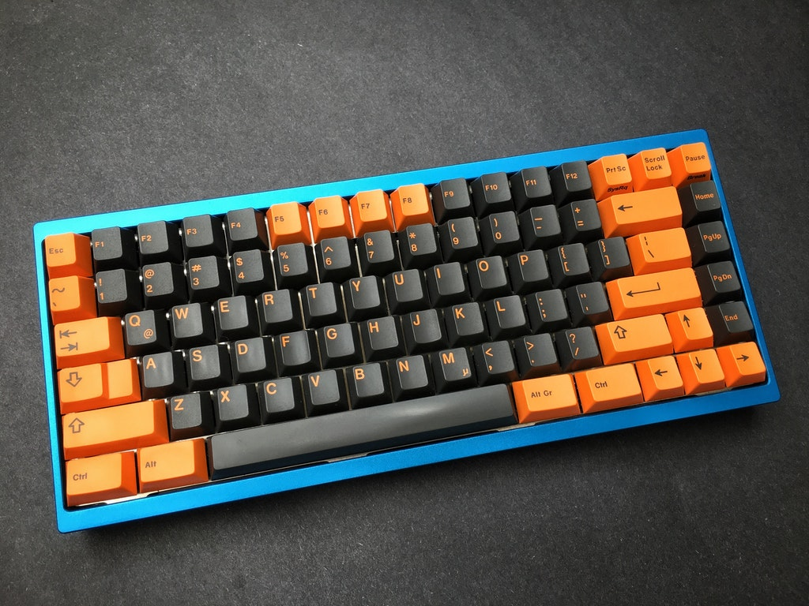
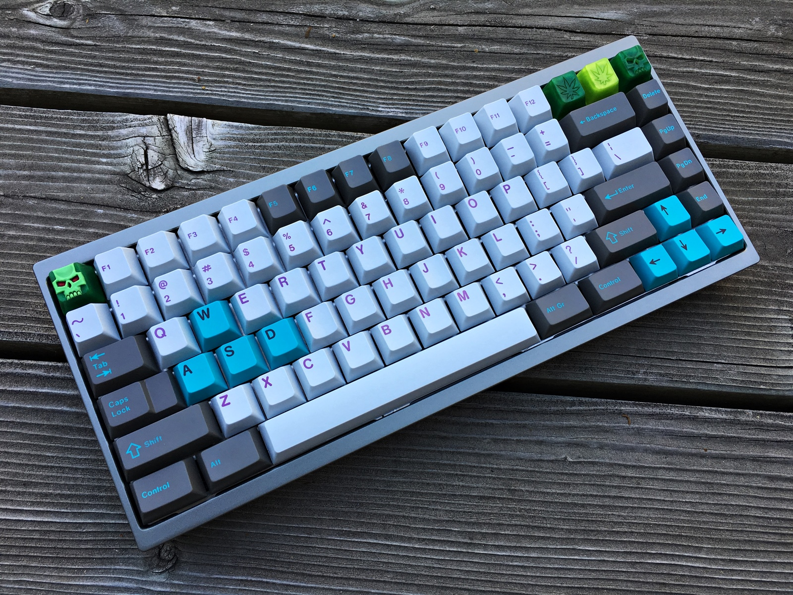
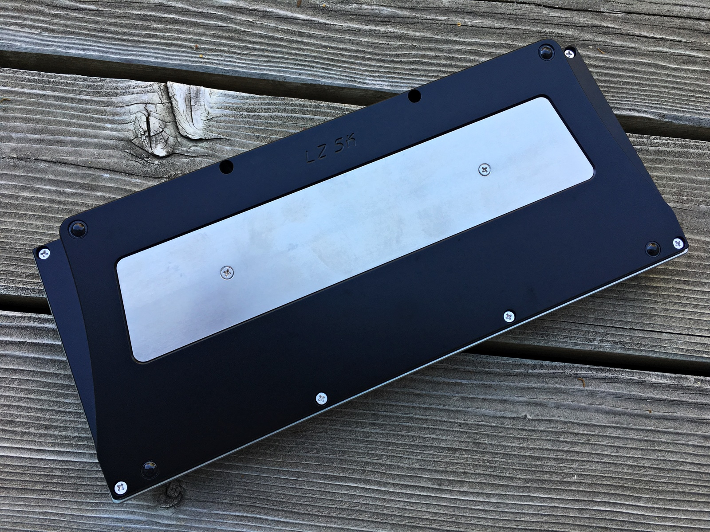
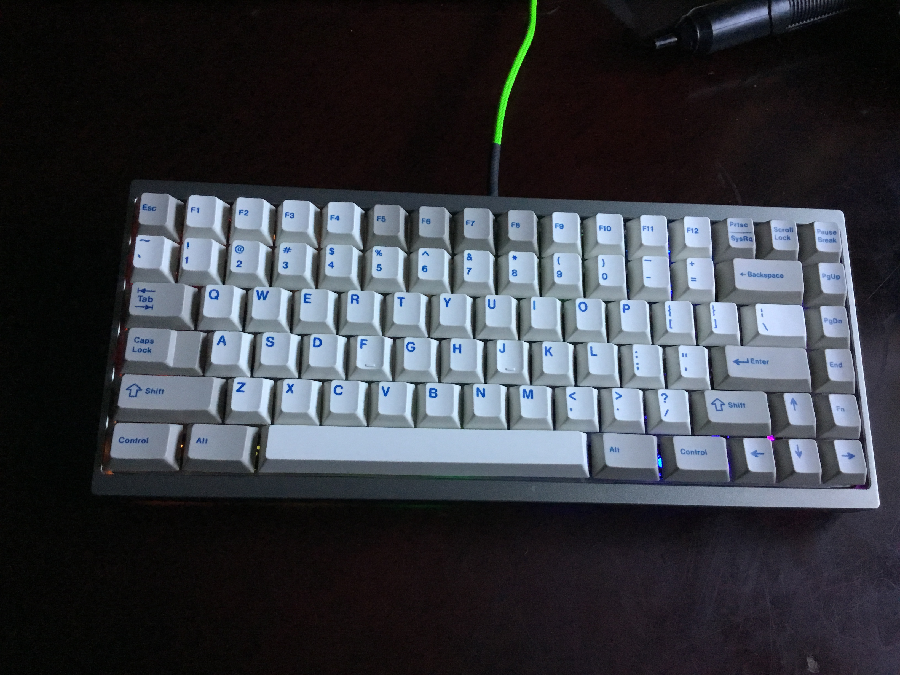

---

###Where to Buy

---

###Build Guides / Albums
* Photo Album by Krushnine on [Reddit](https://www.reddit.com/r/MechanicalKeyboards/comments/527utb/photos_lzsk_with_hyperfuse/)
<blockquote class="imgur-embed-pub" lang="en" data-id="a/4sMfx"><a href="//imgur.com/4sMfx">[photos] LZ-SK with Hyperfuse</a></blockquote> 

---

###How to Program
- Finger SK L3 PCB
- Use the [JigOn Firmware](http://kbdlab.co.kr/index.php?mid=board_sw&document_srl=2702787)
   - PDF Guide [here](Leeku_L3_Software.pdf) original [GeekHack thread](https://geekhack.org/index.php?topic=83950.0)

---

###Mods &amp; Addons

---

###More Info

---

###Gallery  

