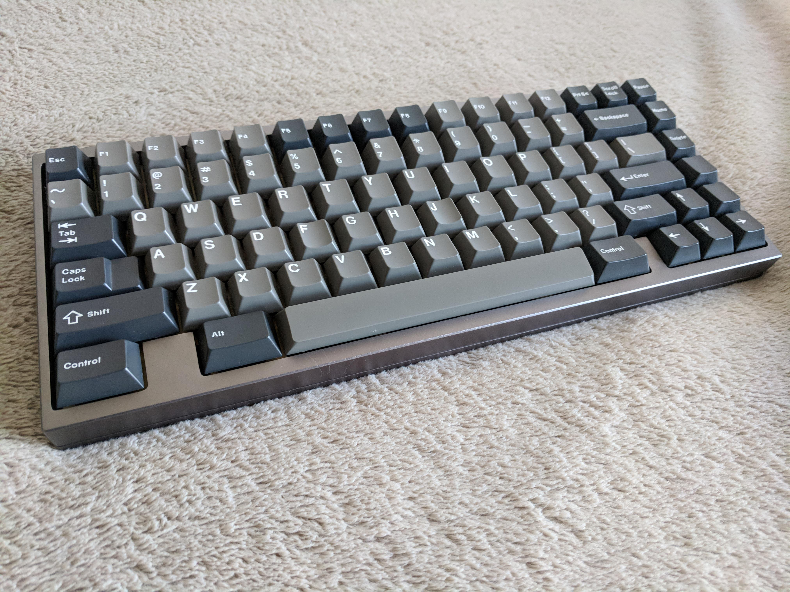
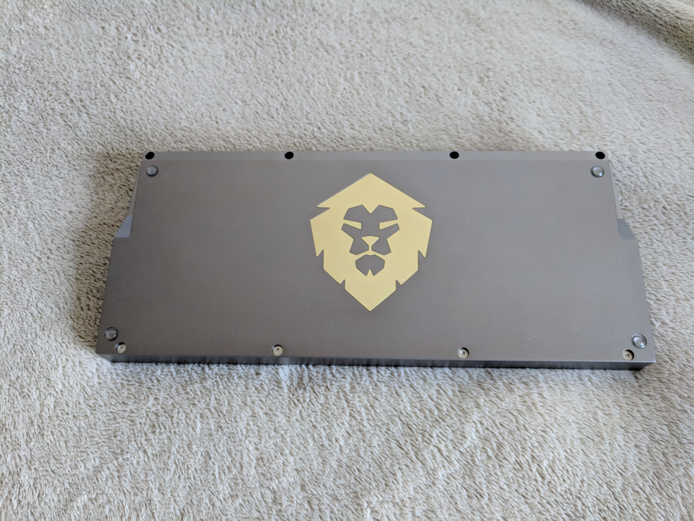

---

###Where to Buy
* Round One - Private Group Buy buy invitation in late 2017 ::: ENDED
* Round Two - Group Buy was run on [GeekHack](https://geekhack.org/index.php?topic=95000.0) in March 2018 ::: ENDED

---

###Build Guides / Albums
* Interest Check Album by Elaine aka Catweewee on [GeekHack](https://geekhack.org/index.php?topic=95000.0)
<blockquote class="imgur-embed-pub" lang="en" data-id="a/qakGd"><a href="//imgur.com/qakGd">SINGA R2 Champagne and Navy and Brass plate</a></blockquote> 

* 'Singa 75' Photo Album by Elaine aka Catweewee on [Reddit](https://www.reddit.com/r/MechanicalKeyboards/comments/7hg24k/singa_75/)
<blockquote class="imgur-embed-pub" lang="en" data-id="a/Nks3Z"><a href="//imgur.com/Nks3Z">SINGA 75.</a></blockquote> 

* 'R1 Group Pics' by Elaine aka Catweewee on [Reddit](https://www.reddit.com/r/MechanicalKeyboards/comments/7rwsxs/singa_r1/)
<blockquote class="imgur-embed-pub" lang="en" data-id="a/cer1r"><a href="//imgur.com/cer1r">SINGA R1.</a></blockquote> 

* 'Violet Singa' by Sauchuang on [Reddit](https://www.reddit.com/r/MechanicalKeyboards/comments/7u8ctc/photos_violet_singa_75/)
<blockquote class="imgur-embed-pub" lang="en" data-id="a/6EpUY"><a href="//imgur.com/6EpUY">[photos] Violet SINGA 75%</a></blockquote> 

* 'Velvet Singa' by AznReaper on [Reddit](https://www.reddit.com/r/MechanicalKeyboards/comments/7ya0ks/velvet_singa_a_custom_75_keyboard/)
<blockquote class="imgur-embed-pub" lang="en" data-id="a/B3Fmj"><a href="//imgur.com/B3Fmj">Velvet Singa, a custom 75% keyboard</a></blockquote> 

---

###How to Program
- TGR PCB by Winkeyless
- Use Bootmapper Client

---

###Mods &amp; Addons

---

###More Info
* Interest Check thread for R2 of Singa on [GeekHack](https://geekhack.org/index.php?topic=93398.0)

---

###Gallery  

