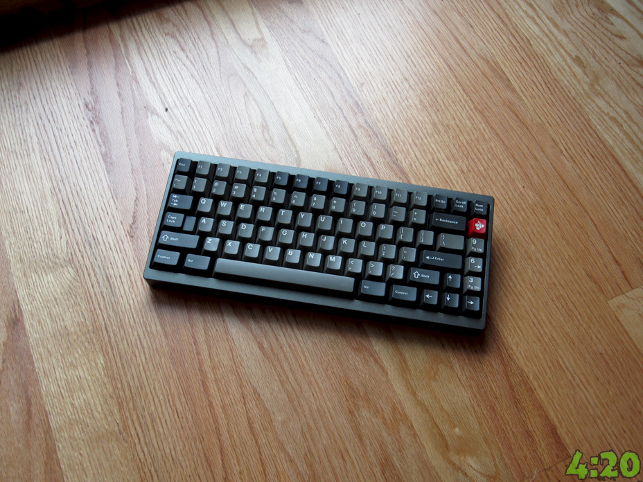
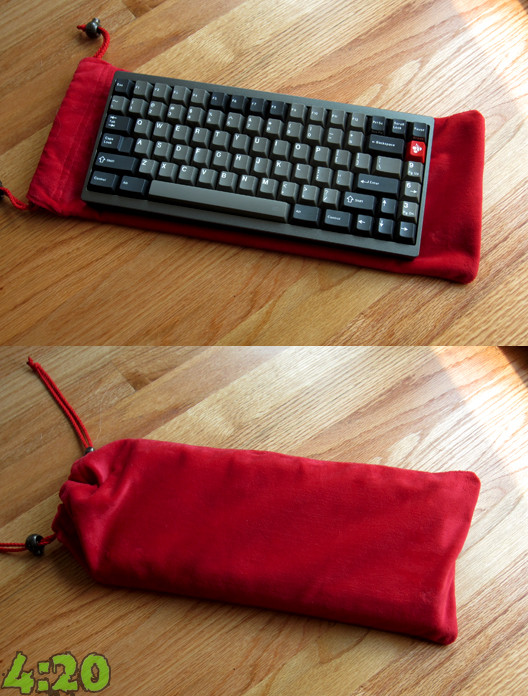
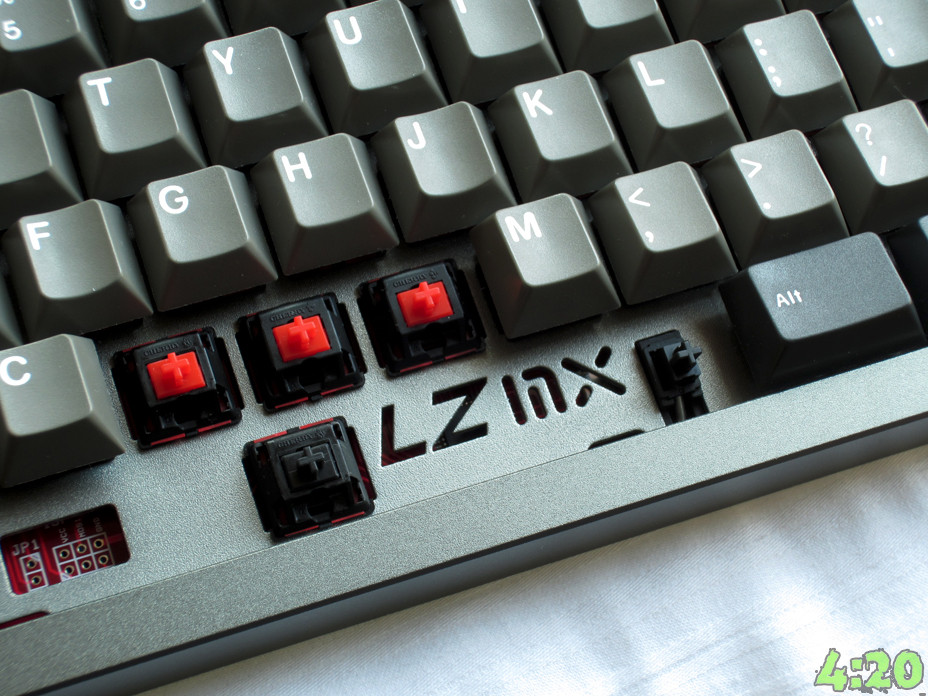
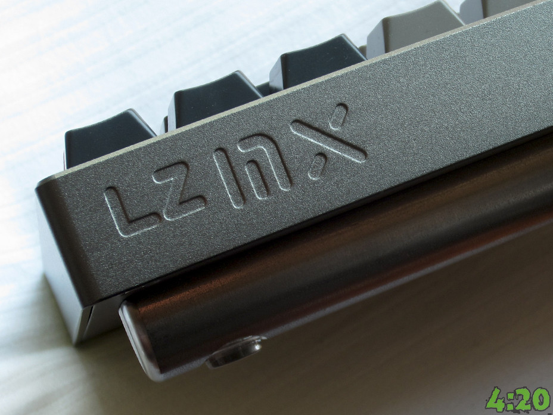

---

###Where to Buy
* ~~Group Buy was run on [___](#) in ____~~ ::: ENDED

---

###Build Guides / Albums
- Review and Photos on DangWang's Blog

---

###How to Program

---

###Mods &amp; Addons

---

###More Info

---

###Gallery  

