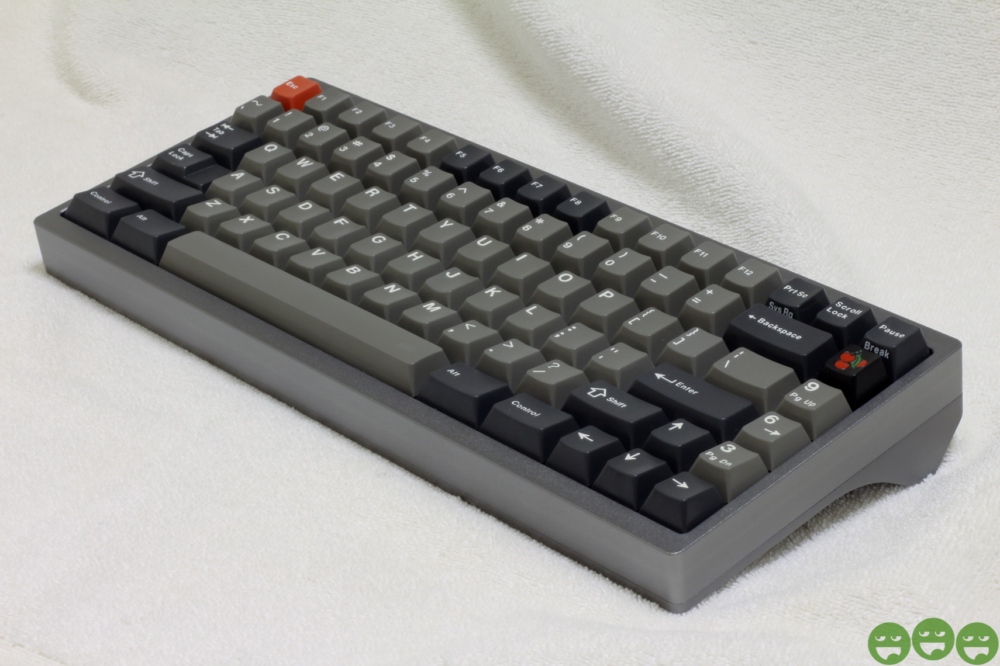
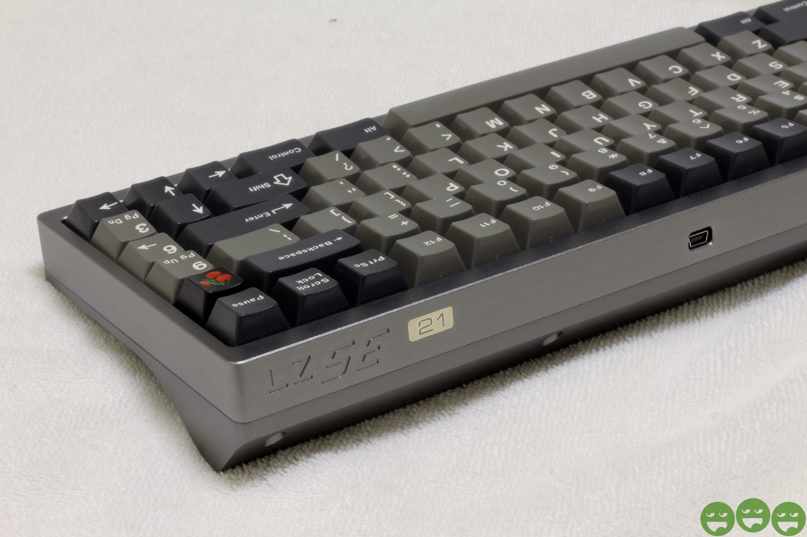

---

###Where to Buy
* ~~Group Buy was run on [___](#) in ____~~ ::: ENDED

---

###Build Guides / Albums
- Photos from Pacifist42 on [Reddit}(https://www.reddit.com/r/MechanicalKeyboards/comments/28b8nv/my_lz_mx_mini_se/)
<blockquote class="imgur-embed-pub" lang="en" data-id="a/HOQzt"><a href="//imgur.com/HOQzt">lz mx mini se</a></blockquote> 

- Typing Video by KeyChatter on [YouTube](https://www.youtube.com/watch?v=7HFrsfdpYFo)
<iframe width="560" height="315" src="https://www.youtube.com/embed/7HFrsfdpYFo?rel=0&amp;showinfo=0" frameborder="0" allow="autoplay; encrypted-media" allowfullscreen></iframe> 

- Typing Video by Youngsu Lee on [YouTube](https://www.youtube.com/watch?v=7eyYvXsSzjc)
<iframe width="560" height="315" src="https://www.youtube.com/embed/7eyYvXsSzjc?rel=0&amp;showinfo=0" frameborder="0" allow="autoplay; encrypted-media" allowfullscreen></iframe> 

- Typing Video by 신수빈 on [YouTube](https://www.youtube.com/watch?v=aD-KuBggaDY)
<iframe width="560" height="315" src="https://www.youtube.com/embed/aD-KuBggaDY?rel=0&amp;showinfo=0" frameborder="0" allow="autoplay; encrypted-media" allowfullscreen></iframe> 

---

###How to Program

---

###Mods &amp; Addons

---

###More Info

---

###Gallery  

